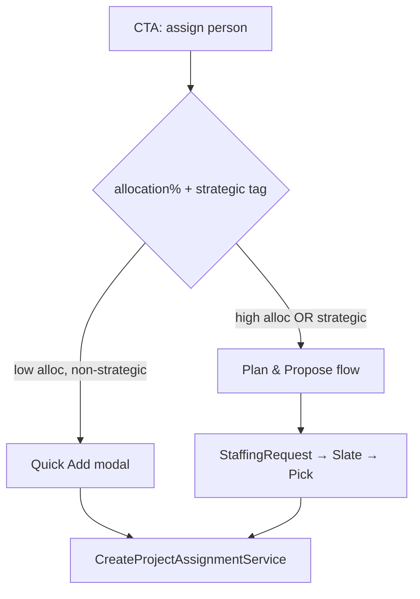
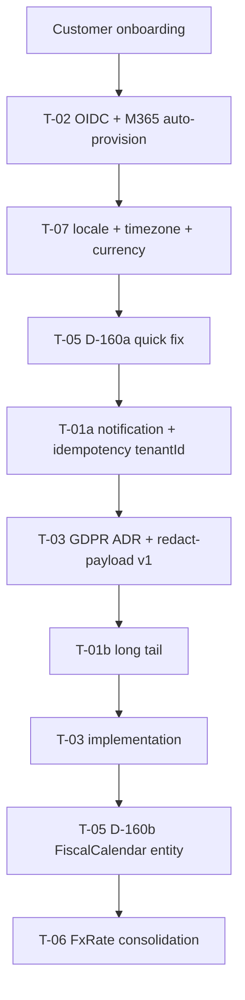
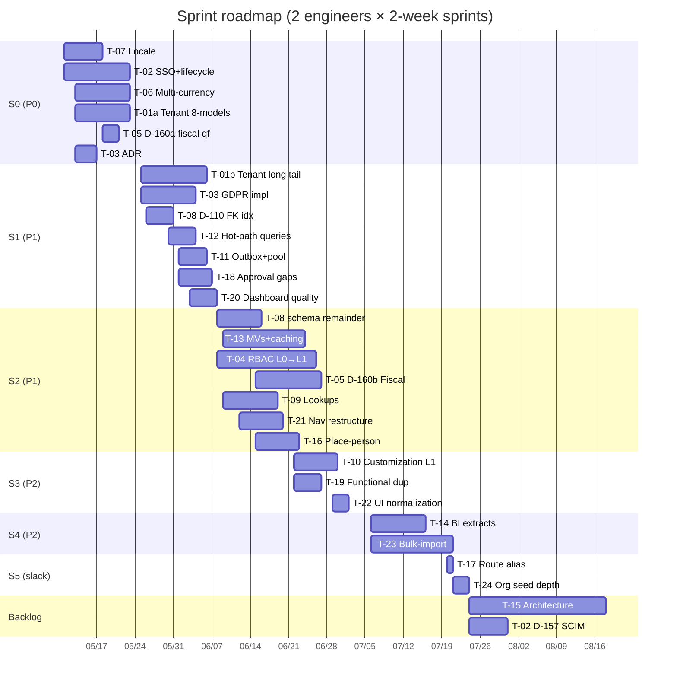

# Next-Iteration Plan

**Status:** Phase 11 master plan, authored 2026-05-10.
**Inputs:** 9 audit docs (Phase 1–9), 24 themes (`docs/planning/synthesis-themes.md`), 87 research findings (D-85..D-171), HARDEN_BRIEF F-/HD-/WO-/PM-/S- sibling work.
**Plan posture:** Cross-references HARDEN_BRIEF rather than absorbing it. Themes T-NN map to one or two goals; tasks in the xlsx (`next-iteration-roadmap.xlsx`) inherit the theme's effort range.
**Capacity assumed:** 2 engineers × 2-week sprints ≈ 40 person-days per sprint after non-coding overhead. **Effort coding:** S = 1–2d, M = 3–5d, L = 1–2 weeks, XL = 2+ weeks.

---

## Executive summary

DeliveryCentral has 87 documented findings across 9 audit lenses. They cluster into **24 themes** with an impact×effort score; six P0 themes form a Sprint 0 that maps to Phase 9's Top-10 Blockers (locale, SSO, multi-currency, multi-tenant isolation, GDPR, fiscal calendar). At the assumed 2-engineer cadence, Sprint 0 ships 4 P0 themes in full and starts T-01 + T-03 implementation; Sprint 1 finishes both. Sprints 2–4 deliver scalability, customization, navigation, and JTBD-completeness work. Sprint 5 absorbs spillover. T-15 (architecture refactors), T-17 (route aliases), T-24 (deeper seed) park in the backlog.

**Why this shape.** Three forces dominate. (a) **Real-customer readiness** — fiscal calendar / multi-currency / locale / SSO / tenant isolation / GDPR are non-negotiable for any enterprise customer. They are bunched in Sprint 0–1 because each one alone is a deal-blocker. (b) **Scaling-cliff prevention** — D-110 FK indexes, D-142 outbox, D-143 connection pool, D-144/145/146 hot-path queries are pre-failures the system avoids today only because seed-scale traffic is small; Sprint 1 lands the hardening. (c) **JTBD completeness** — Phase 4's RED items (audit log admin surface, work-evidence RBAC) are user-visible bugs; Sprint 1 fixes them.

**What HARDEN_BRIEF still owns.** F6.1–F6.3 (tenantId NOT NULL flip + RLS on the 25 scoped models), HD-4 ResponsibilityRule for mutations, HD-7 OutboxEvent skeleton, S-* domain consolidation work in flight. This plan **extends** HARDEN_BRIEF's scope to the 80 unscoped models (T-01), to read endpoints (T-04), and to the producer wiring (T-11) — without re-litigating the closed work. The xlsx Sheet 5 explicitly maps every Phase 1–9 D-item to its closing HARDEN_BRIEF item where one exists.

**Risk concentration.** Sprint 0 is the riskiest sprint. T-01 (multi-tenant data isolation) is the largest single workstream (15–25 person-days) and is splittable; the plan keeps T-01a (notification + idempotency + integration sync) in Sprint 0 and T-01b (long-tail of 60 models) in Sprint 1. T-03 GDPR strategy default is **redact-payload v1** (per stakeholder direction); cryptographic forgetting parks as v2.

**Definition of "done done"** for the iteration: at end of Sprint 5, a real customer hitting the system on Day 1 with a non-Jan-1 fiscal year, mixed currencies, EU residency, Okta SSO, distributed teams across 3 timezones can complete onboarding, daily operations, and quarterly reporting without hitting a P0 limitation.

---

## Goal 1 — Lean the flows

### Current state

15 cross-cutting flows mapped in Phase 1; 8 multi-path situations classified KEEP/DEPRECATE/MERGE. The headline issue: **6 FE entry points to "place a person on a project"** with no clear routing rubric (`flow-audit.md` row #1). Three legacy aliases (`/timesheets`, `/timesheets/approval`, `/admin/people/new`) exist as dead routes pointing at canonical pages. Three back-end endpoints (case approve, budget-change approve, period lock) lack FE wiring; two admin surfaces (`/admin/audit-log`, `/admin/setup`) are absent entirely. Phase 4 walker logged audit-log gap as RED, others as AMBER.

### Target state

Two user-visible flows for placing a person ("Quick Add" + "Plan & Propose"), routed by allocation% + strategic tag at the CTA. Three legacy aliases replaced by `<Navigate>` redirects. Five admin/approval JTBDs reachable from `route-manifest.ts`. Slate vs assignment reject semantic difference codified in `canonical-staffing-workflow.md`.

### Migration path

1. Spike: confirm CreateProjectAssignmentService accepts both flow shapes; document the routing-rubric helper.
2. Build "Quick Add" modal as an entry-point consolidation (replaces 3 of 6 surfaces).
3. Wire 3 missing FE buttons (case approve / budget-change approve / period lock).
4. Add `/admin/audit-log` page (DataTable + filters).
5. Add `/admin/setup` post-install control (re-runnable migration check).
6. Add 3 `<Navigate>` redirects for legacy aliases.
7. Slate-vs-assignment-reject documentation.

### Acceptance criteria

- [ ] Phase 1 flow #1 walker shows 2 entry points, not 6.
- [ ] Phase 4 walker re-run flips A4 (audit log) RED → GREEN.
- [ ] All 5 wired admin/approval JTBDs reachable in ≤3 clicks (UX Law 1).
- [ ] 3 legacy aliases redirect; old paths still resolve for 1 release.
- [ ] `canonical-staffing-workflow.md` documents slate-reject-all vs assignment-reject distinction.

### Sprint mapping

- Sprint 1: T-18 (5 admin/approval JTBDs) — M
- Sprint 2: T-16 (place-person flow consolidation) — L
- Sprint 5: T-17 (3 redirects) — S
- Sprint 2 (concurrent): D-90 documentation — S

### Estimated effort

T-18 = M (6–8d). T-16 = L (6–9d). T-17 = S (1d). D-90 = S (1d). **Goal total: M+L+S+S ≈ 14–19d.**

### Risks

| Risk | Likelihood | Impact | Mitigation |
|---|---|---|---|
| "Quick Add" UX collapses information needed by PMs (skill match, capacity) | Medium | Medium | Shared component for the rubric helper; A/B with 2 PMs before generalising |
| Legacy alias redirects break bookmarks | Low | Low | Keep redirects active for 1 release; add Deprecation header |
| `/admin/audit-log` page accidentally exposes other-tenant rows pre-T-01 | Low | High | Gate behind T-01a tenantId on AuditLog; do not ship until T-01a is in |

### Dependencies on other goals

- D-114 admin audit log gates on Goal 8 T-01a (tenantId on AuditLog) — sequence Sprint 0 → Sprint 1.
- D-138 retire-evidence-group (Goal 7) gates on D-116 evidence RBAC widening (Goal 4 T-20).

---

## Goal 2 — Deprecate doubled functionality

### Current state

Phase 2 registered 20 candidate duplications. Two orphan join tables (`ProjectTag`, `ProjectTechnology`) with zero writes; a cached counter (`StaffingRequest.headcountFulfilled`) that drifts vs derived count; a relation duplicate (`Project.projectManagerId` vs `Project.leadPmPersonId`) — DM-2.5/DM-3 may already own this. Three legacy assignment services injected-but-unused in `assignments.controller.ts`. Two FE legacy aliases (`/staffing-requests/:id/fulfil`, `/staffing-board`) covered partially; `/staffing-board` already redirects to `/staffing-desk?view=timeline`. `/admin/dictionaries` HR-scoped legacy overlaps `/metadata-admin`.

### Target state

Two orphan tables dropped. `headcountFulfilled` derived via Prisma `_count`. PM-relation canonical decision documented. Three unused services deleted. `/admin/dictionaries` either consolidated into `/metadata-admin` (preferred) or formally split with a documented rationale.

### Migration path

1. Confirm DM-2.5/DM-3 status on `Project.projectManagerId` vs `leadPmPersonId`; if neither owns it, audit writers and pick the loser.
2. Schema migration: drop `ProjectTag`, `ProjectTechnology`; remove `headcountFulfilled` from schema.
3. FE consumers of `headcountFulfilled` switch to `_count.fulfilledRecords`.
4. Delete 3 unused services from `assignments.controller.ts` constructor.
5. Decide `/admin/dictionaries` posture; merge into `/metadata-admin` if chosen.

### Acceptance criteria

- [ ] 2 orphan tables removed from schema; migration verified on staging.
- [ ] `StaffingRequest.headcountFulfilled` removed; consumers read derived count; tests cover.
- [ ] ADR or DM-3 follow-up documents canonical PM relation.
- [ ] 0 unused services in `assignments.controller.ts`.

### Sprint mapping

- Sprint 3: T-19 (D-94, D-95, D-97) — M
- Sprint 2: T-16 part (D-98 delete unused services) — S
- Sprint 4: T-16 part (D-100, D-101, D-102 cleanup) — S
- Sprint 5: T-17 (3 redirects) — S

### Estimated effort

T-19 = M (4–6d). D-98 + D-100 + D-101 + D-102 = S each. **Goal total: ~8–12d.**

### Risks

| Risk | Likelihood | Impact | Mitigation |
|---|---|---|---|
| `headcountFulfilled` derived count is slow on large slates | Low | Low | Compose with existing `_count`-based query in `StaffingRequest` aggregate |
| Dropping `ProjectTag` breaks an unidentified consumer | Low | Medium | Pre-grep `prisma.projectTag` across full codebase; CI guards via type-check |

### Dependencies on other goals

- T-19 D-97 may be already-done by DM-2.5/DM-3 — Phase 11 should re-verify before sprint slotting.
- D-102 (deprecate `/staffing-board`) sequences with the drag-write inside `/staffing-desk` (Distribution Studio scope).

---

## Goal 3 — Simplify architecture

### Current state

Phase 8 found `dashboard.module.ts` imports from 10 modules (presentation aggregation hub). `forwardRef` cycle count mis-stated in Phase 20c-08 (actual: 5 modules / 3 bidirectional cycles, not "4 modules"). Four god files: `setup.service.ts` (696 LoC), `MyTimePage.tsx` (1,237 LoC), `TimesheetPage.tsx` (971 LoC), `workforce-planner.service.ts` (1,584 LoC). DB connection pool defaults to ~9 at 4 vCPU; cliff at ~50 concurrent users. Outbox publisher + DomainEvent producers are zero-wired despite the schema models existing.

### Target state

Outbox producers wired and active; DB pool env-driven and tuned for the deployed tier. God files split where the split is meaningful (workforce-planner is cohesive; setup/MyTime/Timesheet are accumulation god files). Cycles documented; dashboard hub coupling decision recorded as ADR.

### Migration path

1. Sprint 1: env-drive `connection_limit`; document tuning matrix.
2. Sprint 1: wire ≥3 mutation producers via OutboxModule; activate publisher tick.
3. Backlog: split MyTimePage, TimesheetPage, setup.service per their natural domain seams.
4. Backlog: ADR on `dashboard.module.ts` shape; either keep as hub or push queries to owning modules.
5. Backlog: cycle-count refinement note (D-151).

### Acceptance criteria

- [ ] `prisma.service.ts` reads `DATABASE_POOL_LIMIT` env var; documented in `docs/ops/scaling-tuning.md`.
- [ ] `dc_outbox_events_dispatched_total` >0 in staging Prometheus after a single mutation flow.
- [ ] (Backlog) No file in `src/` exceeds 800 LoC.

### Sprint mapping

- Sprint 1: T-11 (D-142 + D-143) — M
- Backlog: T-15 (D-99, D-150, D-151, D-152) — XL

### Estimated effort

T-11 = M (4–7d). T-15 = XL (15–25d, backlog). **Goal total: M (S1) + backlog.**

### Risks

| Risk | Likelihood | Impact | Mitigation |
|---|---|---|---|
| Activating outbox producers double-fires events alongside the dual-write seam | Medium | High | Toggle via existing `flag.outboxEnabled` PlatformSetting; staged rollout |
| DB pool tuning regresses cold-start latency | Low | Medium | Prom alert on `dc_outbox_events_backlog`; revertable env var |

### Dependencies on other goals

- T-11 D-142 (outbox) is prereq for Goal 9 T-14 D-170 (webhook registry).

---

## Goal 4 — JTBD coverage per role

### Current state

Phase 4 walked 8 roles × 5 JTBDs = 40 sessions on the live stage. **Score: 27 GREEN / 11 AMBER / 2 RED.** RED items: Admin investigates audit (A4) and Employee logs work evidence (E4). AMBER items mostly relate to RBAC silent failures, dual-role default landing, RM dashboard data-shaping, and portfolio-radiator zero-display. Plus dashboard JTBDs that depend on data quality (RM Sophia 6-person team shows 0% util while global staffing-desk shows 27% fill rate / 15 overallocated).

### Target state

40/40 GREEN. Silent JS RBAC errors replaced by visible error region or hidden when role lacks access. Dual-role default landing documented or per-user override. Portfolio radiator either correct or seed-fixed. Work-evidence reachable by employees (RBAC widened or relocated). Audit log admin page exists.

### Migration path

1. Investigate RM dashboard data shaping for Sophia; confirm seed coverage of RM-managed teams.
2. Verify `ProjectRagSnapshot` seed data; fix portfolio-radiator data path.
3. Widen `/work-evidence` RBAC self-scope OR relocate component into `/dashboard/employee` + `/my-time`.
4. Document HR > RM dual-role precedence; add `account.preferredDashboardRoute` PlatformSetting per-user override.
5. Audit `useAuth().principal.roles` consumers; standardize on visible-error or hidden-when-no-role pattern; remove silent-error paths.
6. Add `/admin/audit-log` page (covered also by Goal 1 T-18).

### Acceptance criteria

- [ ] Phase 4 walker re-run on ≥6 affected JTBDs returns GREEN.
- [ ] No "Insufficient role for this operation" silent errors on rendered pages.
- [ ] Sophia RM dashboard shows ≥0% but accurate utilization, matching staffing-desk view.
- [ ] HR > RM precedence documented in `route-manifest.ts` comments + PlatformSetting override key.
- [ ] `DeliveryManagerDashboardPage.test.tsx` exists (D-135).

### Sprint mapping

- Sprint 1: T-20 (D-115, D-116, D-119, D-120, D-121) — M
- Sprint 1: T-18 part (D-114 admin audit log) — S
- Sprint 3: T-22 part (D-135 DM dashboard test) — S

### Estimated effort

T-20 = M (5–7d). T-18 D-114 = S (1d). D-135 = S (1d). **Goal total: ~7–9d.**

### Risks

| Risk | Likelihood | Impact | Mitigation |
|---|---|---|---|
| Self-scope on `/work-evidence` leaks other people's evidence | Medium | High | Reuse `@AllowSelfScope` guard pattern; integration test must cover cross-personId 403 |
| Per-user dashboard override conflicts with impersonation overlay | Low | Medium | Impersonation overlay always wins; documented in CLAUDE.md |
| Fixing portfolio radiator changes meaning of "0% Green" snapshot | Low | Low | Migration adds `is_seed_fix` flag on regenerated snapshots |

### Dependencies on other goals

- D-116 evidence RBAC fix gates Goal 7 D-138 (retire evidence group).
- D-114 admin audit log gates on Goal 8 T-01a (tenantId on AuditLog).

---

## Goal 5 — Increase tenant customization

### Current state

Phase 5 catalogued 13 new debt items + 11 already-correct positives across the 5-layer L0..L4 customization model. Phase 9 added 5 more (D-171). Three repeated `@RequireRoles(...)` role-list patterns (24×, 29×, 22×). 9 enums baked in code that should be tenant-customizable lookups. ~21 hardcoded constants across staffing/SLA/risk/closure that should be PlatformSettings. ResponsibilityRule shipped (HD-4) for mutations only — read endpoints can't consume tenant rules. No admin UI to redefine role capabilities.

### Target state

Three-layer extension:
- **L1 (PlatformSettings):** ~21 constants registered + a `/admin/platform-settings` admin surface.
- **L2 (MetadataDictionary):** 9 enums migrated; tenant admin can add a 10th value via `/metadata-admin`.
- **L0+→L1 (Roles):** `@RequireRoles` patterns extracted to constants → driven from PlatformSetting → folded into ResponsibilityRule (extended to read endpoints) → admin UI for tenant role redefinition.

### Migration path

1. Extract repeated role-list patterns to `src/shared/auth/role-presets.ts` (HD-4 step 1).
2. Drive presets from `responsibilityMatrix.*.roles` PlatformSetting (HD-4 step 2).
3. Extend `ResponsibilityActionKind` to cover reads; rewire 330 `@Get` invocations.
4. 9-enum bundled migration to MetadataDictionary (expand-migrate-contract per `enum-evolution-playbook.md`).
5. FE risk-tab + risk-register switch to `entry.displayName` reads.
6. ~21 hardcoded constants registered as PlatformSetting keys + per-knob consumer wiring.
7. Industry presets (Finance/Healthcare/Tech/Public-Sector) seed JSON profiles.
8. Build `RolePermissionAdminPage` admin UI.
9. Add `Grade` TS const for type-safe DTOs.

### Acceptance criteria

- [ ] 0 hardcoded role lists in route-manifest or controllers.
- [ ] Tenant can create a custom role + grant fine-grained read/write rules via UI.
- [ ] All 9 enum values surface as MetadataDictionary entries; tenant can add a 10th.
- [ ] All ~21 PlatformSetting keys are registered + consumed.
- [ ] Industry presets seed correctly; admin can switch.

### Sprint mapping

- Sprint 2: T-04 (D-130, D-158, D-159) — XL
- Sprint 2: T-09 (D-101, D-107, D-128, D-131, D-132) — L
- Sprint 3: T-10 (D-122, D-123, D-124, D-125, D-126, D-127, D-129, D-171) — L

### Estimated effort

T-04 = XL (12–18d). T-09 = L (8–12d). T-10 = L (6–9d). **Goal total: ~26–39d.**

### Risks

| Risk | Likelihood | Impact | Mitigation |
|---|---|---|---|
| ResponsibilityRule extension to reads causes ACL drift on busy endpoints | High | High | Stage by route group; FF behind `flag.responsibilityRule.reads`; soak in staging for 1 sprint |
| Enum migration breaks existing data | Medium | High | Expand-migrate-contract per enum (per `enum-evolution-playbook.md`); CI lint rolls forward |
| Industry preset switch confuses admins | Medium | Low | Preview mode (dry-run); admin sees diff before commit |

### Dependencies on other goals

- T-04 D-158 (read endpoints) sequences after T-04 D-130 (extract role-list constants).
- T-09 D-107 (enum migration) gates T-09 D-128 (cadence fold) and D-131 (FE labels).

---

## Goal 6 — Normalize UI

### Current state

Phase 6 audit was thin (Phase DS + Phase 18 already cover most substance). 6 conformance rules audited: 5 clean + 1 regression (`MyTimePage.tsx:821` raw `<button>` violates `no-raw-button` ERROR with baseline=0). DS-5 / `MasterDetailLayout` decision is deferred per `ds-deferred-items.md` — `DepartmentSidebarDrawer.tsx` (231 LoC) + `PersonSidebarDrawer.tsx` (244 LoC) are the inline-panel pattern that may become orphaned. `DeliveryManagerDashboardPage.test.tsx` is the only role dashboard without a test file.

### Target state

Conformance ratchet enforced as blocking CI gate. DS-5 either scheduled or formally retired. DM dashboard test parity.

### Migration path

1. Verify `node scripts/check-ds-conformance.cjs --report` runs as a blocking gate on PRs touching `frontend/`.
2. Replace raw `<button>` at `MyTimePage.tsx:821` with DS `<Button>` ghost/icon variant.
3. DS-5 decision: either schedule MasterDetailLayout for Sprint 4–5 or formally accept the inline-drawer pattern.
4. Author DM dashboard test mirroring the other 7.

### Acceptance criteria

- [ ] Conformance ratchet at 0; CI blocks on regression.
- [ ] DS-5 either has a Sprint slot or `ds-deferred-items.md` records the formal retirement.
- [ ] DM dashboard has a test file at `DeliveryManagerDashboardPage.test.tsx`.

### Sprint mapping

- Sprint 3: T-22 (D-133, D-134, D-135) — S

### Estimated effort

T-22 = S (2–3d). **Goal total: 2–3d.**

### Risks

| Risk | Likelihood | Impact | Mitigation |
|---|---|---|---|
| DS-5 acceptance hides a future scaling problem | Low | Medium | Document the shape and the trigger condition for revisiting |
| CI gate fails on existing legacy code that escaped the baseline | Medium | Low | Run `--report` once, ratchet baseline if pre-existing |

### Dependencies on other goals

None.

---

## Goal 7 — Review tab categories

### Current state

Phase 7 audit: 60+ routes across 6 groups. `work` has 18 routes (overloaded), `admin` has 15 (overloaded), `governance` has 2 (underused), `evidence` has 1 (underused). Implicit "My Work" pseudo-group computed at sidebar render time, not stored as `RouteGroup`. Two new admin surfaces (`/admin/audit-log`, `/admin/setup`) need new homes.

### Target state

8–9 `RouteGroup` keys: `projects`, `staffing`, `time`, `reports`, `admin-config`, `admin-integrations`, `admin-governance`, plus existing `dashboard` and `account`. `governance` retired (`/exceptions` → `reports`). `evidence` retired (`/work-evidence` → `reports`, after self-scope RBAC widening). "My Work" pseudo-group either codified as a real RouteGroup or commented in `SidebarNav.tsx` as a documented computation.

### Migration path

1. Sprint 1: precondition — D-116 evidence RBAC widening (Goal 4 T-20).
2. Sprint 2: split `work` group (18 → 4 sub-groups: `projects`, `staffing`, `time`, `reports`).
3. Sprint 2: retire `governance`; fold `/exceptions` into `reports`; resolve `/integrations` duplicate (per D-101 / Goal 5).
4. Sprint 2: retire `evidence`; fold `/work-evidence` into `reports`.
5. Sprint 2: split `admin` (15 → 3 sub-groups).
6. Sprint 2: update `RouteGroup` type to 8–9 keys.
7. Sprint 5: codify or comment "My Work" pseudo-group at `SidebarNav.tsx:82-87`.

### Acceptance criteria

- [ ] `route-manifest.ts` has 8 or 9 `RouteGroup` keys (no overloaded group >12 routes).
- [ ] Phase 7 audit re-walked; no group-count outliers.
- [ ] `/admin/audit-log` (Goal 1) lands in `admin-governance`.

### Sprint mapping

- Sprint 2: T-21 (D-136, D-137, D-138, D-139, D-140) — L

### Estimated effort

T-21 = L (6–10d). **Goal total: 6–10d.**

### Risks

| Risk | Likelihood | Impact | Mitigation |
|---|---|---|---|
| Group rename breaks existing bookmarks | Low | Low | URL paths unchanged; only sidebar grouping changes |
| Retiring `evidence` ahead of D-116 RBAC widening orphans the route | Medium | High | Hard sequence: D-116 in Sprint 1, retire in Sprint 2 |

### Dependencies on other goals

- D-138 retire-evidence sequences after D-116 (Goal 4).
- D-101 `/admin/dictionaries` sequences with Goal 5 T-09.

---

## Goal 8 — Real-organization readiness

### Current state

Phase 9 mapped Day-1 / Week-1 / Month-1 breakage for a real customer (5,000-person org, fiscal year ≠ Jan 1, multi-currency, Okta SSO, distributed timezones, GDPR-bound). 19 new findings (D-153..D-171). **Headlines:** SSO settings shipped without OIDC handler; tenant timezone read but unused; `general.fiscalYearStart` setting unused (`financial.repository.ts:216-217` hardcodes Jan 1); zero `FxRate` model (mixed-currency consolidation broken); 80 of 105 models lack `tenantId`; zero `purge|forget|gdpr` hits in `src/`. AuditLog hash-chained, indefinite-retention, payload-PII intact.

### Target state

Day-1 path works for the canonical real customer profile: Okta SSO → tenant pick → fiscal year set to Apr 1 → currency set to GBP with FX rates seeded → distributed teams across `Europe/London` + `America/Los_Angeles` see correct week boundaries → multi-region public holidays register → erasure endpoint redacts payload PII → notification suite is tenant-isolated → audit log purges per retention setting.

### Migration path

**Sprint 0:**
1. T-07 — consume `general.timezone` + `timesheets.weekStartDay` + `general.currency` everywhere; install `date-fns-tz`; multi-region `PublicHoliday`.
2. T-02 — `/auth/oidc/login` + `/auth/oidc/callback` using `openid-client`; M365 reconciliation upserts Person rows.
3. T-06 — `FxRate { tenantId, fromCurrency, toCurrency, rate, asOf }` model; `financial.service.ts` accepts `displayCurrency`.
4. T-05 D-160a — quick fix: consume `general.fiscalYearStart` setting in `financial.repository.ts:216-217`.
5. T-01a — add `tenantId` to NotificationChannel/Template/Request/Delivery + IdempotencyKey + IntegrationSyncState + PlatformSetting + AuditLog (8 models).
6. T-03 ADR — write the redact-payload-v1 ADR + cryptographic-forgetting-v2 backlog ticket.

**Sprint 1:**
1. T-01b — extend tenantId rollout to long-tail of 60 unscoped models + Prisma middleware filter + CI lint.
2. T-03 implementation — `POST /admin/persons/:id/forget` + redact `payload.email` + `payload.actorDisplayName` to `[redacted]` while preserving hash chain.
3. D-168 retention — `audit.retentionDays` setting + auto-purge cron.

**Sprint 2:**
1. T-05 D-160b — new `FiscalCalendar` + `FiscalPeriod` entities; reverse migration of `ProjectBudget.fiscalYear: Int` → `FiscalPeriodId`.
2. Bulk-import expansion (T-23, can slip to Sprint 4).

### Acceptance criteria

- [ ] Test tenant configured against Okta dev account completes OIDC handshake; Person row auto-created.
- [ ] `general.timezone='Europe/London'` + `weekStartDay='monday'`; pulse + utilization weeks align to Monday 00:00 London time.
- [ ] Multi-region tenant registers UK + IN + AU public holidays in same workspace.
- [ ] `BudgetCapexOpexSummary` renders with tenant-set currency (e.g. GBP) for default; mixed-currency consolidation matches FX-rate snapshot.
- [ ] `fiscalYearStart='Apr1'` produces capitalisation report with bounds Apr1–Mar31 (D-160a).
- [ ] 105/105 models tenant-scoped; cross-tenant probe fails with 403/404 (T-01a + T-01b).
- [ ] `POST /admin/persons/:id/forget` redacts AuditLog `payload.email` + `actorDisplayName`; hash chain still validates.
- [ ] AuditLog rows older than `audit.retentionDays` purge nightly.

### Sprint mapping

- Sprint 0: T-07, T-02 (D-155+D-156), T-06, T-01a, T-05 (D-160a), T-03 ADR — 4 themes + ADR
- Sprint 1: T-01b, T-03 impl, T-08 D-110 priority — continuation
- Sprint 2: T-05 D-160b — L
- Sprint 4: T-23 bulk-import — L

### Estimated effort

T-07 = M (5–7d). T-02 = L (8–12d). T-06 = L (7–10d). T-01 = XL (15–25d, splittable). T-03 = L (10–15d). T-05 = M+L (3d + 10–15d). T-23 = L (12–18d). **Goal total: ~70–105d across S0–S4.**

### Risks

| Risk | Likelihood | Impact | Mitigation |
|---|---|---|---|
| Adding tenantId to AuditLog breaks the hash chain | Medium | High | Expand-migrate-contract: add column nullable, backfill, set NOT NULL after backfill verified |
| OIDC handler accepts ID token from a tenant that doesn't exist in DB | Medium | High | Strict tenant resolution from Okta `tid` claim; reject if no Tenant row matches |
| FxRate snapshot at `asOf` in the past silently mis-attributes spend | Medium | Medium | Document the lookup semantic; alarm when no rate within ±7 days of `asOf` |
| `fiscalYearStart` flip mid-year breaks in-flight rollups | Low | High | Validate that no project has open `ProjectBudget` rows when admin changes the setting |
| Redact-payload erasure doesn't satisfy a customer's "real deletion" expectation | Medium | Low | Document the strategy + offer cryptographic-forgetting v2 path on request |

### Dependencies on other goals

- T-01a tenantId on AuditLog is prereq for Goal 4 D-114 admin audit log + Goal 1 T-18.
- T-06 FxRate is prereq for T-05 D-160b (capitalisation rewrite must happen once, not twice).

---

## Goal 9 — Scalability and modularity

### Current state

Phase 8: 20 perf hotspots ranked. Top three: project-assignment unbounded findMany (`project-assignment.repository.ts:84`), PvA unbounded findMany (`planned-vs-actual-query.service.ts:79`), DM dashboard 4× full TimesheetEntry scans. Two N+1s: PvA per-project `findUnique` loop + workforce planner per-person `platformSetting.findUnique` inside a 5,000-person loop. Six MV bundles identified: utilization, project actuals, capitalisation, overtime, DM dashboard aggregates, radiator history. `D-110 FK indexes` is the prerequisite for the MV bundle. Tenant-shared metadata endpoints serve `no-store` despite being shared, slow-changing, public-cacheable. No ETag interceptor; mood heatmap regenerates 5,200 cells per request.

### Target state

P95 dashboard latency <1s at 5,000-person seed scale. 6 MVs refreshed via cron; existing dashboards consume MV instead of live query. CDN caches tenant-shared metadata for 1h; ETag returns 304 on heatmap/timeline. CSV/XLSX BI extracts with cursor pagination + `modifiedSince`. Webhook event registry. `eslint-plugin-prisma` blocks new unbounded `findMany` calls.

### Migration path

**Sprint 1:**
1. T-08 D-110 priority — 12 missing FK indexes + CI lint rule.
2. T-12 — fix top-3 unbounded findMany + 2 N+1s.
3. T-11 — wire outbox producers + env-driven DB pool.

**Sprint 1–2:**
4. T-08 schema-quality batch remainder (CHECKs, effective-dating, FK-action, naming).

**Sprint 2:**
5. T-13 D-147 — 6 MVs + refresh cron.
6. T-13 D-148 — `Cache-Control: public, max-age=3600` on tenant-shared metadata.
7. T-13 D-149 — ETag interceptor for mood heatmap + project timeline; radiator endpoints to `private, max-age=60`.

**Sprint 4:**
8. T-14 D-169 — CSV/XLSX export endpoints + cursor pagination + `modifiedSince`.
9. T-14 D-170 — webhook event-type registry surfaced at `/admin/webhooks/registry`.

### Acceptance criteria

- [ ] Dashboard P95 latency for DM, PvA, RM dashboards <1s at seed scale; load test scaffold per `slo-budgets.json`.
- [ ] 12 FK indexes present in production schema; CI lint blocks new FK additions without index.
- [ ] 6 MVs created + refreshed via cron; ≥3 dashboards consume MV instead of live query.
- [ ] `Cache-Control: public, max-age=3600` on `/api/admin/skills`, `/api/metadata/dictionaries*`, `/api/admin/roles`, `/api/admin/grades`; 304 verified.
- [ ] Mood heatmap returns ETag; conditional GET returns 304.
- [ ] BI extract endpoints support cursor + `modifiedSince` filter.
- [ ] Webhook registry page lists all event types + JSON schema.

### Sprint mapping

- Sprint 1: T-08 D-110 priority + T-12 + T-11 — L
- Sprint 1–2: T-08 remainder — L
- Sprint 2: T-13 — XL
- Sprint 4: T-14 — L

### Estimated effort

T-08 = L (10–15d). T-11 = M (4–7d). T-12 = M (3–5d). T-13 = XL (12–18d). T-14 = L (8–12d). **Goal total: ~37–57d across S1–S4.**

### Risks

| Risk | Likelihood | Impact | Mitigation |
|---|---|---|---|
| MV refresh cron overloads DB during business hours | Medium | High | Refresh schedules outside business-hours windows; concurrent refresh limit |
| ETag implementation introduces stale reads on mutating endpoints | Low | Medium | Apply only to verified-stable endpoints; explicit allowlist not denylist |
| `eslint-plugin-prisma` doesn't exist or is too strict | Medium | Low | Hand-roll a custom rule based on existing `architecture-check` script |
| BI extract cursor + `modifiedSince` regresses to full scan if customer omits filter | Low | Low | Document the contract; default to "scan-prevented" (require either cursor or modifiedSince) |

### Dependencies on other goals

- T-13 D-147 (MVs) gates on T-08 D-110 (FK indexes).
- T-14 D-170 (webhooks) gates on Goal 3 T-11 D-142 (outbox producers).
- T-14 D-169 (extracts) gates on T-13 (caching headers).

---

## Cross-cutting roadmap

24 themes across 6 sprints + backlog. Sequencing edges from `synthesis-themes.md` §6.

### Sprint capacity check

At 2 engineers × 2-week sprints ≈ 40 person-days/sprint:

| Sprint | Themes | Effort low-bound | Effort high-bound | Capacity | Tightness |
|---|---|---|---|---|---|
| S0 | T-07, T-02, T-06, T-01a, T-05a, T-03 ADR | 33d | 47d | 40d | tight (high-bound exceeds; T-01a may slip start of T-01b into S1) |
| S1 | T-01b, T-03 impl, T-08 D-110, T-12, T-11, T-18, T-20 | 41d | 56d | 40d | over — drop T-08 D-110 priority into S2, or T-18 to S2 |
| S2 | T-08 remainder, T-13, T-04, T-05b, T-09, T-21, T-16 | 60d | 88d | 40d | very over — split T-04 across S2/S3, defer T-09 to S3, T-16 to S3 |
| S3 | T-10, T-19, T-22, T-04 spillover, T-09, T-16 | 22d | 36d | 40d | feasible |
| S4 | T-14, T-23 | 20d | 30d | 40d | feasible (slack) |
| S5 | T-17, T-24, slack | 4d | 4d | 40d | slack — absorbs S2/S3 spillover |
| Backlog | T-15, T-02 D-157 | — | — | — | — |

**The capacity check identifies S1 and S2 as over-budget** at 2 engineers. Recommendation in Phase 11 → Phase 12 review: present this to stakeholders. Either (a) add a 3rd engineer for S1+S2, (b) defer T-04 to S3, (c) drop T-21 nav restructure to S3.

---

## Risk register

Cross-iteration risks (per-goal risks listed in each goal section).

| ID | Goal | Risk | Likelihood | Impact | Mitigation |
|---|---|---|---|---|---|
| R-01 | 8 | T-01 multi-tenant rollout breaks an existing repository at runtime | High | High | Feature-flag rollout; staging soak; CI lint on new repos |
| R-02 | 8 | Sprint 0 budget over-runs; P0 work slips | Medium | High | Capacity check above documents the tightness; pre-commit to T-01 split + SCIM defer |
| R-03 | 5 | ResponsibilityRule reads extension causes silent ACL drift | High | High | FF + staging soak |
| R-04 | 9 | MV refresh cron causes DB contention | Medium | High | Off-hours schedule; concurrent refresh limit |
| R-05 | 8 | Redact-payload v1 fails GDPR audit | Low | High | ADR documents v2 cryptographic-forgetting upgrade path |
| R-06 | 8 | OIDC handler bug allows cross-tenant login | Low | Critical | Integration test for cross-tenant `tid` claim; manual security review pre-ship |
| R-07 | 9 | Outbox producers double-fire alongside dual-write seam | Medium | High | `flag.outboxEnabled` gate; staged rollout |
| R-08 | 1 | Quick-Add modal collapses information PMs need | Medium | Medium | A/B with 2 PMs; rubric helper component shared |
| R-09 | 8 | Capacity over-budget triggers ad-hoc descoping mid-sprint | High | Medium | Sprint-level review at S1 mid-point; pre-agreed deferrable list (T-09, T-21) |
| R-10 | 8 | T-08 D-110 FK indexes deferred → T-13 MVs degrade | Medium | High | Hard sequence in roadmap; T-13 doesn't start until D-110 done |
| R-11 | 9 | Webhook registry exposes internal event types not meant to be public | Low | Medium | Event-type opt-in registry, not opt-out |

---

## Definition of done per goal

Each goal is "done" when its acceptance criteria are met AND the relevant audit artifact has been re-walked or re-verified to confirm closure. The DoD lines below list the verification step explicitly so Phase 12 (QA) can check.

| Goal | DoD verification |
|---|---|
| 1 — Lean flows | Phase 1 walker re-run; flow #1 shows 2 entry points, not 6. JTBD walker re-run on A4 shows GREEN. |
| 2 — Deprecate doubled | Schema diff shows `ProjectTag` + `ProjectTechnology` removed; type-check passes; ADR for D-97 exists or is closed by DM-2.5. |
| 3 — Simplify architecture | Prom shows `dc_outbox_events_dispatched_total` >0; tuning matrix exists. Backlog items remain tracked as T-15. |
| 4 — JTBD coverage | Phase 4 walker re-run; 0 RED, ≤4 AMBER. DM dashboard test exists. |
| 5 — Tenant customization | 0 hardcoded role-list arrays in route-manifest; tenant-created custom role works end-to-end. 9 enums migrated. ~21 PlatformSetting keys registered. |
| 6 — Normalize UI | Conformance ratchet at 0; CI gate is blocking. DS-5 has a slot or formal retirement. |
| 7 — Tab categories | `route-manifest.ts` shows 8–9 RouteGroup keys, no group >12 routes. |
| 8 — Real-org readiness | Test-tenant onboarding canary passes: Okta SSO → fiscal Apr1 → GBP currency + GBP/EUR/USD FX rates → 3-region public holidays → distributed teams across `Europe/London` + `America/Los_Angeles` → erasure endpoint redacts payload. |
| 9 — Scalability + modularity | k6 load test against 5,000-person tenant: P95 <1s for DM/PvA/RM dashboards. 12 FK indexes present. ≥3 dashboards consume MV. ETag returns 304 on heatmap. |

---

## Coverage of HARDEN_BRIEF (cross-reference, not absorption)

The xlsx Sheet 5 enumerates per-D-id closure. Headline overlaps:

| HARDEN item | Closes / extended-by (theme) | Notes |
|---|---|---|
| F6.1–F6.3 (tenant scope flip + RLS) | T-01a covers the scope HARDEN_BRIEF deferred | F6 is 25 models; T-01a is the 8 most-critical of the 80 unscoped; T-01b is the long tail |
| HD-4 (ResponsibilityRule for mutations) | T-04 D-158 extends to reads | Sprint 2 |
| HD-7 (OutboxEvent skeleton) | T-11 D-142 wires producers + activates publisher | Sprint 1 |
| HD-10 (SLA pre-breach) | T-10 D-124 makes warning levels tenant-configurable | Sprint 3 |
| HD-12 (PlatformFlagsService) | T-10 consumes the typed registry | Sprint 3 |
| WO-6 (legacy assignment endpoint deprecation) | T-16 D-89 adds `Deprecation` headers | Sprint 2 |
| DM-2.5 (publicId rollout) | T-19 D-97 verifies before action | Sprint 3 |
| Phase 20c-08 (forwardRef cycles) | T-15 D-151 refines count to 5 modules / 3 cycles | Backlog |
| Phase 20c-12 (unbounded findMany) | T-12 D-144 closes top-3 of 9 | Sprint 1 |
| Phase 20c-15 (god page split) | T-15 D-150 covers backend + non-dashboard pages | Backlog |

Full per-D-id coverage in `next-iteration-roadmap.xlsx` Sheet 5.

---

_End of NEXT_ITERATION_PLAN.md._
