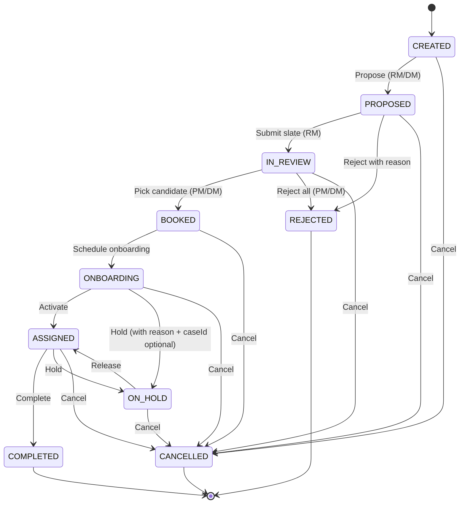
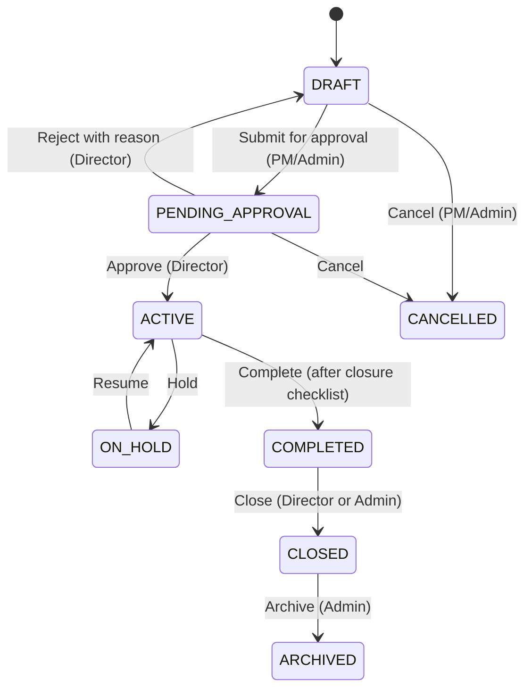
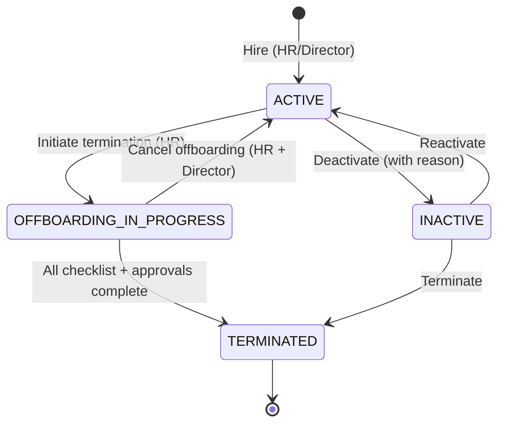
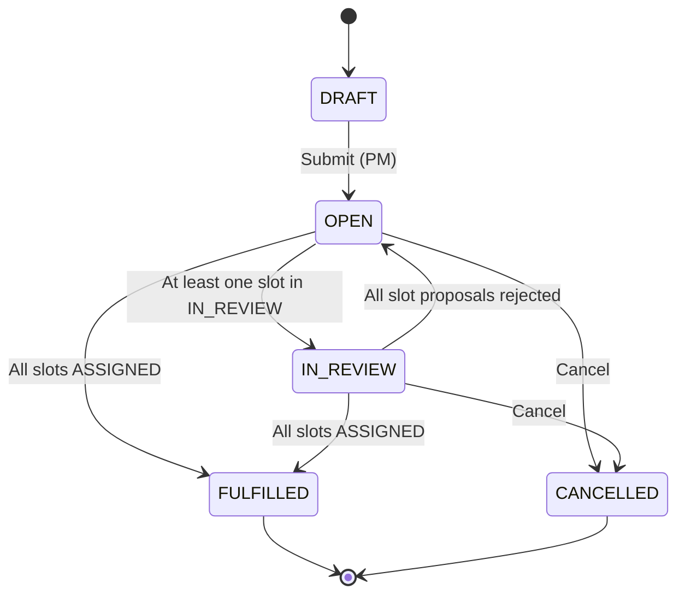

# DeliveryCentral — Phase HARDEN

**A Claude-Code-ready hardening brief for the next iteration.**

- Repo: `viktordrukker/DeliveryCentral`
- Stage: `https://deliverit-test.agentic.uz` (corrected from `deliveryit-test` — see Discrepancy D-01 + D-22)
- Scope: harden People · Staffing · Project Monitoring · Cost & Utilization, then graduate Supply & Demand from "shipped" to "trustworthy"
- Authored by: deep-recon synthesis of repo @ `main` + benchmark study of Float / Runn / Resource Guru / Kantata / OpenAir
- Format: drop into VSCode → hand to Claude Code → execute task by task in numbered order

---

## 0. How to use this document (for the VSCode agent)

This brief is structured so you can:

1. Read **§1 Context Snapshot** to anchor the codebase mental model.
2. Read **§2 Discrepancy Register**. **DO NOT begin implementation until §2.X items are verified or remediated.** Several "done" items in `MASTER_TRACKER.md` are at risk of drift.
3. Pick the next task from **§9 Roadmap**, then jump to its detailed spec in §3–§8.
4. For each task you implement, follow the **Definition of Done** template in §10.
5. After each sub-phase, update `docs/planning/MASTER_TRACKER.md` and `docs/planning/current-state.md` per the rules in `CLAUDE.md` §6.

**Operating constraints baked in (from `CLAUDE.md` and `.claude/rules/ux-laws.md`):**

- ≤3 clicks for any core action (UX Law 1).
- No dead-end screens (UX Law 2).
- Filters persist via URL (UX Law 5).
- Action-data adjacency <200px (UX Law 4).
- Every KPI is a clickable drilldown (UX Law 9).
- All persistent data must be Prisma-backed; no new in-memory stores for persistent data (CLAUDE.md pitfall #11).
- All destructive actions go through `ConfirmDialog`, never `window.confirm()` (pitfall #4).
- All status colors via `var(--color-status-*)` tokens, never raw hex (pitfall #16).
- Backend types must compile clean (`tsc --project tsconfig.build.json --noEmit`); frontend `npm --prefix frontend run test` must stay green.
- Use Docker for everything local; never run npm on host (pitfall #12).

---

## 1. Context Snapshot

### 1.1 What's already shipped (do not re-build)

| Domain | Capability | Where it lives |
|---|---|---|
| Auth & RBAC | 8 roles (admin, director, hr_manager, resource_manager, project_manager, delivery_manager, employee + dual roles), JWT+refresh, impersonation, route manifest | `src/modules/identity-access/`, `frontend/src/app/route-manifest.ts`, `frontend/src/app/auth-context.tsx` |
| People | Person CRUD, hire/terminate/deactivate, reporting lines (effective-dated), org units, resource pools, manager scope, M365 + RADIUS reconciliation, EmployeeActivityEvent feed (Phase 19), PulseEntry mood, PersonSkill (proficiency 1-5 + certified) | `src/modules/organization/`, `src/modules/integrations/m365/`, `src/modules/integrations/radius/`, `src/modules/pulse/`, `src/modules/skills/` |
| Staffing | 9-state canonical workflow (`CREATED → PROPOSED → IN_REVIEW → BOOKED → ONBOARDING → ASSIGNED → COMPLETED` plus `REJECTED`/`CANCELLED`/`ON_HOLD`), state machine `ASSIGNMENT_STATUS_TRANSITIONS`, multi-candidate proposal slate, Director-approval threshold, SLA timers, breach sweep, 6 notification events, ApprovalQueue page | `src/modules/assignments/`, `src/modules/staffing-requests/`, `src/modules/staffing-desk/`, `frontend/src/routes/assignments/ApprovalQueuePage.tsx` |
| Project Monitoring | Project lifecycle (`DRAFT/ACTIVE/ON_HOLD/CLOSED/COMPLETED/ARCHIVED`), Project Radiator v1 (16-axis PMBOK radar with override + audit), milestones, change requests, RAG snapshots, risk register, vendor engagements, threshold config, PDF/PPTX export | `src/modules/project-registry/`, `frontend/src/routes/projects/` (RadiatorTab, MilestonesTab, ChangeRequestsTab), `PortfolioRadiatorPage`, admin `RadiatorThresholdsPage` |
| Cost & Utilization | ProjectBudget with EVM (`earnedValue`, `actualCost`, `plannedToDate`, `eac`, `capexCorrectPct`), PersonCostRate (effective-dated, multi-currency), BudgetApproval, baseline vs actual rollups, burn/run rate, utilization metrics on dashboards | `src/modules/financial-governance/`, `src/modules/workload/`, `frontend/src/routes/dashboard/PlannedVsActualPage.tsx` |
| Time | TimesheetWeek + TimesheetEntry, PeriodLock (Finance lock), self-approval prevention, missing-timesheet alerts, leave + overtime + public holiday | `src/modules/timesheets/`, `src/modules/leave-requests/`, `src/modules/overtime/` |
| Supply & Demand | "Distribution Studio" overhaul: strategy solver, min-skill tuning, two-tier fallback with chain/follow-on staffing, multi-week coverage expansion, server-persisted scenarios, unified status/priority filters, HC-level diagnostics, legend-aligned cell colors | `frontend/src/routes/staffing-board/`, `frontend/src/features/planner/`, `src/modules/staffing-desk/` |
| Foundations | OutboxEvent + DomainEvent table (DM-7), AuditLog (Prisma-backed), InAppNotification + bell + SSE stream, NotificationTemplate/Channel/Request/Delivery, MetadataDictionary + CustomFieldDefinition + WorkflowDefinition + EntityLayoutDefinition, PlatformSetting (admin-tunable), Tenant + tenantId on 15 aggregates + scaffolded RLS | various; see `src/modules/audit-observability/`, `src/modules/notifications/`, `src/modules/customization-metadata/`, `src/modules/platform-settings/` |
| Quality gates | `npm run verify:pr` runs lint + architecture (dependency-cruiser) + contracts + tokens + schema + migrations + enum + publicid + tests fast + frontend tests; `verify:full` adds DB tests + slow tests + Playwright | `package.json`, `scripts/check-*.cjs` |

### 1.2 What's named in the brief but already substantially exists

The user's brief enumerates capabilities that **largely already ship** — your job is to harden, fill specific gaps, and make UX <3 clicks, not rebuild:

- **People → Add Employee, Resource Manager assignment, basic skillset, SPC, M365 integration, photo, contract, mood/timesheet/assignment monitoring, release** → infra exists; gaps are in (a) the "Add Employee" UX wizard, (b) Resource Manager as a first-class assignable role on Person, (c) contract fields, (d) "rate stale" / "contract expiring" alerts.
- **Staffing → request → proposal → follow-up → selection → case mgmt → booking → onboarding → assigned → completed** → fully shipped (Phase CSW + WO-1/2/3); gaps are in (a) StaffingRequestDetailPage redesign (WO-4.12), (b) RM/PM/DM/Director dashboard tiles (WO-4.14/15), (c) cutover/migration of legacy code paths (WO-6).
- **Project Monitoring → creation, status reporting, schedule/budget/resource/vendor, time reporting** → shipped (Project Radiator v1 + EVM); gaps are in (a) Director-approval gate on project activation (a `PENDING_APPROVAL` status missing from `ProjectStatus`), (b) automated rollups beyond the radiator scoring cache, (c) vendor SLA tracking surfaces.
- **Cost Utilization → overall, project-based, baseline vs actual** → EVM columns exist; gaps are in (a) margin computation that distinguishes cost rate from bill rate (today `PersonCostRateType` enum has only `INTERNAL` — see D-09), (b) project-level margin dashboard, (c) burn-rate alerting wired to notifications.
- **Supply & Demand planning** → already shipped (Phase 13 + Phase D + Distribution Studio overhaul); gap is **trust** — the existing planner needs (a) heatmap density/zoom polish, (b) demand pipeline view, (c) scenario apply/discard observability, (d) drag-to-assign in ≤2 clicks per Float/Resource Guru pattern.

### 1.3 What's pending in the tracker (highest signal)

| Phase | Status | Key remaining items |
|---|---|---|
| Phase 19 | 9/10 | **19-10** tests for activity feed |
| Phase 20c | 2/18 | **20c-01** boundary violations, **20c-02** LeaveRequestRepository, **20c-03** rename in-memory-staffing-request, **20c-05** add `$transaction()` to multi-step ops (CRITICAL), **20c-06** split AuthService god, **20c-09** DTOs for 25+ inline `@Body()`, **20c-10** typed Gateway generics, **20c-12** pagination on unbounded findMany, **20c-15** split god dashboard pages |
| Phase 21 | 0/11 (Sprint A 1/N done) | F2 notification preferences, F9 nudge, F11/F15 undo register/consume, F3 export gap-fill, full Sprint A-D backlog |
| Phase WO | ~80% | **WO-4.12** StaffingRequestDetailPage redesign, **WO-4.14** RM/PM/DM dashboard tiles, **WO-4.15** Director dashboard tiles, **WO-5.5-8** observability + docs, **WO-6** migration + cutover |
| Phase DM | 91 mig | DM-2.5 publicId 8 more aggregates, DM-3 Phase 2 blocked, DM-7-5 caller migration, DM-7.5 NOT NULL flip + two-tenant seed, DM-8-1b/2/5 cutover |
| Phase DS | in flight | DS-2-5 inline-panel drawer migration, DS-3 form molecules, DS-4 DataView, DS-5 layouts, DS-6 docs, DS-7 enforcement |
| Phase CC | 0/5 deferred | CC-9, CC-10, CC-11, CC-12 (144 ResponsiveContainer structural fix), CC-13 |
| Phase 17 | ✅ | (release gates) |
| Phase 18 | ✅ | (page grammars) |

---

## 2. Discrepancy Register (READ FIRST)

These are concrete inconsistencies between (a) the user's brief, (b) the live stage, (c) repo docs, and (d) repo code. **Each must be resolved or risk-accepted before the affected work begins.**

| ID | Category | Discrepancy | Evidence | Recommended action |
|---|---|---|---|---|
| **D-01** | Credentials | User-provided creds `admin@delivery.local / wewffikp2026` returned **"Invalid credentials"** on the live login (verified by automated attempt 2026-05-02). CLAUDE.md it-company seed has `admin@deliverycentral.local / DeliveryCentral@Admin1`. Owner is logging in manually to verify. | live login attempt 2026-05-02 | After owner provides verified creds, document them out-of-repo (1Password vault or equivalent). Add a verifier to `scripts/verify-seed.cjs` that asserts the live admin email exists at boot. |
| **D-02** | Backend health | `PublicIdBootstrapService` cannot resolve `PublicIdService` (DI failure) → backend container is unhealthy → frontend can't start (`depends_on: service_healthy`). | `current-state.md` (2026-04-18 PM note); `docs/testing/qa-handoff-2026-04-18.md` §8a | **Phase 0 task**: fix DI registration in `PublicIdModule`. Without this, no integration test can run, and "build never fails" cannot be guaranteed. |
| **D-03** | Schema drift | `prisma/schema.prisma` was reverted in some session — `AssignmentStatus` enum was rolled back to pre-CSW values (`CREATED/PROPOSED/BOOKED`), surgically restored from HEAD, but ~1,120 lines of diff remain unaudited. | `current-state.md` 2026-04-18 PM | Run `git diff origin/main -- prisma/schema.prisma` and audit every block. Compare against the canonical 9-status workflow in `docs/planning/canonical-staffing-workflow.md`. |
| **D-04** | Workflow cutover | Phase WO-6 (migration + cutover) is entirely pending. Old approve/reject/end/revoke/activate services were "updated" to use canonical literals, but legacy controller endpoints likely still exist alongside the 9 new transition endpoints (`/propose /reject /book /onboarding /assign /hold /release /complete /cancel`). | `MASTER_TRACKER.md` Phase CSW + Phase WO-6 | Audit `frontend/src/lib/api/assignments.ts` and `src/modules/assignments/presentation/` for dual paths. Either remove legacy endpoints or document them as deprecated with sunset date. Add a deprecation header (`Deprecation: true; Sunset: <date>`) on legacy paths. |
| **D-05** | Tests claimed ≠ tests written | Phase 19-10 (tests for activity feed API + component + modal flow) is unchecked while 19-01..09 are checked. CSW phase declares "10 backend test files + 4 frontend test files migrated" but no spec file count is given. | `MASTER_TRACKER.md` Phase 19, Phase CSW | Run `npm run test:fast` and `npm --prefix frontend run test`. Capture failing/skipped counts. **If anything is `it.skip` with TODO**, surface in §10 and either fix or add to deferred-items register. |
| **D-06** | Multi-tenancy half-shipped | DM-7.5 is 6/8: tenantId column added to 15 aggregates, RLS policies scaffolded, resolver middleware scaffolded, but `NOT NULL` flip + two-tenant seed + enablement are pending. Reads via Prisma may bypass RLS if middleware isn't wired. | `MASTER_TRACKER.md` Phase DM-7.5 | Tenant-aware queries should be **off** in single-tenant mode by default behind a `TENANT_RLS_ENABLED=false` flag. Document this state explicitly in `docs/architecture/`. Do not assume isolation is enforced. |
| **D-07** | publicId rollout half-shipped | DM-2.5 is 2/10 aggregates (Skill + StaffingRequest). 47 controllers still leak raw UUIDs (controller-uuid-leak baseline 47). Both `id` (UUID) and `publicId` are emitted in DTOs as a transitional measure, but only some endpoints accept `pub_…` IDs. | `MASTER_TRACKER.md` Phase DM-2.5 | Document the contract: which endpoints accept publicId vs UUID-only. Use the transitional `ParsePublicIdOrUuid` pipe in any new endpoint. Don't extend further endpoints that leak UUIDs without a paired publicId. |
| **D-08** | Skills double-truth | `Person.skillsets String[]` (legacy free-text array) coexists with `PersonSkill` join (new typed model with proficiency + certified). Reads/writes may go to either depending on caller. | `prisma/schema.prisma` line 249 + line 1547 | Make `Person.skillsets` **read-only** (mark `@deprecated` in TS, stop writing new values). Backfill from `PersonSkill` in a migration. Plan its drop in DM-6b-1 follow-up. |
| **D-09** | No bill rate vs cost rate distinction | `PersonCostRateType` enum has only one value: `INTERNAL`. There is no field for **bill rate** (what we charge clients for this person). Project margin math is therefore impossible from the data alone. | `prisma/schema.prisma` line 1973–1975 | **Add bill-rate-per-project** at the assignment level (see §7.2-G2). Do NOT add a second column on Person — bill rate varies by project/role/client. The existing `PersonCostRate.rateType` stays as cost-only. |
| **D-10** | Project tags / techStack double-truth | `Project.tags String[]` coexists with `ProjectTag` join; `Project.techStack String[]` coexists with `ProjectTechnology` join. | `prisma/schema.prisma` lines 585–586 + 622, 2131, 2144 | Same pattern as D-08. Mark string-array columns deprecated, route reads through join, plan removal. |
| **D-11** | StaffingRequest derived status drift | `StaffingRequest.status` (DB column) coexists with `DeriveStaffingRequestStatusService` (computed from per-slot assignments). They can disagree. | `MASTER_TRACKER.md` Phase CSW (g) + `prisma/schema.prisma` line 1595 | Either (a) make the DB column a write-through cache of the derived status, or (b) drop the column and serve only derived. Decide before building any UI that branches on it. |
| **D-12** | No project approval gate | User asks "Project creation — Project Manager, Director approves." `ProjectStatus` has no `PENDING_APPROVAL`. There's `BudgetApproval` for budgets, but project activation has no Director gate. | `prisma/schema.prisma` line 51 | Add a `PENDING_APPROVAL` state OR introduce `ProjectActivationApproval` table mirroring `BudgetApproval`. See §6.2-G1. |
| **D-13** | Resource Manager not first-class on Person | User wants RM assigned at hire and notified. `Person` has no `resourceManagerId`. Current implicit RM = manager-of-managers via reporting line, OR resource pool membership. | `prisma/schema.prisma` line 238–298 | Add `Person.resourceManagerId String? @db.Uuid` and a derivation rule (default = pool's RM owner). Wire notify on hire. See §4.2-G3. |
| **D-14** | Contract fields missing | User asks for "contract length." `Person` has no `employmentType`, `contractEndsOn`, `contractType`. | `prisma/schema.prisma` line 238–298 | Add `employmentType` enum (FTE/CONTRACTOR/INTERN/VENDOR), `contractStartsOn DateTime? @db.Date`, `contractEndsOn DateTime? @db.Date`. Add a daily sweep that emits a "contract expiring in 30/14/7 days" notification. |
| **D-15** | Photo not first-class on Person | Avatar/photo lives in `PersonExternalIdentityLink` (M365) — pull-only. No first-class `photoUrl` on Person, no upload path for non-M365 users. | `prisma/schema.prisma` line 238–298 + 313 | Add `Person.photoUrl String?` (S3-style URL or data URL for small avatars). Source priority: explicit upload > M365 cached > initials placeholder. |
| **D-16** | Self-approval guards exist for assignment + timesheet but not for case approval | `ApproveCaseService` exists (Phase 20b-07) but no documented `actorId !== subject` guard. | inferred from `MASTER_TRACKER.md` Phase 20b-07 entry | Audit `src/modules/case-management/application/approve-case.service.ts`; add the same guard pattern as in `approve-project-assignment.service.ts`. |
| **D-17** | Admin-tunable PlatformSettings spread across docs | `assignment.directorApproval.allocationPercentMin`, `assignment.sla.*`, `assignment.slo.*`, `staffing.slate.*` etc. are seeded but no central catalog page exists for an admin to discover them. | `MASTER_TRACKER.md` Phase WO-1.7 + WO-5 | Build the catalog as **§Appendix B** of this brief; surface via the Admin → Assignment Workflow panel (already exists for assignment.* — extend pattern to people.* and project.*). |
| **D-18** | "Mood monitoring" claimed but no aggregation surface | `PulseEntry` exists, weekly per person; widget on EmployeeDashboard. No team / org rollup, no manager alerting on declining trend. | `prisma/schema.prisma` line 1430 + Phase 9 | Add weekly mood rollup endpoint + manager alert on 3-week trailing decline. See §4.2-G7. |
| **D-19** | Time reporting alerts incomplete | Notifications include assignment events but per `MASTER_TRACKER.md` 20b-10, "no notifications for: assignment activated, assignment amended, project staffed, employee deactivated, case approved/rejected, **timesheet locked**, leave request denied" — though 20b-10 is checked, the wording is ambiguous about which events were actually wired. | Phase 20b-10 line in tracker | Verify via `grep -r "notify" src/modules/timesheets/` and `grep -r "in-app-notifications" src/modules/`. List actual events in §Appendix C. |
| **D-20** | UI says "Coming soon" in places per CLAUDE.md pitfall #14 | Project detail page has no CTA to approve work hours. "Resolve" action from Planned vs Actual cannot lead to an approval flow on project detail. | `CLAUDE.md` §8 pitfall #14 | Remediate by adding work-hour approval CTA to `ProjectDetailsPlaceholderPage.tsx`. Track as P&M-04. |
| **D-21** | StaffingRequestStatus has only 5 values; the user's "9 stages" map to the assignment, not the request | User brief lists request → proposal → follow-up → selection → case → booking → onboarding → assigned → completed. Repo: `StaffingRequest.status ∈ {DRAFT,OPEN,IN_REVIEW,FULFILLED,CANCELLED}` (request-level); the 9-stage detail lives on the per-slot `ProjectAssignment.status`. | `prisma/schema.prisma` lines 1566 + 129 | This is correct architecture — but UI must display **both** the request-level rollup and per-slot detail. Document the mapping in `docs/planning/canonical-staffing-workflow.md` and on `StaffingRequestDetailPage`. (Aligns with WO-4.12.) |
| **D-22** | Live URL typo | Brief originally tried `deliveryit-test.agentic.uz` (typo) — actual URL is `deliverit-test.agentic.uz`. Verified via owner. | owner clarification 2026-05-02 | Use `deliverit-test.agentic.uz`. Sandboxed automated lookup originally failed because of the typo; live walk now possible. |
| **D-23** | Frontend uses MUI v7 + custom CSS variables, NOT Tailwind/shadcn — beware of generic spec advice | The benchmark report and external best-practice docs may suggest shadcn/Tailwind patterns. The repo has hard rules: MUI + custom CSS variables only. | `CLAUDE_CODE_TASK_BACKLOG.md` Phase 0 + `CLAUDE.md` §4 | Every new component must use existing primitives (`DataTable`, `StatusBadge`, `SectionCard`, `WorkflowStages`, etc.) and design tokens. No new dependencies without explicit approval. |
| **D-24** | Six "in-memory" services exist by name; some really use Prisma underneath | `in-memory-staffing-request.service.ts` has 40+ Prisma calls (per Phase 20c-03). Naming is misleading; agents searching for "real" services may pick wrong file. | Phase 20c-03 | Rename then update imports. Required as a precondition for §5 staffing tasks. |
| **D-25** | Phase DS deferred-items register documents UX semantic risks | DS-2-5 says 2/4 drawers can't be migrated to `<Drawer>` because they're inline sidebar panels (no backdrop). Migrating is a UX semantic change. | `MASTER_TRACKER.md` Phase DS-2-5 | Do NOT migrate org sidebar drawers as part of any task in this brief; defer to dedicated DS-5 work. |
| **D-26** | Live recon: CLAUDE.md is stale about admin email | Live admin panel shows `admin@delivery.local` is the seeded admin (matches user's creds). CLAUDE.md says `admin@deliverycentral.local`. | live walk 2026-05-02 (Admin → Admin Panel) | Update CLAUDE.md §10 IT-Company test accounts table with the live values. Add a Phase 0 task to refresh `CLAUDE.md` and `current-state.md` against the actual `it-company` seed output. |
| **D-27** | Live recon: stale breadcrumbs across navigation | Breadcrumb strip appends visited sections instead of reflecting current path. Example: `WORKLOAD OVERVIEW > PEOPLE > NEW ADMIN > STAFFING DESK > APPROVAL QUEUE > DIRECTOR DASHBOARD > Projects` after a normal click-through. | live walk 2026-05-02 | New task **FE-FOUND-01**: rewrite `Breadcrumb` to derive from the current route + a per-route ancestor manifest, not from session history. Add E2E spec asserting clean breadcrumb after deep navigation. |
| **D-28** | Live recon: Create Employee page header copy is wrong | Page title says **"New Admin"** (instead of "New Employee"). Subtitle says "Consolidated operator-facing control surface for configuration and platform settings" (copy from a different page — likely an admin shell). | live walk 2026-05-02 (`/admin/people/new`) | New task **FE-FOUND-02**: fix title + subtitle on `AdminPeopleNewPage.tsx`. Likely 2-line fix; add a snapshot test on titlebar copy per page. |
| **D-29** | Live recon: date inputs render in Russian locale | "Hire Date" placeholder shows `ДД.ММ.ГГГГ` regardless of user/browser locale. | live walk 2026-05-02 | New task **FE-FOUND-03**: explicit locale wiring on date pickers — read tenant locale from `PlatformSetting locale.default` (default `en-US`) and override per-user via Account Settings. |
| **D-30** | Live recon: Create Employee form still writes legacy `Person.skillsets` | The form has a "Skillsets" checkbox section that maps to legacy `Person.skillsets String[]` (not `PersonSkill` rows). Confirms D-08 is currently **active in production code paths** — not just historical residue. | live walk 2026-05-02 | P-04 task is now URGENT (was MEDIUM). Move it from Sprint 1 to Sprint 0 prerequisite, OR add a write-block: refuse to set `Person.skillsets` from the form and route writes to `PersonSkill`. |
| **D-31** | Live recon: Create Employee form is missing the fields the user named | No fields visible for: Resource Manager, Employment Type, Contract End Date, Photo, SPC/cost rate. Confirms G3 / G5 / G6 / D-13 / D-14 / D-15 are all real gaps. | live walk 2026-05-02 | All scoped under P-01 + P-02 (no change). |
| **D-32** | Live recon: Approval Queue exists but SLA columns are empty for live data | `/assignments/queue` has 1 PROPOSED assignment with SLA Stage `—` and Due In `—`. Either (a) SLA service is OFF for the running env (`flag.assignmentSlaSweepEnabled=false`?), or (b) SLA fields are not being set on the PROPOSED → IN_REVIEW transition. | live walk 2026-05-02 (`/assignments/queue`) | Phase 0 task: query `SELECT id, status, slaStage, slaDueAt, slaBreachedAt FROM "ProjectAssignment" WHERE status IN ('PROPOSED','IN_REVIEW','BOOKED','ONBOARDING')` and confirm whether the SLA write path is silently broken. If broken: high-severity bug. |
| **D-33** | Live recon: Director Dashboard missing all WO-4.15 + C-07 tiles | Confirmed in live: no Director-approvals tile, no 24h SLA breach tile, no time-to-fill sparkline, no portfolio P&L. Only Health Distribution shows (and it's 100% green — no signal). | live walk 2026-05-02 (`/dashboard/director`) | Sprint 2 (S-03) and Sprint 5 (C-07) priorities confirmed. |
| **D-34** | Live recon: Staffing Desk shows -165 surplus (more supply than demand) and 0 open demand | Demand pipeline is empty in the live `it-company` seed. S&D flow validation will be limited unless demand is seeded. | live walk 2026-05-02 (`/staffing-desk`) | Add Phase 0 task: extend `prisma/seeds/it-company-dataset.ts` with 8-12 open StaffingRequests (mixed roles, urgencies, mostly DRAFT/OPEN with 2-3 in IN_REVIEW). |
| **D-35** | Live recon: Project list has empty Client column for all projects | All 20+ projects show `—` for Client. Yet `Client` model exists and `Project.clientId` is on the schema. Suggests seed never sets clients. | live walk 2026-05-02 (`/projects`) | Add to Phase 0 seed extension (D-34): seed 4-6 Clients and assign `clientId` to all active projects. C-01 RateCard CLIENT scope cannot be tested without this. |
| **D-36** | Live recon: grades are G1-G10 (not P1-P5) | Live row shows `G8` for grade. J8 banding decision (P1-P5) needs to map to the actual seed grade dictionary, OR the dictionary needs to flip to P1-P5 (preferred per J8 alignment). | live walk 2026-05-02 (`/staffing-desk` table) | Decision needed — see Open Question OQ-Live-1 below. Default suggestion: keep grade dictionary as G1-G10 internally; introduce a separate **band** column (P1-P5) on `Person`, derived from grade via a configurable mapping in `PlatformSetting compensation.banding.gradeToBandMap`. |
| **D-37** | Live recon: Onboarding "Getting started" widget is hardcoded, not interactive tour | Workload Overview shows "Getting started (3/4)" with hardcoded checks: Create Pool / Add Project / Invite People / File Staffing Request. This is NOT a role-aware interactive tour — it's a one-time static checklist for the admin role. | live walk 2026-05-02 (`/`) | DOC-03 (interactive tour) is additive on top, not a replacement. Document the existing widget as the "first-mile setup checklist" and keep it; tour is the per-role onboarding overlay. |
| **D-38** | Live recon: only 7 distinct roles visible in admin (not 8) | Admin → Create Local Account lists `admin, delivery_manager, project_manager, resource_manager, hr_manager, director, employee` = 7 roles. The "8 roles" framing in CLAUDE.md / docs counts dual-role (RM+HR) as separate. | live walk 2026-05-02 (`/admin`) | Documentation correction: "7 base roles + multi-role assignment" is the accurate framing. Update Appendix D + brief language. |
| **D-39** | Live recon: session timeout is aggressive | Session expired during a deep walk after ~10 minutes of moderate activity (form fills, navigations, JS exec); landed back on `/login`. JWT TTL likely <15 min with no idle-extend. | live walk 2026-05-02 | Verify JWT access TTL + refresh policy. Suggest: access 30 min, refresh 8h, idle-refresh on user activity. Add to PlatformSetting `auth.session.idleTimeoutMinutes`, `auth.session.absoluteTimeoutHours`. Document in `docs/security/sessions.md`. |
| **D-40** | Live recon: form data lost on session timeout | When session expires mid-form-fill (Create Employee), the redirect to `/login` discards all typed input. Re-login lands on the dashboard, not back on the form. | live walk 2026-05-02 | New task **FE-FOUND-04**: persist in-flight form drafts to `sessionStorage` keyed by `(personId, route, formId)`; restore on re-auth and on accidental navigation away. Show "Restore draft?" CTA on form mount when draft exists. Violates UX Law 3 today. |
| **D-41** | Live recon: grade dictionary in seed is `G7..G15`-style "Junior/Mid/Senior" | Form Grade dropdown first option = `G7 — Junior`. Confirms grades like G7, G8, G9, etc. — NOT G1-G10 as I'd inferred earlier. The actual range needs full enumeration. | live walk 2026-05-02 | Update D-36 + Appendix B `compensation.banding.gradeToBandMap` defaults to use G7..G15 (or whatever the full live range is). Phase 0 task: dump the full grade dictionary and document it. |
| **D-42** | Live recon: Line Manager dropdown loads ALL 202 people | The Line Manager `<select>` has 202 options. No type-ahead; native dropdown. With even modest scale this is unusable. | live walk 2026-05-02 (Create Employee form) | New task **FE-FOUND-05**: replace native `<select>` with the existing `PersonSelect` (cmdk-style search) component. Same swap on every Line Manager / Resource Manager / approver picker. Already a known DS pattern (`@/components/common/PersonSelect`). |
| **D-43** | Live recon: Org Unit dropdown shows 13 options without parent hierarchy | "Backend Department (DEP-BE)", etc. Flat list, no tree, no department-grouping. Hard to find correct unit in a real org. | live walk 2026-05-02 | New task **FE-FOUND-06**: replace flat OrgUnit `<select>` with a tree-aware picker (existing `frontend/src/components/org/` likely has primitives; if not, render the org chart in a popover). |

### Discrepancies from deep workflow walks (2026-05-02 round 2)

The first walk sampled landing pages; this round actually exercised create/assign/approve/lifecycle flows end-to-end. Findings are weightier than read-only inspection.

| ID | Source workflow | Discrepancy / behavior | Severity | Recommended action |
|---|---|---|---|---|
| **D-44** | Create Employee · ConfirmDialog | Confirm copy says "This will permanently create a new employee record. The action cannot be undone." But employees ARE deactivatable + terminatable + reactivatable. Copy is misleading and inconsistent with reality. | LOW | Update text to "Create employee `{name}` in `{org unit}`?" with subtext "You can deactivate or terminate later." Also: standardize `ConfirmDialog.bodyTone` to neutral for non-destructive actions. |
| **D-45** | Create Employee · Person 360 | Newly created employee shows "Inactive" lifecycle status + "Already inactive" CTA. Verified the DB record is actually ACTIVE (filtered Inactive list shows 0 people; total grew from 201 → 202 in Active filter). The Person 360 page **mis-derives** status. | HIGH | Person 360 status derivation bug. Investigate `frontend/src/features/people/usePersonHeader.ts` (or equivalent). Likely reading `terminatedAt` presence vs `employmentStatus` mismatch. |
| **D-46** | Create Employee · Skills | Form has "Skillsets" checkbox group (Frontend/Backend/Data/DevOps — broad categories) — confirmed-checked Frontend on submit. **Skills tab on Person 360 shows "No skills recorded"**. Edit Skills uses a different vocabulary (25 specific skills like React/Java/AWS — modern `PersonSkill` rows). The form writes to legacy `Person.skillsets String[]` but the read paths only consume `PersonSkill`. Two systems with different vocabularies = silent data loss. | CRITICAL | P-04 (skills consolidation) needs to also REPLACE the form's checkbox UI with a real `PersonSkill` picker. AND: vocabularies must be reconciled (categories ↔ specific skills mapping, OR drop categories entirely). |
| **D-47** | Create Employee · History tab | Brand-new Person 360 → History tab shows "Lifecycle Activity: No activity" + "Change History: No audit events recorded yet." Phase 19-02 (`Emit activity events from existing services: ... person create`) is checked off in tracker but is **broken in production**. No `EmployeeActivityEvent.HIRED` row, no `AuditLog` row. | CRITICAL | Phase 19-02 audit. Likely the form posts to a different endpoint (admin shortcut path) that bypasses `CreateEmployeeService.execute` → `EmployeeActivityService.emit`. Trace endpoint, ensure event emission. |
| **D-48** | People list · URL filters | Loading `/people?q=walker` does NOT populate the search input (input shows blank, list shows full). But `/people?lifecycleStatus=INACTIVE` DOES populate the Status dropdown. Filter URL persistence is **partial** — works for some params, not others. | HIGH | Phase 20g filters — audit which filter params actually round-trip. Likely `useFilterParams` only wires the lifecycleStatus, not q. Fix or document as known partial. |
| **D-49** | People list · INACTIVE filter | Filter by Inactive shows "0 filtered people" — yet Person 360 of new employee says "Inactive". Data-vs-display contradiction confirms D-45 is a UI bug, not a backend bug. | HIGH | Same fix as D-45. |
| **D-50** | Create Project · post-submit | After successful project create (banner: "Created project Test E2E Project in DRAFT.") the form is **reset and stays on the same page**. No redirect to the new project, no "View Project" CTA on the success banner. UX Law 3 violation (context loss). | HIGH | After create, redirect to `/projects/:id` OR show a sticky banner with `[View project] [Create another]` CTAs. |
| **D-51** | Create Project · subtitle | Subtitle on `/projects/new` is "Internal project registry and external links." (the People list subtitle pattern). All wizard steps inherit a wrong subtitle. | LOW | Page-specific subtitles. Tied to D-28 / D-37. |
| **D-52** | Create Project · code generation | New project gets code `PRJ-F9CF0C18` (random hash format). Seed projects use `IT-PROJ-001` (sequential prefix-numeric). Two distinct conventions in one DB. | MED | Decide: human-readable sequential vs random hash. Suggest `IT-PROJ-{nextNum}` for everything; document convention; backfill new ones. Update `prisma/seed.ts` and `CreateProjectService` to share a `ProjectCodeGenerator`. |
| **D-53** | Create Project · priority | Step 2 dropdown set to **HIGH**, saved to DB as **MEDIUM**. Verified on the projects list (Test E2E Project shows priority MEDIUM). Silent value drop. | HIGH | Verify form payload + service mapping. Likely the `<select>` value vs DTO field name mismatch. Add a payload-roundtrip test. |
| **D-54** | Project Detail · KPI vs Pulse contradiction | KPI strip says **GREEN** (Overall RAG); Project Pulse panel says **25/100 (Red)**. Same project, same screen, two contradictory verdicts. | CRITICAL | Decide: which is the source of truth? RAG snapshot vs Radiator overall. Reconcile in `useProjectDashboard.ts`; remove duplication; show one verdict + breakdown. |
| **D-55** | Project Detail · cold-start | Brand-new DRAFT with no team / no budget / no milestones / no risks scores **34/100 Red** on the radiator. Score is computed from defaults rather than reflecting "no data yet." | HIGH | Update `ProjectRadiatorScorerService` to return `{ score: null, reason: 'INSUFFICIENT_DATA' }` when project lacks the prerequisites for each axis. Render Radiator with "Not enough data yet" placeholder per axis. |
| **D-56** | Projects list · health column | Health column shows the same fake `34` score for the new DRAFT. | HIGH | Same fix as D-55 — render `—` for projects below the data threshold. |
| **D-57** | Project Detail · Activate location | The Activate button is on the Lifecycle tab only — not visible on the main Radiator tab. Discoverability issue. | LOW | Surface a state-aware primary CTA in the page title bar (matches WO-4.13 pattern for assignments). |
| **D-58** | Project Detail · activate UX | Single-click activation, no `ConfirmDialog`. Inconsistent with Create Employee which DID confirm a non-destructive create. | MED | Standardize: state-changing transitions get a `ConfirmDialog`. Add to `ds:check` rule. |
| **D-59** | Project Detail · audit silence | After Activate succeeded ("Project Test E2E Project activated."), Project Lifecycle tab still says "No lifecycle events recorded yet" + "Full Change History: No audit events recorded yet." Activate also bypasses event/audit emission. Same root cause family as D-47. | CRITICAL | Inspect `ActivateProjectService`. Ensure it writes `OutboxEvent` + `AuditLog` rows. Likely the entire create/activate code path skips the cross-cutting concerns. |
| **D-60** | Subtitle leak across pages | Multiple pages keep showing the subtitle of the page the user came from (Workload Overview's "Primary dashboard entry point.", People's subtitle, etc.). Confirms D-28 pattern is widespread. | MED | Per-route subtitle in `useTitleBarActions` or remove subtitle when none defined. |
| **D-61** | Activate Project | No `ConfirmDialog` on Activate (covered by D-58). | — | — |
| **D-62** | Activate Project | No Director-approval gate (refines D-12 / G31 / PM-01). The gap is on `DRAFT → ACTIVE`, not on Create. | HIGH | PM-01 spec already updated for this. |
| **D-63** | Activate Project · audit | No event row (D-59). | — | — |
| **D-64** | UX consistency | Create Project = 3-step wizard with great helper text + live preview. Create Staffing Request = single page with helper text + live preview panel + skill catalog picker. **Create Employee = single page with no helper text, no preview, broken skill input.** Three different patterns inside one product. | HIGH | P-02 (employee wizard) elevated; align all create flows on the same primitives (stepper, helper text, preview, catalog picker). Consider `<CreateFlowShell>` DS molecule. |
| **D-65** | Staffing Request form · "Candidate is known" | Checkbox auto-elevates the named person to rank #1 in the proposal slate. Excellent UX but this convention is undocumented in the brief. | LOW | Add to S-02 spec as a default behavior; note in canonical-staffing-workflow.md. |
| **D-66** | Staffing Request form · skill picker | Uses modern `PersonSkill` catalog with the warning copy: "Pick from the catalog. Custom names are not allowed (prevents data drift)." Exemplary UX writing. | LOW | Use this copy as the model for ALL catalog-bound pickers (DOC-07 editorial pass). |
| **D-67** | Staffing Request form · subtitle | Subtitle is "Primary dashboard entry point" (Workload Overview's). Subtitle leak (D-60 family). | LOW | Same fix. |
| **D-68** | Cmd+K · person search | Search "walker" returns "No results". Test E2E Walker exists in `/people` (verified). The palette doesn't search People at all. | HIGH | Wire People into the cmdk palette using the existing `people-search` API. The palette currently only knows pages + projects. |
| **D-69** | Cmd+K · project search | Typing "acme" highlights "Acme" in "Acme Portal" but returns ALL 5 projects unfiltered. The match-highlight runs but the filter doesn't narrow the list. | MED | Filter logic in cmdk `Command.Filter` is pass-through. Switch to a real fuzzy-match filter (cmdk supports this natively). |
| **D-70** | Notification bell | Empty after creating a person, creating a project, AND activating the project. Whole inbox shows "No notifications". The notification fan-out is inactive for these life events. | CRITICAL | Same root cause family as D-47/D-59. Without `OutboxEvent` rows, NotificationEventTranslator never fires, InAppNotification never inserts. Sprint 0 must fix the create/lifecycle event pipeline before any notification work. |
| **D-71** | `?` cheatsheet shortcut | Pressing `?` did not open the cheatsheet (the previously-opened bell dropdown stayed open and Escape didn't close it). Either `?` is not globally bound, or focus is trapped in the dropdown. | MED | Audit the global keymap (likely `frontend/src/app/keyboard-shortcuts.tsx`). Ensure `?` is bound at document level with proper guards. Also: Escape must close any open transient surface (dropdowns, popovers, modals). |
| **D-72** | Planner · cell click is read-only | Clicking a heatmap cell opens a popover with details (Acme Portal: "Week of 04-27 · Supply 555% · Demand 0%" + people list). **No inline edit**. Confirms G50 / SD-02 in the strongest possible way: existing UX is "view only," needs the Float-style 2-click assign to ship. | HIGH | SD-02 (inline cell editor) confirmed required. Spec stays as written. |
| **D-73** | Planner · supply/demand metric | The popover shows "Supply 555%" — meaning the cell aggregates 555% of allocation across multiple people. This is real over-allocation surfaced honestly, but the heatmap colors don't highlight it (cells appear uniformly green). Over-allocation is hidden. | HIGH | SD-09 visual alert indicators must include a per-cell over-allocation badge when `cellSupply > 100%` per person OR aggregate. |
| **D-74** | Breadcrumb · navigation continues to leak | New project creation reset the form but breadcrumb path retained "PEOPLE > PROJECTS > TEST E2E PROJECT > NEW > Staffing Desk" after navigation. Confirms D-27 across many flows. | HIGH | Same fix — derive breadcrumb from current route, not history. |

### Counter-finding (positive)

The repository's better surfaces (Create Project wizard, Create Staffing Request form, Distribution Studio shell, ApprovalQueuePage, AssignmentWorkflowSettings panel) demonstrate the team **already knows how to build the pattern this brief recommends.** The gaps are mostly:

1. **Older surfaces (Create Employee) haven't been migrated to the same patterns.**
2. **Cross-cutting plumbing (event emission, audit logging, notification fan-out) has silently regressed for the create/activate paths** — a deep regression that affects multiple domains at once and is invisible without exercising the workflows.
3. **Two visualization sources for the same data (KPI vs Pulse, Radiator score vs RAG snapshot, Person status vs DB status)** keep producing contradictions.
4. **Cold-start defaults pollute scoring surfaces** (radiator on a brand-new project produces a Red score without any data).

These four families produce most of the new D-items and should drive Sprint 0 priorities ahead of any feature work.

**The first task in §9 Roadmap is "verify all D-items"** — please do not skip. Live findings D-26..D-38 added 2026-05-02.

---

## 3. Cross-cutting foundations to harden

These foundations are touched by every domain section. Get them right once, reuse everywhere.

### 3.1 Transactional integrity (CRITICAL — Phase 20c-05)

**Problem.** Multi-step operations in `assign-project-team`, `terminate-employee`, `create-project-assignment`, plus several upcoming hardening tasks, lack `prisma.$transaction()` wrapping. Partial failures leave inconsistent state (e.g., person terminated but assignments not ended).

**Standard pattern to apply.**

```ts
// Repository port stays the same; service receives a UnitOfWork.
export class TerminateEmployeeService {
  constructor(
    private readonly prisma: PrismaService,
    private readonly people: PersonRepositoryPort,
    private readonly assignments: ProjectAssignmentRepositoryPort,
    private readonly cases: CaseRecordRepositoryPort,
    private readonly outbox: OutboxPort,
    private readonly events: EmployeeActivityEventService,
  ) {}

  async execute(input: TerminateEmployeeInput): Promise<TerminateEmployeeResult> {
    return this.prisma.$transaction(async (tx) => {
      const person = await this.people.findById(input.personId, tx);
      if (!person) throw new NotFoundException();
      if (person.props.terminatedAt) throw new ConflictException('already terminated');

      person.terminate({ at: input.terminatedAt, reason: input.reason, by: input.actorId });
      await this.people.save(person, tx);

      const active = await this.assignments.listActiveByPerson(person.id, tx);
      for (const a of active) {
        a.transitionTo('CANCELLED', { reason: `EMPLOYEE_TERMINATED: ${input.reason ?? ''}`, actorId: input.actorId });
        await this.assignments.save(a, tx);
      }

      await this.cases.openOffboardingIfMissing({ subjectPersonId: person.id, actorId: input.actorId }, tx);
      await this.events.emit(tx, { personId: person.id, type: 'TERMINATED', actorId: input.actorId, summary: ..., relatedEntityId: ... });
      await this.outbox.append(tx, { topic: 'people.lifecycle', eventName: 'employee.terminated', aggregateType: 'PERSON', aggregateId: person.id, payload: ... });
      return { personId: person.id, endedAssignments: active.length };
    });
  }
}
```

**Rules.**

- All repository methods MUST accept an optional `tx: Prisma.TransactionClient` last argument.
- Outbox writes MUST happen inside the same transaction as the state change (transactional outbox pattern); the publisher reads from `OutboxEvent` separately.
- Keep transactions short. If you call >50ms of external I/O, do it OUTSIDE the transaction (compute first, write last).
- Idempotency: every public mutation endpoint accepts `Idempotency-Key: <uuid>` header. Hash the key + actorId + endpoint and store in a small `IdempotencyKey` table (TTL 24h). Re-receiving the same key returns the cached response.

**Tasks.**

- [ ] **F1.1** Make `Prisma.TransactionClient` an optional last param on every repository method (back-compat at boundaries).
- [ ] **F1.2** Wrap `terminate-employee.service.ts`, `create-project-assignment.service.ts`, `assign-project-team`, `propose-slate.service.ts` (slate atomic upsert), `approve-budget.service.ts`, `complete-case-step.service.ts`.
- [ ] **F1.3** Add `IdempotencyKey` model + middleware:

  ```prisma
  model IdempotencyKey {
    id          String   @id @default(uuid()) @db.Uuid
    keyHash     String   @unique @db.VarChar(64)
    actorId     String   @db.Uuid
    endpoint    String   @db.VarChar(120)
    statusCode  Int
    response    Json
    createdAt   DateTime @default(now()) @db.Timestamptz(3)
    expiresAt   DateTime @db.Timestamptz(3)

    @@index([expiresAt])
    @@map("idempotency_keys")
  }
  ```
  Middleware order: `Auth → Tenant → Idempotency → Validation → Handler`.
- [ ] **F1.4** Add `pg_advisory_xact_lock` helper for cross-row invariants (e.g., "no two `BOOKED` assignments for the same person at >100% in the same week").

**Acceptance.** A planted "fault-injection" test (raise after the second mutation in a multi-step service) leaves the DB unchanged. Existing happy-path E2E tests continue to pass.

### 3.2 Event bus & outbox (extend DM-7)

**Today.** `OutboxEvent` exists with status, topic, eventName, aggregateType/Id, payload. `DomainEvent` table is in (Phase DM-7). `EmployeeActivityEvent` is People-specific; it's in addition to `OutboxEvent`, not replacing it.

**Gaps.**

- No publisher loop documented in this brief's audit; verify `OutboxEventPublisherService` runs in production (`@Cron` or `@Interval`). If not present, add it.
- Many lifecycle moments are NOT yet emitting outbox events (project activated, vendor engagement started, milestone slipped, leave approved). Add them.
- No "event catalog" file. Add `docs/architecture/event-catalog.md` enumerating every event with payload schema.

**Pattern.** Every state-changing service MUST append to `OutboxEvent` inside the transaction, then return. The publisher loop dequeues PENDING events with `availableAt <= now()`, fans them out to (a) NotificationEventTranslatorService, (b) external webhooks (future), (c) integration adapters (Jira mirror, M365 group sync).

**Tasks.**

- [ ] **F2.1** Verify `OutboxEventPublisherService` exists and runs; if not, build it. Add backoff with `availableAt = now() + retryDelay` and `attempts` column.
- [ ] **F2.2** Add `attempts Int @default(0)` and `lastError String?` to `OutboxEvent` if missing.
- [ ] **F2.3** Add `outbox-publisher.metrics.ts` exporting `outbox_pending_count`, `outbox_published_total`, `outbox_failed_total`.
- [ ] **F2.4** Author `docs/architecture/event-catalog.md` (template in §Appendix C).

### 3.3 RBAC / role matrix (extend `route-manifest.ts` + `@RequireRoles`)

**Today.** Centralized `route-manifest.ts` maps every route to `allowedRoles[]`. Backend uses `@RequireRoles(...)` and `@AllowSelfScope({ param: '...' })`. ABAC layer scaffolded under `src/modules/identity-access/application/abac/`.

**Gaps.**

- Some new endpoints in WO-2/3 may not have `@RequireRoles` at all (defense in depth missing).
- Resource-Manager scoping (RM sees only people in pools they own) is partially enforced; not unified.
- The brief's "release from organization" requires an HR + Director "two-person rule" for senior roles — not modeled.

**Tasks.**

- [ ] **F3.1** Add a CI check (`scripts/check-rbac.cjs`) that asserts every `@Post|Put|Patch|Delete` controller method has either `@RequireRoles(...)` or `@Public()`.
- [ ] **F3.2** Introduce `@RequireApprovals({ roles: ['hr_manager', 'director'], threshold: 2 })` decorator for two-person-rule actions. Implementation: gates the handler behind a separate `Approval` row; first call creates pending, second call (different actor with required role) executes.
- [ ] **F3.3** Build a centralized `PersonScopeService.canActorSee(actor, person): boolean` consulted by every directory/list endpoint that accepts `personId` filters.
- [ ] **F3.4** Document the role matrix as **§Appendix D**.

### 3.4 Audit log

**Today.** `AuditLog` is Prisma-backed (Phase 20b-06). Hash chains intact (4 tables). Business audit page exists.

**Gaps.**

- Audit entries for non-state-changing reads of sensitive data (compensation views, PII) — not modeled.
- No "who exported this report" trail.
- `AuditLog` and `EmployeeActivityEvent` overlap; clarify which is canonical for what.

**Tasks.**

- [ ] **F4.1** Document the canonical line in `docs/architecture/audit-vs-activity.md`: `AuditLog` = "who did what when, for compliance/forensics, immutable"; `EmployeeActivityEvent` = "human-readable timeline for a person's record, displayable in UI."
- [ ] **F4.2** Add `@AuditRead({ category: 'compensation' })` decorator that writes a `READ` row when triggered by an actor whose role is NOT in `OWN_DATA_ROLES`. Apply to `GET /people/:id/cost-rates`, `GET /reports/margin`.
- [ ] **F4.3** Add `exportedBy`/`exportedAt`/`exportedFilters` rows on every PDF/PPTX/XLSX export action (`docs/runbooks/export-audit.md`).

### 3.5 Notifications (extend events; close the "send + retry" loop)

**Today.** Channels (email, Teams), templates, requests, deliveries, retry, in-app inbox + bell + SSE stream, 6 WO-3 events plus notification preferences scaffold.

**Gaps.**

- No per-person notification preference UI (Phase 21 F2 scoped but not built).
- Pre-breach SLA warnings (50% / 75%) deferred (WO-3 deferred line).
- Many lifecycle moments don't notify the people who care: see §Appendix C catalog.
- Director recipient lookup uses a fallback email — not per-director routing.

**Tasks.**

- [ ] **F5.1** Build `PersonNotificationPreference` UI panel (3 columns: event category × channel × on/off). Default policy seeded.
- [ ] **F5.2** Add `assignment.sla.warningPercents Int[]` setting; SLA service emits `assignmentSlaWarning` at each percent threshold.
- [ ] **F5.3** Per-director routing: pick recipient by `Project.deliveryManagerId` (or `programId → Director`), with fallback to `assignment.directorApproval.fallbackRecipientPersonId`.
- [ ] **F5.4** Add the §Appendix C events that aren't yet wired.

### 3.6 Tenant-aware queries + multi-tenancy (DM-7.5 finish)

**Tasks.**

- [ ] **F6.1** Decision needed: do you ship multi-tenant in this iteration or hold? **Recommendation**: hold. Keep `tenantId` columns and resolver middleware, gate RLS behind `TENANT_RLS_ENABLED=false` default. Document in `docs/architecture/tenancy.md`.
- [ ] **F6.2** Add startup guard: if `TENANT_RLS_ENABLED=true` and any aggregate has `tenantId IS NULL`, refuse to start.
- [ ] **F6.3** Backfill `tenantId` defaults to `'default'` on all 15 aggregates using a guarded migration.

### 3.7 Customization layer (MetadataDictionary + CustomFieldDefinition + WorkflowDefinition + EntityLayoutDefinition + PlatformSetting)

**Today.** All four primitives exist with admin pages. Used for: assignment rejection reasons (WO), case kinds, Director approval thresholds, slate sizes, SLO budgets.

**Gaps.**

- No discoverability — admins don't know what knobs exist.
- `EntityLayoutDefinition` is unused for People domain (custom fields per tenant, e.g., "internal employee ID format").
- WorkflowDefinition is not driving any real workflow yet — it's modeled, not consumed.

**Tasks.**

- [ ] **F7.1** Build `Admin → Tenant Settings → Catalog` page that lists every `PlatformSetting` key with description, default, current value, last-edited-by, last-edited-at. Driven by `PlatformSettingsService.DEFAULTS` map.
- [ ] **F7.2** Wire `CustomFieldDefinition` reads on Person Edit and Project Edit forms — render extra fields under a "Custom" section, persist to `CustomFieldValue`.
- [ ] **F7.3** Defer WorkflowDefinition consumption — it's bigger than this iteration. Note as roadmap.

### 3.8 Observability (metrics + structured logs + traces)

**Today.** Structured JSON logging with correlation ids, `/api/health`, `/api/readiness`, `/api/diagnostics`, `/api/health/deep` (12-aggregate probe). Monitoring UI on port 8081.

**Gaps.**

- No domain metrics catalog. No Prometheus exporter wired.
- No SLO dashboard.

**Tasks.**

- [ ] **F8.1** Add `prom-client` (already approved? if not, request) → expose `/metrics` (admin-only).
- [ ] **F8.2** Domain counters per §Appendix E catalog (e.g., `staffing_request_filled_total`, `assignment_sla_breach_total`, `timesheet_missing_total`).
- [ ] **F8.3** Trace IDs propagated through OutboxEvent.payload so that a user action → DB write → published event → consumer side-effect is end-to-end traceable in logs.

### 3.9 Feature flags

**Today.** Ad-hoc env vars (`PUBLIC_ID_STRICT`, `ASSIGNMENT_SLA_SWEEP_DISABLED`, `MATCHING_ENGINE_V2`).

**Gap.** No central registry, no tenant-level overrides.

**Tasks.**

- [ ] **F9.1** Promote env-flag pattern to `PlatformSetting` keys under prefix `flag.*`. Add `getFlag(key, defaultBool)` helper. Consolidate `ASSIGNMENT_SLA_SWEEP_DISABLED` → `flag.assignmentSlaSweepEnabled`.
- [ ] **F9.2** Document flag lifecycle: introduce → ramp → cleanup. Refuse to ship a flag without an `expiresAt` in the registry.

### 3.10 Build-never-fails guarantees

The user's exaggerated stake makes this non-negotiable. Every PR in this hardening must:

1. Pass `npm run verify:pr` locally (lint + architecture + contracts + tokens + schema + migrations + enum + publicid + fast tests + frontend tests).
2. Add at least one Jest spec **and** one Playwright happy-path spec for the introduced behavior.
3. Annotate a rollback path in the PR description (env flag, reverse migration, or feature toggle).
4. Bump the relevant version column on touched aggregates so optimistic concurrency stays alive.
5. If a Prisma migration is added, classify it correctly (`expand`, `contract`, `data`, `mixed`) per `scripts/check-migration-classification.cjs`.

If the agent ever finds itself wanting to commit `--no-verify` (CLAUDE.md pitfall #10), STOP. The hook is the contract.

---

## 4. Domain: People

### 4.1 Current state (precise)

**Models.**

- `Person` (`prisma/schema.prisma:238`) — id, personNumber, givenName, familyName, displayName, primaryEmail, grade, role, location, timezone, **legacy `skillsets String[]`** (D-08), employmentStatus (`ACTIVE|INACTIVE|TERMINATED|...`), hiredAt, terminatedAt, archivedAt, deletedAt, version, plus 30+ relations.
- `PersonOrgMembership`, `ReportingLine` (effective-dated, type `LINE_MANAGER|FUNCTIONAL_MANAGER|HR_PARTNER|...`, authority `PRIMARY|DOTTED`), `PersonResourcePoolMembership`.
- `PersonExternalIdentityLink` (M365), `ExternalAccountLink` (LDAP/AD).
- `PersonSkill` (skillId × proficiency 1-5 × certified bool), `Skill` (name, category — global, not per-tenant).
- `PersonCostRate` (effectiveFrom, hourlyRate, currencyCode; `rateType` enum currently `INTERNAL` only — see D-09).
- `PulseEntry` (weekStart, mood 1-5, note).
- `EmployeeActivityEvent` (eventType strings: `HIRED|ASSIGNED|UNASSIGNED|DEACTIVATED|TERMINATED|REACTIVATED|ROLE_CHANGED|ORG_UNIT_CHANGED|ASSIGNMENT_APPROVED|ASSIGNMENT_ENDED`).
- `LeaveBalance`, `OvertimeException`.

**Backend services (`src/modules/organization/application/`).**

- `create-employee.service.ts`, `deactivate-employee.service.ts`, `terminate-employee.service.ts` (cascades to end active assignments).
- `assign-line-manager.service.ts`, `terminate-reporting-line.service.ts`.
- `person-directory-query.service.ts`, `org-chart-query.service.ts`, `manager-scope-query.service.ts`.
- `employee-activity.service.ts` (Phase 19) emits to `EmployeeActivityEvent`.

**M365 / RADIUS** (`src/modules/integrations/m365/`, `src/modules/integrations/radius/`).

- M365 reconciliation records (subject person ↔ external user), category-based, manager mapping.
- Pull job emits `M365DirectoryUserImported`, `M365DirectoryUserLinked`, `M365DirectoryManagerMapped` events.

**Frontend pages (`frontend/src/routes/people/`).**

- People directory (list with filters), Person 360 detail page (tabs: Profile, Activity Feed, Assignments, Cases, Notifications), Create employee form, Terminate dialog, Pulse widget on EmployeeDashboard.

**Notifications wired.**

- assignment.created, .approved, .rejected, .amended; case.created, .step_completed, .closed, .approved, .rejected; employee.deactivated, .terminated.

### 4.2 Gap analysis (numbered, severity)

| ID | Gap | Severity | Origin |
|---|---|---|---|
| **G1** | "Add Employee" is a form, not a wizard. Today: 12+ fields on one screen. User wants ≤3 clicks; should be 3-step wizard with M365 prefill. | HIGH | User brief, UX Law 1 |
| **G2** | M365 prefill on add-employee form is not interactive. Today: M365 reconciliation surfaces in admin → integrations, not at the moment of adding. | HIGH | User brief |
| **G3** | No first-class **Resource Manager** field on Person. RM relationship is implicit (resource pool owner / manager-of-managers). | HIGH | D-13, user brief |
| **G4** | No notification "new employee available" to RM on hire. | HIGH | User brief |
| **G5** | No contract fields. Cannot say "Lucas's contract expires in 14 days." | HIGH | D-14, user brief |
| **G6** | No first-class photoUrl. Avatars rely on M365 cache + initials. | MED | D-15, user brief |
| **G7** | Pulse mood: no team/org rollup, no manager alert on declining trend. | MED | D-18, user brief |
| **G8** | SPC monitoring: no "rate stale" detector. No alert when last `PersonCostRate` is older than N months. | MED | User brief |
| **G9** | "Time reporting alerts" — verify what's actually wired (D-19); add missing-timesheet weekly nag. | MED | D-19, user brief |
| **G10** | "Assignment monitoring": dashboard exists but no alerting when person crosses utilization thresholds (over 100% in coming 2 weeks, under 50% for 4+ weeks). | MED | User brief |
| **G11** | Capacity planning supply/demand trends — already exists in Distribution Studio, but no executive trend page (HC growth/decline by department, hiring vs attrition vs bench). | MED | User brief |
| **G12** | Skills double-truth (D-08): legacy `skillsets String[]` vs `PersonSkill`. Risk of stale matching results. | MED | D-08 |
| **G13** | Two-person-rule: terminating senior (grade ≥ X) should require HR + Director approval. | LOW | User brief implication |
| **G14** | "Release from organization" lacks a checklist (equipment return, knowledge transfer, final timesheet, account deprovisioning). Today: just sets `terminatedAt` + cascades. | MED | User brief |
| **G15** | No view of "people without resource manager" / "people without manager" — data integrity dashboard for HR. | LOW | Persona JTBD (HR) |

### 4.3 Hardening tasks (Claude-Code-actionable)

> **Convention.** Every task below has: ID · scope (BE/FE/BOTH) · files · schema delta · service signature · UI · RBAC · telemetry · edge cases · acceptance criteria · dependencies. Pick tasks in the order shown.

#### P-01 — Add bill-rate-and-contract fields to Person

- Scope: BE (+ minor FE)
- Severity: HIGH; closes G3, G5, G6
- Files: `prisma/schema.prisma`, new migration, `src/modules/organization/domain/entities/person.entity.ts`, `src/modules/organization/application/create-employee.service.ts`, `src/modules/organization/application/contracts/*.dto.ts`, `frontend/src/lib/api/people.ts`, frontend types.
- Schema delta:

  ```prisma
  enum EmploymentType {
    FTE
    CONTRACTOR
    INTERN
    VENDOR
  }

  model Person {
    // ... existing ...
    employmentType        EmploymentType?  @default(FTE)
    contractStartsOn      DateTime?        @db.Date
    contractEndsOn        DateTime?        @db.Date
    photoUrl              String?
    resourceManagerId     String?          @db.Uuid
    resourceManager       Person?          @relation("PersonResourceManager", fields: [resourceManagerId], references: [id])
    resourceManagedPeople Person[]         @relation("PersonResourceManager")
  }
  ```
  Migration: `expand` (additive, all nullable; safe to deploy without code change).
- Service contract update: `CreateEmployeeService.execute(input: { ..., employmentType, contractStartsOn, contractEndsOn, photoUrl, resourceManagerId })`. Backfill rule: if `resourceManagerId` is null at creation, derive from primary `PersonResourcePoolMembership.pool.ownerPersonId`; if no pool, leave null and surface in HR data-integrity dashboard.
- DTOs: extend `CreateEmployeeRequestDto`, `PersonDirectoryItemDto`, `PersonDetailDto`, `UpdatePersonRequestDto`.
- Telemetry: count `people_with_missing_resource_manager_total` (gauge), `people_with_contract_expiring_30d_total`, `people_with_contract_expiring_7d_total`.
- Edge cases:
  - Resource manager = self → reject (`actorId === target.id` and `target.resourceManagerId === target.id`).
  - Contract end < contract start → reject.
  - Setting `employmentType` from CONTRACTOR → FTE clears `contractEndsOn` (unset because FTE has no contract end by default; warn in UI).
- Acceptance:
  - Migration applies cleanly on fresh DB and on the it-company seed.
  - `tsc --project tsconfig.build.json --noEmit` clean.
  - New unit test: `create-employee.service.spec.ts` covers the 3 edge cases.
  - New Playwright spec: HR creates employee with all new fields populated; appears on Person 360.
- Dependency: D-02 fixed (backend healthy).

#### P-02 — Refactor "Add Employee" into a 3-click wizard with M365 prefill

- Scope: FE (+ small BE)
- Severity: HIGH; closes G1, G2
- Files: new `frontend/src/routes/people/AddEmployeeWizardPage.tsx`, new `frontend/src/components/people/M365LookupStep.tsx`, replace usage of existing add-employee form (legacy form remains accessible behind `?legacy=true` query param for one release).
- Wizard steps (each ≤1 click to advance):
  1. **Identify** — single search input for name/email; calls `GET /integrations/m365/lookup?q=...` (new endpoint, returns up to 5 suggestions including name, email, jobTitle, manager, photoUrl, externalId). Pick one OR click "Skip — manual entry."
  2. **Confirm core** — pre-filled card showing name, email, displayName, photo, manager, employmentType (default FTE), location/timezone (from M365). User can edit. One field per row, all visible without scroll.
  3. **Assign & finish** — Resource Manager select (default = derived per P-01 rule), resource pool, grade, contract end date (only if `employmentType === CONTRACTOR`), initial skills (Combobox over Skill catalog), starting cost rate (optional). Submit creates Person + ResourcePoolMembership + ReportingLine + initial PersonCostRate (if rate provided) + initial PersonSkill rows + onboarding case (auto via existing 20b-08) + emits `employee.hired` + sends `personHired` notification to assigned RM.
- New BE endpoint: `GET /integrations/m365/lookup?q=...` (admin/hr_manager/director). Reads from `M365DirectoryReconciliationRecord` cache; falls back to live Graph call if `flag.m365LiveLookupEnabled=true` (default false).
- RBAC: hr_manager OR director only. CSRF-safe.
- Telemetry: `people_added_via_wizard_total`, `people_added_with_m365_prefill_total`, `wizard_avg_completion_seconds`.
- UX:
  - Use DS `<Modal size="xl">` OR full-page route `/people/add` with sticky stepper. Stepper component: existing `<WorkflowStages variant="horizontal">` (built in WO-4.1).
  - Each step has Back / Next; final step is Save. No modal-on-modal.
  - Contract end is conditional, hidden for FTE.
  - First focus = search input. Pressing Enter selects top suggestion.
- Edge cases:
  - M365 lookup returns 0 — skip step seamlessly.
  - Email already exists in `Person` — block with "This email is already on file" + link to existing person.
  - Network/Graph timeout >2s — degrade to manual entry without blocking.
- Acceptance:
  - Manual: 3 keystrokes → top suggestion → Enter → 2 clicks → Save = ≤5 interactions, target ≤7 seconds.
  - Playwright: `e2e/tests/06-hr-people.spec.ts` extended with wizard happy path.
  - The legacy `/people/new` form continues to work behind `?legacy=true`.
- Dependency: P-01.

#### P-03 — Notify Resource Manager on hire + on assignment changes

- Scope: BE
- Severity: HIGH; closes G4, G10
- Files: `src/modules/notifications/application/notification-event-translator.service.ts`, new template seeds, `src/modules/organization/application/create-employee.service.ts` (already emits `employee.hired` after P-02 — make sure translator routes to RM), `src/modules/assignments/application/transition-project-assignment.service.ts` (already emits status events — extend recipient resolution).
- New routing rule: every event whose payload has `personId` resolves recipients via `PersonScopeService.recipientsFor({ personId, eventCategory })`. The category-to-roles map lives in `PlatformSetting` (`notifications.routing.<category>.roles`). For `people.lifecycle`, default roles = `['resource_manager', 'hr_manager']`.
- Telemetry: `notifications_routed_total{category,role}`.
- Acceptance: hiring a person triggers an in-app notification to their RM and a digest email to HR; verifiable via `GET /api/notifications/inbox` for the RM personId.
- Dependency: P-01.

#### P-04 — Promote skills to single source of truth (deprecate `Person.skillsets`)

- Scope: BE (+ data migration)
- Severity: MED; closes G12 / D-08
- Files: `prisma/schema.prisma`, new migration `2026MMDD_dm_skills_dedup`, `src/modules/skills/application/`, `src/modules/organization/application/person-directory-query.service.ts`, frontend hooks reading skillsets.
- Migration: `data` classification, idempotent. For each Person where `skillsets` non-empty AND no `PersonSkill` rows: insert `PersonSkill` with proficiency=3 (assumed), `certified=false` for each unique tag (auto-create `Skill` row if missing). Then mark `skillsets` as `@deprecated` in Prisma schema comment; do not drop the column yet (DM-6b-1 will).
- Service rule: all writes to skill data go through `PersonSkillService.set(personId, [{skillId, proficiency, certified}])`. No new code may write to `Person.skillsets`. Adding a `scripts/check-skillsets-write.cjs` baseline ratchet to enforce.
- Acceptance: `SELECT COUNT(*) FROM persons WHERE array_length(skillsets, 1) > 0 AND id NOT IN (SELECT person_id FROM person_skills)` returns 0 after migration.

#### P-05 — Contract-expiring + SPC-stale alert sweeps

- Scope: BE
- Severity: HIGH (contract) + MED (rate)
- Files: new `src/modules/organization/application/sweep-contract-expiry.service.ts`, new `src/modules/financial-governance/application/sweep-cost-rate-stale.service.ts`, `src/modules/notifications/application/notification-event-translator.service.ts`, new templates, `PlatformSetting` keys.
- PlatformSetting keys (seed):
  - `people.contract.expiryWarningDays Int[] = [30, 14, 7]`
  - `people.costRate.staleAfterMonths Int = 12`
  - `flag.contractExpirySweepEnabled bool = true`
  - `flag.costRateStaleSweepEnabled bool = true`
- Sweep: runs daily 06:00 in tenant TZ (default UTC). For each person:
  - If `contractEndsOn` is in `[today, today + warningDays.max()]` AND `today` matches one of the warningDays bins (within ±0 days), emit `person.contractExpiring` with payload `{ personId, daysRemaining, contractEndsOn }`. Recipients: RM + HR + person themselves.
  - If `(now() - max(personCostRate.effectiveFrom)) > staleAfterMonths`, emit `person.costRateStale` once per quarter (idempotency window `personId × quarter`). Recipients: RM + HR.
- Telemetry: `people_contract_expiry_alerts_total{daysRemaining}`, `people_cost_rate_stale_total`.
- Edge cases: terminated persons (`terminatedAt IS NOT NULL`) are skipped. Persons on long-term leave (`LeaveRequest.status=APPROVED` and current) get the alert routed to HR only (not the person).
- Acceptance: planted dataset with one person at 7-days-out fires once; running the sweep again same day does not duplicate (idempotency via `OutboxEvent` natural key `person.contractExpiring:<personId>:<bin>:<isoDate>`).

#### P-06 — Pulse rollup + manager declining-trend alert

- Scope: BE + FE
- Severity: MED; closes G7
- BE files: new `src/modules/pulse/application/pulse-trend-query.service.ts`, new `sweep-pulse-trend.service.ts`.
- Endpoints:
  - `GET /api/pulse/team-summary?managerId=&weeks=8` → returns `[{personId, weekStart, mood}]` for the manager's direct reports for the last `weeks`.
  - `GET /api/pulse/org-summary?orgUnitId=&weeks=8` → aggregated `{ avg, p50, p25, declineCount }`.
- Sweep: weekly Monday 09:00, finds reports with 3 consecutive declining moods AND latest mood ≤2; emits `pulse.declineDetected` to manager (RM as fallback). Cooldown: don't repeat for the same `personId` within 4 weeks unless mood drops further.
- FE files: new `frontend/src/components/dashboard/PulseTrendCard.tsx` for ManagerScope dashboards (ResourceManager, HR, Delivery, Director). Card renders 8-week sparkline per report with declining ones flagged.
- RBAC (revised per J7): **Resource Manager, Project Manager, Director, HR Manager** see (within their scope: RM sees pool, PM sees project's people, Director sees portfolio, HR sees all). Employee always sees their own. No peer/cross-department leaks.
- Configurable per F5.1 via `notifications.routing.pulse.roles String[] = ['resource_manager', 'project_manager', 'director', 'hr_manager']` and `pulse.visibility.roles` (read scope) with same default.
- Acceptance: `e2e/ux-regression/pulse-decline.spec.ts` with seeded declining person triggers card visibility on RM/PM/Director/HR dashboards (within scope) and stays hidden for peers.

#### P-07 — RM-initiated, HR + Director-approved Release flow (revised per J3)

- Scope: BE + FE
- Severity: HIGH; closes G14, G13 (per J3 the dual-approval rule is **standard for everyone**, not grade-gated)
- **Per owner decision J3**: Resource Manager opens a Release case → HR Manager AND Director must both approve → on second approval the termination cascades.
- Schema delta:

  ```prisma
  enum PersonEmploymentStatus {
    ACTIVE
    INACTIVE
    OFFBOARDING_IN_PROGRESS
    TERMINATED
  }

  enum ReleaseApprovalDecision {
    APPROVED
    REJECTED
    NEEDS_INFO
  }

  model PersonReleaseRequest {
    id                  String                    @id @default(uuid()) @db.Uuid
    personId            String                    @db.Uuid
    initiatedByPersonId String                    @db.Uuid                                       // RM
    reason              String                                                                   // structured: dictionary key + free text
    reasonCode          String                    @db.VarChar(60)                                // from MetadataDictionary "release-reasons"
    targetTerminationDate DateTime                @db.Date
    checklist           Json                      @default("{}")                                  // see below
    caseRecordId        String                    @db.Uuid                                       // 1:1 with the OFFBOARDING case (P-07 reuses existing case infra)
    status              String                    @default("PENDING_APPROVAL")                    // PENDING_APPROVAL | APPROVED | REJECTED | CANCELLED | COMPLETED
    cancelledAt         DateTime?                 @db.Timestamptz(3)
    completedAt         DateTime?                 @db.Timestamptz(3)
    createdAt           DateTime                  @default(now()) @db.Timestamptz(3)
    updatedAt           DateTime                  @updatedAt @db.Timestamptz(3)
    person              Person                    @relation("PersonReleaseRequestSubject", fields: [personId], references: [id])
    initiatedBy         Person                    @relation("PersonReleaseRequestInitiator", fields: [initiatedByPersonId], references: [id])
    caseRecord          CaseRecord                @relation(fields: [caseRecordId], references: [id])
    approvals           PersonReleaseApproval[]
    version             Int                       @default(1)

    @@index([personId, status])
    @@index([status, targetTerminationDate])
    @@map("person_release_requests")
  }

  model PersonReleaseApproval {
    id            String                    @id @default(uuid()) @db.Uuid
    requestId     String                    @db.Uuid
    role          String                    @db.VarChar(40)   // 'hr_manager' | 'director'
    actorPersonId String                    @db.Uuid
    decision      ReleaseApprovalDecision
    reason        String?
    decidedAt     DateTime                  @default(now()) @db.Timestamptz(3)
    request       PersonReleaseRequest      @relation(fields: [requestId], references: [id], onDelete: Cascade)

    @@unique([requestId, role])                                    // one approval per role per request
    @@map("person_release_approvals")
  }
  ```
  Migration: `expand`. Existing direct-terminate path (legacy `POST /people/:id/terminate`) remains for admin-only break-glass.
- Checklist (JSON, owner-extensible via PlatformSetting `people.release.checklistTemplate`):
  ```json
  {
    "equipmentReturned": false,
    "knowledgeTransferDone": false,
    "finalTimesheetSubmitted": false,
    "accountDeprovisioned": false,
    "exitInterviewScheduled": false,
    "outstandingExpensesSettled": false,
    "ndaReminded": false
  }
  ```
- Workflow states:
  ```
  RM submits → PENDING_APPROVAL
    HR approves OR Director approves → still PENDING_APPROVAL (need both)
    HR + Director both approve → APPROVED → checklist complete → COMPLETED → cascade
    HR or Director rejects → REJECTED → notify RM
    RM cancels → CANCELLED (only while PENDING_APPROVAL)
  ```
- Endpoints:
  - `POST /people/:id/release-requests` (RM, HR, Director, Admin) — body: `{ reasonCode, reason, targetTerminationDate }`
  - `POST /people/release-requests/:id/approve` (HR or Director)
  - `POST /people/release-requests/:id/reject` (HR or Director, reason required)
  - `POST /people/release-requests/:id/cancel` (initiator OR admin)
  - `POST /people/release-requests/:id/checklist-step` — body: `{ stepKey, completed: bool, note? }`
  - `POST /people/release-requests/:id/finalize` — only callable by HR/Admin once status=APPROVED AND all checklist booleans = true; performs the actual termination cascade.
- Self-rejection guards: HR/Director cannot approve a release where `actorPersonId === request.personId`.
- Notifications: `release.requested` → HR + Director; `release.partiallyApproved` → other approver; `release.approved` → RM + person + line manager; `release.rejected` → RM; `release.completed` → all stakeholders.
- FE:
  - Person 360: new "Release" tab visible to RM + HR + Director; surfaces existing/pending request, current approval state, checklist progress.
  - Approval queue page extension: HR & Director see "Pending releases" tile.
  - Modal for "Initiate release" — reason picker (from `release-reasons` dictionary, admin-extensible per F7), target date, checklist template auto-populated.
  - Confirmation chain at finalize uses `ConfirmDialog` with HR's name + Director's name visible.
- PlatformSettings:
  - `people.release.requireDualApproval` Bool default `true`
  - `people.release.requiredApprovalRoles` String[] default `['hr_manager', 'director']`
  - `people.release.checklistTemplate` Json (above)
  - `people.release.gracePeriodDays` Int default `0` (delay between approval and finalize; e.g., 14 days for HR notice)
- Acceptance:
  - RM submits release → both HR and Director receive notification + see queue tile.
  - Single approval keeps status PENDING; second approval (different role) flips to APPROVED.
  - Finalize blocked if any checklist item is false.
  - On finalize, all active assignments transition to CANCELLED with reason `EMPLOYEE_RELEASED`; `Person.employmentStatus → TERMINATED`; `terminatedAt` set; `employee.terminated` event fires; cases link reflects completion.
  - Admin can still call legacy direct-terminate endpoint with `?adminBreakGlass=true&reason=...`; this bypasses dual-approval but writes a high-severity `AuditLog` row.

#### P-08 — HR data-integrity surface

- Scope: BE + FE
- Severity: LOW; closes G15
- BE: new `src/modules/organization/application/data-integrity-query.service.ts` returning counts and lists for: people without manager, people without RM, people without grade, people without primary email, people without resource pool, people with stale cost rate, people with no skills logged.
- Endpoint: `GET /api/people/data-integrity` (hr_manager + admin).
- FE: new `frontend/src/routes/people/PeopleDataIntegrityPage.tsx` — Decision Dashboard grammar: KPI strip (counts) → action table (one row per issue type → click → filtered People list with the right query string).
- Acceptance: KPIs link via filter URL params; clicking "12 people without RM" navigates to `/people?missingResourceManager=true`.

#### P-09 — Time + assignment alert wiring (close G9, G10 via foundations)

- Scope: BE
- Severity: HIGH; closes G9, G10, ties to D-19
- Audit + extend events per F5.4. Specifically:
  - `timesheet.missingForWeek` emitted Monday 10:00 for any Person who had >0 active assignments the previous week and submitted 0 hours. Recipients: person + line manager.
  - `timesheet.locked` emitted on `PeriodLock` create. Recipients: all PMs whose projects had hours in the locked period.
  - `assignment.utilizationOver100` emitted by `AssignmentSlaSweepService` extension when computed allocation in any week exceeds 100%. Recipients: RM + person.
  - `assignment.utilizationUnder50for4w` emitted weekly by a new `BenchRiskSweepService`. Recipients: RM.
- Acceptance: each event has a template, fires under planted conditions in tests, lands in in-app inbox + email queue.

### 4.4 People domain — UX checklist (≤3 clicks)

| Action | Clicks today | Clicks target | How |
|---|---|---|---|
| Add new employee | ~7 (form scroll + submit) | 3 (search → confirm → save) | P-02 wizard |
| Find employee by name | 2 (sidebar → directory → type → click) | 1 (Cmd+K → type → Enter) | Existing `cmdk` palette already wires Person search |
| See employee's current allocations | 2-3 | 1 (KPI in Person 360 → click) | Verify Person 360 KPI strip exists; UX Law 9 |
| Terminate employee | 3 (open person → terminate → confirm) | 3 (with new checklist) | P-07 |
| See team mood trend | n/a | 2 (Manager dashboard → PulseTrend card → click person) | P-06 |

---

## 5. Domain: Staffing

### 5.1 Current state (precise)

**Models.**

- `StaffingRequest` (`prisma/schema.prisma:1581`) — projectId, requestedByPersonId, role, skills String[], summary, allocationPercent, headcountRequired/Fulfilled, candidatePersonId (single-candidate legacy field), priority `LOW|MEDIUM|HIGH|URGENT`, status `DRAFT|OPEN|IN_REVIEW|FULFILLED|CANCELLED`, startDate, endDate, cancelledAt.
- `StaffingRequestProposalSlate` + `StaffingRequestProposalCandidate` (multi-candidate slate; partial-unique index for single PICKED).
- `StaffingRequestFulfilment` (joins request → assignment per slot).
- `ProjectAssignment` — the 9-status canonical workflow lives here.
- `AssignmentApproval` (records who approved when, sequence-numbered for two-step Director approval).
- `AssignmentHistory` (per-transition audit trail with `changeType = STATUS_<TARGET>`, reason, actor, before/after JSON).
- `AssignmentProposalSlate` + `AssignmentProposalCandidate` — separate from the request-level slate, attached to a specific assignment for the 9-status workflow.

**State machine.** `src/modules/assignments/domain/value-objects/assignment-status.ts` exports `ASSIGNMENT_STATUS_TRANSITIONS` (see `docs/planning/canonical-staffing-workflow.md`). 9 statuses, role-gated transitions, reason-required transitions.

**Services.**

- `transition-project-assignment.service.ts` (single dispatcher for 9 transition endpoints).
- `proposal-slate.service.ts` (`submit | acknowledge | pickCandidate | rejectAll`).
- `director-approve.service.ts` (sequence>1 approval).
- `director-approval-threshold.service.ts` (reads `assignment.directorApproval.allocationPercentMin`, `.durationMonthsMin`).
- `assignment-sla.service.ts` (`applyTransition` re-anchors per status; status→stage map).
- `assignment-sla-sweep.service.ts` (`@OnModuleInit` schedules `setInterval`; emits breaches).
- `derive-staffing-request-status.service.ts` (computed status from per-slot pipeline).
- `staffing-suggestions.service.ts` (matching engine v1).
- `derive-staffing-request-status.service.ts` is wired into `StaffingRequestWithDerived` DTO.

**Endpoints.** (`/api/assignments/...`)

- Per-transition: `/propose`, `/reject`, `/book`, `/onboarding`, `/assign`, `/hold`, `/release`, `/complete`, `/cancel`.
- Slate: `POST /:id/proposals`, `POST .../:slateId/acknowledge`, `POST .../:slateId/pick`, `POST .../:slateId/reject-all`.
- `POST /:id/director-approve`.
- `GET /:id/proposals` (active slate).

**Frontend.**

- `ApprovalQueuePage` at `/assignments/queue` with scope filters (`mine|team|breached|all`).
- `AssignmentDetailsPage` (WO-4.13 redesign: zero-scroll-to-act, primary CTA inline + in title bar).
- `ProposalReviewModal`, `ProposalBuilderDrawer`, `RejectAllReasonModal`, `OnboardingScheduleModal`.
- `StaffingRequestsPage` (lists + derived status + aging badges).
- DS atom `<WorkflowStages>` for visual stage strip.
- Admin → Assignment Workflow settings panel (PlatformSetting CRUD).

**Notifications.** 6 events: `proposalSubmitted`, `proposalAcknowledged`, `proposalDirectorApprovalRequested`, `assignmentOnboardingScheduled`, `assignmentSlaBreached`, `assignmentEscalatedToCase`.

**SLA stage map.** `CREATED→PROPOSAL`, `PROPOSED→REVIEW`, `IN_REVIEW→APPROVAL`, `ONBOARDING→RM_FINALIZE`. Other statuses clear SLA fields.

**PlatformSettings (seeded).** `assignment.directorApproval.{allocationPercentMin,durationMonthsMin}`, `assignment.sla.{stage}.budgetBusinessDays`, `assignment.sla.sweepIntervalMinutes`, `assignment.sla.warningPercents` (deferred), `staffing.slate.{minCandidates,maxCandidates}`, `assignment.slo.timeToFillBusinessDays`, matching weights, nudge cooldown.

### 5.2 Gap analysis

| ID | Gap | Severity | Origin |
|---|---|---|---|
| **G16** | StaffingRequestDetailPage redesign — pending. Today: dense list view; user wants one-screen review with stage strip + stage-specific action card. | HIGH | WO-4.12 |
| **G17** | RM/PM/DM dashboards missing Pending-Proposals KPI tile + embedded approval queue. | HIGH | WO-4.14, WO-5.5 |
| **G18** | Director dashboard missing Director-approvals-waiting tile + 24h SLA breach panel + Time-to-fill sparkline. | HIGH | WO-4.15, WO-5.6 |
| **G19** | Pre-breach SLA warnings (50% / 75%) deferred. Breach is binary; people get notified only after SLA misses. | MED | WO-3 deferred |
| **G20** | Director recipient lookup uses fallback email; per-director routing missing. | MED | WO-3 deferred + F5.3 |
| **G21** | Onboarding-but-not-billable state not reflected in utilization rollups. ONBOARDING-status assignments may be counted as billable. | HIGH | benchmark synthesis (Float/Kantata) |
| **G22** | Clash detection (>100% allocation) is enforced via `@@unique` on `(personId, projectId, validFrom)` — only a same-day same-project clash. Cross-project >100% allocation is not enforced. | HIGH | benchmark synthesis (Resource Guru) |
| **G23** | Soft-book vs hard-book vs tentative semantics: only one path (`BOOKED`). No "tentative" state for scenario planning that doesn't notify the resource. | MED | benchmark synthesis (Resource Guru) |
| **G24** | "Selection" by PM is implicit in `pickCandidate` — but the PM has no comparison view across multiple staffing requests in a portfolio. | MED | user brief, benchmark |
| **G25** | Case management: case creation from staffing exception is one-click (`Escalate` CTA placeholder per WO-4.13), but the case-from-assignment flow is "deferred." | MED | WO-4.13 note |
| **G26** | Cutover (WO-6) is pending. Legacy endpoints likely still mounted; potential confusion. | HIGH | D-04 |
| **G27** | Matching engine v2 (grade/domain/language/TZ/cert weighting) deferred. Today: skill-only matching. | MED | WO-2 deferred |
| **G28** | Rejection reasons taxonomy lives in `MetadataDictionary` (admin-extensible) but UI doesn't show frequency-based defaults / reorder hot reasons. | LOW | benchmark UX |
| **G29** | "Proposal follow-up" (RM nudge if PM hasn't acknowledged in N days) — `nudgeCooldown` setting exists, no nudge job. | MED | F9 nudge from Phase 21 |
| **G30** | StaffingRequest derived status drift (D-11). | MED | D-11 |

### 5.3 Hardening tasks

#### S-01 — Resolve cutover (Phase WO-6)

- Scope: BOTH
- Severity: HIGH; closes G26 / D-04
- Step A — audit. List every controller method under `src/modules/assignments/presentation/` and `frontend/src/lib/api/assignments.ts`. For each, classify:
  - `legacy` (approve / reject / end / revoke / activate)
  - `canonical` (per the 9 transition endpoints)
- Step B — for each legacy endpoint:
  - If a canonical equivalent exists: add `Deprecation: true; Sunset: 2026-07-01` HTTP headers + log warning when called; route handler internally calls the canonical service. Update Swagger description with `@deprecated`.
  - If no canonical equivalent: keep, document as "non-workflow utility" (e.g., amend, override, revoke).
- Step C — frontend audit: any call site still using legacy endpoints? Migrate to canonical. Add `scripts/check-no-legacy-staffing-api.cjs` baseline (current count → 0 by sunset).
- Step D — staging soak: run for one full sprint with deprecated headers; metrics check `assignment_legacy_endpoint_call_total{route}` per day.
- Step E — sunset day: delete legacy controllers + service files in a single PR.
- Acceptance: zero non-test calls to legacy endpoints in production logs for 7 days; legacy code removed; `MASTER_TRACKER.md` Phase WO-6 checked.

#### S-02 — StaffingRequestDetailPage redesign (WO-4.12)

- Scope: FE
- Severity: HIGH; closes G16
- Files: `frontend/src/routes/staffing-requests/StaffingRequestDetailPage.tsx`, new helper `frontend/src/features/staffing-requests/derived-stage.ts` (mirror of `workflow-progression.ts` pattern from WO-4.13).
- Layout (zero-scroll-to-act, mirrors AssignmentDetailsPage):
  1. **Title bar** — request code, project name, derivedStatus badge, primary CTA hoisted via `useTitleBarActions`.
  2. **Staffing progress card** (compact `<WorkflowStages>` strip mapping the 5 request-level statuses (`DRAFT|OPEN|IN_REVIEW|FULFILLED|CANCELLED`) AS A ROLLUP, with subtitle showing "Stage detail: 3 of 5 slots filled (1 ASSIGNED, 1 ONBOARDING, 1 BOOKED, 2 OPEN)" — derived from the per-slot Assignment statuses).
  3. **Slot pipeline panel** — per-slot card list, each slot shows: candidate (or "open"), assignment status badge, SLA stage + due date + breach badge, "Act" button → opens `ProposalReviewModal` if `IN_REVIEW`, opens `ProposalBuilderDrawer` if `CREATED`, etc.
  4. **Request details** — collapsible SectionCard (skills, allocation, dates, summary, requested by, approvals, history).
  5. **Cases linked to this request** — collapsible.
- RBAC: visible to RM, PM (owner), DM, Director, Admin.
- UX:
  - Per-slot Act button respects the same role-gating as the underlying transition endpoint.
  - Click a slot → opens drawer to assignment detail (without losing context — UX Law 3 / 7).
- Acceptance: a 5-slot request with mixed statuses renders correctly; clicking a slot opens the assignment without page navigation; the primary CTA in title bar always reflects the next-needed action.
- Dependency: S-01 done (so that deprecated endpoints don't pollute the action map).

#### S-03 — Dashboard tiles for RM, PM, DM, Director (WO-4.14, WO-4.15, WO-5.5, WO-5.6)

- Scope: FE
- Severity: HIGH; closes G17, G18
- Files: `ResourceManagerDashboardPage.tsx`, `ProjectManagerDashboardPage.tsx`, `DeliveryManagerDashboardPage.tsx`, `DirectorDashboardPage.tsx`.
- Tiles (use `<KpiStripItem>`, gold-standard from `DashboardPage.tsx` reference):
  - **Pending Proposals (count + sparkline)** — RM/PM/DM. Click → `/assignments/queue?scope=team`.
  - **Director Approvals Waiting (count)** — Director. Click → `/assignments/queue?scope=team&filter=requiresDirectorApproval=true`.
  - **24h SLA Breaches (count)** — Director. Click → `/assignments/queue?scope=breached`.
  - **Time-to-fill (sparkline of last 8 weeks)** — Director. Click → drilldown report page.
- Embedded approval queue panel (RM/PM/DM): use existing `useApprovalQueue` hook; `<DataView>` with action-table grammar; max 8 rows; "View all" link goes to `/assignments/queue?scope=team`.
- Telemetry: dashboard impression metrics already exist; no change needed.
- Acceptance: each tile clicks through to a filtered view that matches the count.
- Prerequisite: 20c-15 (split god dashboards) done so we have room without 600-line files.

#### S-04 — Pre-breach SLA warnings (close WO-3 deferred)

- Scope: BE
- Severity: MED; closes G19
- Files: `src/modules/assignments/application/assignment-sla-sweep.service.ts`, new metrics, new templates.
- Logic: extend the sweep to compute `pctElapsed = (now - slaAnchorAt) / (slaDueAt - slaAnchorAt)`. For each warning percent in `assignment.sla.warningPercents` (default `[50, 75]`), if not already emitted for this assignment+stage+pct, emit `assignment.slaWarning` with payload `{ assignmentId, stage, pctElapsed, dueAt }`. Emit-once-per-bin tracked via OutboxEvent natural key.
- Recipients: per-stage:
  - `PROPOSAL` warning → RM (proposal owner)
  - `REVIEW` warning → PM
  - `APPROVAL` warning → Director (per-director routing — tied to G20)
  - `RM_FINALIZE` warning → RM
- Acceptance: planted assignment with SLA budget 5 days reaches 50% at day 2.5 and emits exactly once.
- Dependency: G20 (per-director routing) — see S-05.

#### S-05 — Configurable Responsibility Matrix (revised per J4)

- Scope: BE + FE
- Severity: HIGH; closes G20 / J4
- **Per owner decision J4**: replace "single backstop person" with a configurable per-tenant **Responsibility Matrix** that maps `(action × scope)` → role / person. PM may approve solo for some action/scope combos; otherwise route to Director / DM / a configured backstop.
- Schema delta:

  ```prisma
  enum ResponsibilityActionKind {
    ASSIGNMENT_DIRECTOR_APPROVAL
    PROJECT_ACTIVATION_APPROVAL
    PROJECT_BUDGET_CHANGE_APPROVAL
    PERSON_RELEASE_APPROVAL
    BUDGET_OVERRUN_APPROVAL
    SLA_BREACH_ESCALATION
    // extensible by additive enum migrations
  }

  enum ResponsibilityScope {
    GLOBAL                     // applies tenant-wide
    PROJECT_TYPE               // by Project.projectType
    ENGAGEMENT_MODEL           // by Project.engagementModel
    CLIENT                     // by Project.clientId
    PROGRAM                    // by Project.programId (future-proofing)
    ORG_UNIT                   // by Person.orgMembership
    BUDGET_BAND                // by ProjectBudget bracket
  }

  enum ResponsibilityResolutionMode {
    ROLE                       // any user with this role
    PERSON                     // a specific named person
    PM_SOLO                    // PM may approve their own request without escalation
    SKIP                       // approval not required for this combo
  }

  model ResponsibilityRule {
    id              String                          @id @default(uuid()) @db.Uuid
    publicId        String?                         @unique @db.VarChar(32)
    action          ResponsibilityActionKind
    scope           ResponsibilityScope             @default(GLOBAL)
    scopeKey        String?                         @db.VarChar(120)             // e.g. "FIXED_PRICE", "client:acme", "budget:lt:50000"
    mode            ResponsibilityResolutionMode
    resolverRole    String?                         @db.VarChar(40)              // when mode=ROLE
    resolverPersonId String?                        @db.Uuid                     // when mode=PERSON
    notes           String?
    priority        Int                             @default(100)                // lower wins; ties broken by specificity (scope != GLOBAL beats GLOBAL)
    enabled         Boolean                         @default(true)
    archivedAt      DateTime?                       @db.Timestamptz(3)
    updatedAt       DateTime                        @updatedAt @db.Timestamptz(3)
    updatedById     String?                         @db.Uuid
    version         Int                             @default(1)

    @@index([action, enabled, priority])
    @@map("responsibility_rules")
  }
  ```
  Migration: `expand`. Seeded defaults emit safe-default rules for each action so existing flows don't break.
- Resolution algorithm:

  ```ts
  ResponsibilityResolver.resolve({ action, project?, person?, budget? }): {
    mode: ResponsibilityResolutionMode,
    resolvedRole?: string,
    resolvedPersonIds?: string[],
    matchedRuleId: string,
  }
  ```
  Walk all enabled rules for `action`; filter to those whose `scope`/`scopeKey` matches the input context; sort by `(scope != GLOBAL ? 0 : 1, priority)`; take first. If `mode === ROLE`, resolve `resolvedPersonIds` by querying people with that role under the project's org context (e.g., directors in the same org unit). Cache per-action result for 60s.
- Default seed rules (for backwards compat):
  - `(ASSIGNMENT_DIRECTOR_APPROVAL, GLOBAL, ROLE, 'director')` — every director.
  - `(PROJECT_ACTIVATION_APPROVAL, GLOBAL, ROLE, 'director')`
  - `(PROJECT_BUDGET_CHANGE_APPROVAL, GLOBAL, ROLE, 'director')`
  - `(PERSON_RELEASE_APPROVAL, GLOBAL, ROLE, 'hr_manager')` AND `(PERSON_RELEASE_APPROVAL, GLOBAL, ROLE, 'director')` — both required (P-07 dual-approval)
  - `(BUDGET_OVERRUN_APPROVAL, GLOBAL, ROLE, 'director')`
  - `(SLA_BREACH_ESCALATION, GLOBAL, ROLE, 'director')`
- Examples of tenant overrides (admin-editable):
  - `(PROJECT_ACTIVATION_APPROVAL, ENGAGEMENT_MODEL='TIME_AND_MATERIAL' AND BUDGET_BAND='budget:lt:25000', PM_SOLO)` — small T&M projects don't need director approval.
  - `(ASSIGNMENT_DIRECTOR_APPROVAL, CLIENT='client:strategic-acme', PERSON, person=Marcus)` — strategic accounts always go to Marcus.
- FE: new admin route `Admin → Responsibility Matrix` showing rules grouped by action; create/edit/disable/clone rules; show "rule preview" for a planted scenario (action × project × person).
- RBAC: read = director, admin; edit = admin only.
- Telemetry: `responsibility_rule_resolved_total{action,mode}`, `responsibility_rule_no_match_total{action}` (must be 0; a default GLOBAL rule must always exist).
- Acceptance:
  - Default seed yields the same routing as today.
  - Adding a `(PROJECT_ACTIVATION_APPROVAL, ENGAGEMENT_MODEL='TIME_AND_MATERIAL', PM_SOLO)` rule lets PM submit AND auto-approve a T&M project (status flows DRAFT → ACTIVE in one operation, with `decidedByPersonId = requestedByPersonId` and audit row `system.actor=ResponsibilityRule:<id>`).
  - Adding a CLIENT-scoped Marcus override routes Acme assignments to him.
- Dependency: PM-01 + P-07 implementations consume this resolver (don't hardcode roles in those services).

#### S-06 — Cross-project clash detection >100%

- Scope: BE (+ FE clash banner)
- Severity: HIGH; closes G22
- Files: new `src/modules/assignments/application/clash-detection.service.ts`, hooked into `transition-project-assignment.service.ts` on `BOOKED` transition and into `create-project-assignment.service.ts`.
- Logic: for the target person, sum `allocationPercent` across all `ProjectAssignment` rows where status ∈ `{BOOKED, ONBOARDING, ASSIGNED}` AND date range overlaps. If sum + new > 100, emit `Conflict` with options:
  - `forceOverride` — requires `override_reason` + RM role; persists `ASSIGNMENT_OVERRIDE_APPLIED` history (already supported).
  - `addAsOvertime` — only if person has `OvertimePolicy` allowing it; emits `assignment.overtime` event.
  - `placeOnWaitingList` — sets status back to `IN_REVIEW` with note.
- pg_advisory_xact_lock the personId for the transaction so two concurrent BOOKED requests can't race past the check.
- FE: banner in `AssignmentDetailsPage` and inline in `ProposalReviewModal` when picking a candidate that would clash.
- Telemetry: `assignment_clash_detected_total{resolution}`, `assignment_force_override_total`.
- Acceptance: planted person at 80% on Project A booked to 30% on Project B raises Conflict; planted same person with override succeeds and writes audit row.

#### S-07 — Tentative booking + scenario planning

- Scope: BE + FE
- Severity: MED; closes G23
- Schema delta:

  ```prisma
  enum AssignmentStatus {
    // existing: DRAFT, CREATED, PROPOSED, IN_REVIEW, REJECTED, BOOKED, ONBOARDING, ASSIGNED, ON_HOLD, COMPLETED, CANCELLED
    TENTATIVE  // not visible to resource; not counted in firm allocation; not notification-triggering
  }
  ```
  But this conflicts with the canonical 9-status doctrine. Better path: introduce a separate field `firmness AssignmentFirmness @default(FIRM)` with values `TENTATIVE | SOFT | FIRM`. State machine remains 9-status. Allocation rollups respect firmness:
  - `TENTATIVE` doesn't count toward booked utilization (excluded by default; included in scenario view).
  - `SOFT` counts as 50% of `allocationPercent` for clash detection (a "reservation hint").
  - `FIRM` counts at 100% (default).
- Migration: `expand`, default `FIRM`. No back-compat break.
- FE: `AssignmentFirmnessSelector` in `CreateAssignmentPage` and `AssignmentDetailsPage`. Distribution Studio gains a "Show TENTATIVE" toggle.
- Notifications: TENTATIVE never triggers `assignment.created` notifications to the person; only RM/PM see them.
- Acceptance: planner heatmap with 50% TENTATIVE + 60% FIRM shows 60% in firm view, 110% in scenario view; clash detection treats it correctly.

#### S-08 — Onboarding-not-billable utilization rule

- Scope: BE
- Severity: HIGH; closes G21
- Files: `src/modules/workload/application/`, `src/modules/financial-governance/application/`.
- Rule: utilization metrics (billable %, productive %, bench %) categorize assignment hours by status:
  - `BOOKED`, `ONBOARDING`: **productive but NOT billable** (counted in productive %, NOT in billable %).
  - `ASSIGNED`: billable (full).
  - `ON_HOLD`: not productive, not billable.
  - `CREATED`, `PROPOSED`, `IN_REVIEW`: planned, not yet productive.
  - `REJECTED`, `COMPLETED`, `CANCELLED`: not counted in current.
- Implement as a single `AssignmentBillabilityClassifier` service with table-driven mapping; consumed by every utilization read.
- Acceptance: planted person 100% in ONBOARDING shows productive=100%, billable=0%; same person in ASSIGNED shows both 100%.

#### S-09 — Proposal follow-up nudge (close G29)

- Scope: BE
- Severity: MED; closes G29
- Files: new `src/modules/assignments/application/proposal-nudge-sweep.service.ts`.
- Logic: every `assignment.sla.sweepIntervalMinutes`, find `IN_REVIEW` assignments where `slaDueAt` is in the next `assignment.proposal.nudgeCooldownHours` hours (default 24) AND last nudge for this slate is older than `nudgeCooldownHours`. Emit `proposal.nudge` to the slate's `proposedByPersonId` (RM) AND the assignment's PM.
- PlatformSetting: `assignment.proposal.nudgeCooldownHours Int = 24`, `flag.proposalNudgeEnabled bool = true`.
- Acceptance: planted IN_REVIEW with 8h to SLA fires once; running sweep at 8h+5min fires nothing; at 32h fires again.

#### S-10 — Matching engine v2 (deferred from WO-2)

- Scope: BE (gated by flag — keep for next iteration if time-boxed)
- Severity: MED; closes G27
- Add columns to `Person`: `domains String[]`, `languages String[]`, `certifications String[]`, `preferredTimezones String[]` (or normalize to `PersonAttribute(personId, key, value)` join — choose join for flexibility).
- `staffing-suggestions.service.ts` weights:
  ```
  score = w1 * skillMatchPct + w2 * gradeFit + w3 * domainOverlap + w4 * languageOverlap + w5 * tzCompat + w6 * certifications + w7 * (1 - allocationConflictPct) + w8 * costFit
  ```
- Weights live in `PlatformSetting` `assignment.matching.weights.*` (already seeded for v1).
- Gated by `flag.matchingEngineV2Enabled` (default false). Document migration path.
- Acceptance: with v2 on, suggestions for a frontend-React-Spanish-tz+1 request rank a Spanish frontend dev higher than an English backend dev with same overall skills.

#### S-11 — Case-from-staffing flow (close G25)

- Scope: BE + FE
- Severity: MED; closes G25
- Files: `src/modules/case-management/application/`, `frontend/src/components/staffing/EscalateToCaseModal.tsx`.
- Flow: from any `AssignmentDetailsPage` or `StaffingRequestDetailPage`, click Escalate → modal asks `caseTypeKey` (default by trigger: SLA breach → `assignment-sla-breach`; over-allocation → `over-allocation`; budget breach → `budget-breach`; no candidate → `staffing-stuck`; candidate fall-through → `candidate-fallthrough`); creates `CaseRecord` with subjectPersonId, ownerPersonId (Director by default), pre-filled steps from the case kind workflow; sets `assignment.onHoldCaseId` if status is `ON_HOLD`; emits `assignment.escalatedToCase`.
- Dictionary: extend `case-kind-assignment-escalation` with the 5 default kinds.
- Acceptance: escalate from a planted SLA-breached assignment → case appears in `/cases?subjectAssignmentId=...`; assignment is linked back via `onHoldCaseId`.

#### S-12 — Reorder-hot-reasons in rejection modal (G28)

- Scope: FE (small)
- Severity: LOW; closes G28
- Files: `RejectAllReasonModal.tsx`, `frontend/src/lib/api/metadata.ts`.
- Rule: order reason entries by `usageCount` desc (track `usageCount` on `MetadataEntry` — already supported per migration history). Add a small "frequently used" divider above the top 3, "all reasons" below. Cache `usageCount` query for 60s.
- Acceptance: after picking "Skills mismatch" 3 times, it appears at the top.

#### S-13 — Resolve StaffingRequest status duality (D-11)

- Scope: BE
- Severity: MED; closes G30 / D-11
- Decision: keep DB column as a write-through cache.
- Implementation: `DeriveStaffingRequestStatusService` becomes the only writer; called inside the same transaction as any per-slot assignment transition that affects the request. Add a `BackgroundReconcileService` that nightly compares cache vs derived and emits `staffing.statusDrift` if they disagree (Sentry-like signal).
- Acceptance: planted request with 2 slots (1 ASSIGNED, 1 OPEN) shows `status=IN_PROGRESS` consistently; manually setting `status` to `FULFILLED` via direct DB write is detected by reconciler.

### 5.4 Staffing UX checklist

| Action | Clicks today | Clicks target | How |
|---|---|---|---|
| Create staffing request from project page | ?  | 2 (Project → New SR → save) | Verify pre-fill of projectId (G-04 from Phase 20g already done) |
| Propose 3 candidates | 4-5 (open drawer, select × 3, submit) | 3 (drawer auto-suggests top 3 — pick or replace, submit) | S-10 matching engine + auto-suggest in `ProposalBuilderDrawer` |
| Pick candidate from proposal | 2 (open modal, click pick) | 1 (inline pick from approval queue row) | Add inline pick button to ApprovalQueue table |
| Approve director-required assignment | 3 (open detail, scroll, approve) | 1 (one-click approve from Director dashboard tile) | S-03 + dashboard inline approve |
| Cancel a stalled SR | 2 | 2 | OK |

---

## 6. Domain: Project Monitoring

### 6.1 Current state

**Models.**

- `Project` — projectCode, name, projectManagerId, deliveryManagerId, clientId, engagementModel `TIME_AND_MATERIAL|FIXED_PRICE|MANAGED_SERVICE`, projectType, priority, domain, techStack/tags (D-10 double-truth), status `DRAFT|ACTIVE|ON_HOLD|CLOSED|COMPLETED|ARCHIVED`, shape `STANDARD|...`, programId, leadPmPersonId, settingsOverride Json, hasLiveSpcRates bool, startsOn/endsOn, baselineEndsOn, forecastEndsOn, criticalPathFloatDays, baselineRequirements, version, archivedAt, deletedAt.
- `ProjectMilestone` — name, plannedDate, actualDate, status `PLANNED|IN_PROGRESS|COMPLETE|SLIPPED|CANCELLED`, progressPct, dependsOnMilestoneIds.
- `ProjectChangeRequest` — title, description, severity, status, requestedBy, decidedBy.
- `ProjectRagSnapshot` — periodic point-in-time RAG (`scheduleRag`, `scopeRag`, `budgetRag`, `peopleRag`).
- `ProjectRadiatorOverride` — manual override of radiator score per axis with audit trail, in-app drop notifications.
- `RadiatorThresholdConfig` — admin-tunable.
- `ProjectRisk`, `ProjectVendorEngagement`, `Vendor`, `ProjectRolePlan`, `ProjectWorkstream`, `ProjectRetrospective`.
- `ProjectExternalLink` (Jira), `ExternalSyncState`.

**Services.** `create-project.service.ts`, `activate-project.service.ts`, `close-project.service.ts`, `assign-team.service.ts`, `project-radiator.service.ts` (16-axis PMBOK scorer; 60s cache), `project-radiator-override.service.ts`, `project-risk.service.ts`, `milestone.service.ts`, `change-request.service.ts`, `vendor-engagement.service.ts`.

**Endpoints.** Standard CRUD + lifecycle + radiator + milestones + CRs + risks + vendors. Project dashboard endpoint returns `evidenceByWeek` + `allocationByPerson` + `staffingSummary`.

**Frontend.** ProjectsPage list with health scores; ProjectDashboardPage; CreateProjectPage; tabs: Radiator (replaces old Status+Report), Milestones, Change Requests, Risks, Vendors, Team, Workstreams, Retrospective, Time, Budget. PortfolioRadiatorPage. Admin RadiatorThresholdsPage. PDF/PPTX export via jspdf/html2canvas/pptxgenjs (per CC-13, host TS errors but Docker runtime works).

### 6.2 Gap analysis

| ID | Gap | Severity | Origin |
|---|---|---|---|
| **G31** | No Director-approval gate on project creation. User wants "Director approves." `ProjectStatus` lacks `PENDING_APPROVAL`. | HIGH | D-12, user brief |
| **G32** | "Project status reporting" — automated aggregations exist (Radiator) but no scheduled status-report digest emailed weekly to PM/DM/Director portfolio. | HIGH | user brief |
| **G33** | Schedule observability: `baselineEndsOn` vs `forecastEndsOn` exists on schema but not surfaced in UI as a "schedule variance days" KPI. | MED | user brief |
| **G34** | Budget observability: EVM columns on ProjectBudget exist but no "budget variance KPI" on Project home with a sparkline. | MED | user brief |
| **G35** | Resource observability: planned vs actual exists; needs to be surfaced as a project-level KPI tile. | MED | user brief |
| **G36** | Vendor observability: ProjectVendorEngagement exists, but no SLA tracking surface ("Vendor X late delivery"). | MED | user brief |
| **G37** | Time reporting management: missing-timesheet detection (Phase 5 + Phase 20b-10) — verify wired; add "uncertain hours" surface for project (hours logged but not approved). | HIGH | user brief, D-19 |
| **G38** | "Project nearing closure" exists on PM dashboard but no automated close-project workflow (final timesheet + final WorkEvidence + retrospective). | MED | user brief |
| **G39** | No CTA from Planned vs Actual → approve-work-hours on project detail (D-20 / CLAUDE.md pitfall #14). | HIGH | D-20 |
| **G40** | Project tags / techStack double-truth (D-10) leads to inconsistent search/filter results. | MED | D-10 |
| **G41** | Risk register exists but no escalation when an open `HIGH/CRITICAL` risk hasn't been touched in 14 days. | MED | benchmark synthesis (Kantata/OpenAir) |
| **G42** | Change request workflow: model exists but no SLA on PM/Director decision; no auto-link to budget impact. | LOW | benchmark |

### 6.3 Hardening tasks

#### PM-01 — Add Director-approval gate on project activation

- Scope: BE + FE
- Severity: HIGH; closes G31 / D-12
- Decision: introduce `PENDING_APPROVAL` status (preferred over a separate approvals table — keeps the flow visible to all users from the project list). Use the existing `BudgetApproval` table style as reference for the audit trail.
- Schema delta:

  ```prisma
  enum ProjectStatus {
    DRAFT
    PENDING_APPROVAL
    ACTIVE
    ON_HOLD
    CLOSED
    COMPLETED
    ARCHIVED
  }

  enum ProjectActivationDecision {
    APPROVED
    REJECTED
  }

  model ProjectActivationApproval {
    id            String                    @id @default(uuid()) @db.Uuid
    projectId     String                    @db.Uuid
    requestedAt   DateTime                  @default(now()) @db.Timestamptz(3)
    requestedById String                    @db.Uuid
    decidedAt     DateTime?                 @db.Timestamptz(3)
    decidedById   String?                   @db.Uuid
    decision      ProjectActivationDecision?
    reason        String?
    project       Project                   @relation(fields: [projectId], references: [id])

    @@index([projectId, requestedAt])
    @@map("project_activation_approvals")
  }
  ```
  Migration: `expand` then a follow-up `data` migration if needed (no existing rows need approval).
- State machine: `DRAFT → PENDING_APPROVAL` (PM/Admin), `PENDING_APPROVAL → ACTIVE` (Director only), `PENDING_APPROVAL → DRAFT` (Director rejects with reason), `ACTIVE → ...` (existing).
- Endpoints: `POST /projects/:id/submit-for-approval` (PM/Admin), `POST /projects/:id/approve` (Director), `POST /projects/:id/reject` (Director, reason required).
- Threshold (admin-tunable): `project.directorApproval.alwaysRequired bool = true` OR `project.directorApproval.budgetThresholdUsd Decimal?` (when null, always required for ACTIVE). Reuse existing PlatformSettingsService pattern from WO-2.3.
- RBAC: PM submits, Director approves. Self-rejection rule: if Director is also PM of the project, refuse and require a different Director (if none exists, fall back to admin).
- Notifications: `project.submittedForApproval` to Director(s); `project.approved` and `project.rejected` to PM + DM + RM.
- FE: ProjectsPage shows pending-approval badge; CreateProjectPage final action labelled "Submit for Director approval"; new `ProjectActivationApprovalPanel` component on ProjectDashboardPage when status is `PENDING_APPROVAL`.
- Acceptance: PM cannot move to ACTIVE directly (unless ResponsibilityMatrix rule says PM_SOLO for the project's scope); Director-self-PM is blocked; audit row written; notifications fire; existing tests updated.

**Extension per J6 — approvals also required on budget change.** Reuse `BudgetApproval` (already exists). Wire so any `ProjectBudget` mutation that changes `capexBudget`, `opexBudget`, `vendorBudget`, OR `eac` (when in `manual` mode) creates a `BudgetApproval` row in `PENDING` status; the budget value does NOT take effect until approval. Resolver: `ResponsibilityResolver.resolve({ action: PROJECT_BUDGET_CHANGE_APPROVAL, project, budget })`. Endpoints: `POST /projects/:id/budgets/:budgetId/submit-change`, `POST .../approve`, `POST .../reject`. Notifications: `project.budgetChange.requested/approved/rejected`. Pending budget rendered as a "shadow" in the FE Budget tab with "Approve / Reject" CTAs for the resolved approver.

Acceptance for budget-change extension: changing `capexBudget` from $100k → $150k creates a PENDING `BudgetApproval`; original $100k stays effective until approval; on approval the new value flips effective and an audit row is written.

#### PM-02 — Project Health KPI strip on ProjectDashboardPage

- Scope: FE (+ small BE)
- Severity: HIGH; closes G33, G34, G35
- Files: `frontend/src/routes/projects/ProjectDashboardPage.tsx`, new `ProjectHealthKpiStrip` component, BE radiator service may need to expose schedule-variance + budget-variance + resource-health as primitives (reuse what radiator already computes per axis).
- KPI tiles (each clickable per UX Law 9):
  - **Schedule** — "+12d" (delta `forecastEndsOn - baselineEndsOn`); colour green if ≤0d, amber 1-7d, red >7d. Sparkline = last 8 weekly snapshots. Click → Schedule tab (Milestones).
  - **Budget** — "+$12k EAC over BAC"; colour by `% over`. Click → Budget tab.
  - **Scope** — "3 open CRs"; click → Change Requests tab.
  - **People** — "2 over-allocated this week"; click → Team tab filtered.
  - **Risks** — "1 critical open"; click → Risks tab filtered.
  - **Time** — "82% timesheets submitted last week"; click → Time tab.
  - **Vendor** — "1 SLA breach"; click → Vendors tab.
  - **Radiator** — current overall score 0-100 with badge tone; click → Radiator tab.
- Data source: extend `GET /projects/:id/dashboard` to include `health: { schedule, budget, scope, people, risks, time, vendor, radiatorOverall }` blocks.
- Acceptance: each tile renders correct value for planted project; clicking each navigates to the right tab with appropriate filter state; no raw hex colors.

#### PM-03 — Weekly status-report digest (close G32)

- Scope: BE
- Severity: HIGH; closes G32
- Files: new `src/modules/project-registry/application/sweep-weekly-status-digest.service.ts`, new email template, PlatformSetting `project.statusDigest.{enabled,dayOfWeek,hourLocal}`.
- Logic: every Monday 08:00 (default), for each ACTIVE project, compose a digest of: radiator score delta WoW, milestones completed this week, milestones slipping, new change requests, new risks, top 3 over-allocations, top 3 under-allocations, hours-vs-budget burn rate, key escalations (open cases). Send to PM + DM + (Director, if portfolio digest opted in).
- Idempotency: `OutboxEvent` natural key `project.statusDigest:<projectId>:<isoWeek>`.
- Acceptance: planted ACTIVE project emits exactly one digest per week; rerun same day = no-op.

#### PM-04 — Approve-work-hours CTA on project detail (close G39 / D-20)

- Scope: FE (+ small BE)
- Severity: HIGH; closes G39 / D-20
- Files: `ProjectDetailsPlaceholderPage.tsx` (Time tab + planned-vs-actual section), `frontend/src/lib/api/timesheets.ts`, BE `timesheets.controller.ts` (verify `approveWeek` endpoint accepts a project filter or returns relevant rows).
- Add: per-row "Approve" / "Reject with reason" buttons on the Planned vs Actual list inside the project detail Time tab. Approve calls `POST /timesheets/weeks/:weekId/approve` (already exists), Reject opens `ConfirmDialog` for reason and calls `POST /timesheets/weeks/:weekId/reject`. Self-approval guard inherited (`actorId !== person.id`).
- Acceptance: from the Planned vs Actual surface, PM resolves an over-actual row into a timesheet approval in 2 clicks, never leaving the project detail page.

#### PM-05 — Project tags / techStack consolidation (D-10)

- Scope: BE
- Severity: MED; closes G40 / D-10
- Same pattern as P-04 (skills): backfill `ProjectTag` from `Project.tags`, `ProjectTechnology` from `Project.techStack`; route reads through the join tables; deprecate the string arrays. Add `scripts/check-no-write-project-strings.cjs` baseline ratchet.

#### PM-06 — Risk register escalation sweep (G41)

- Scope: BE
- Severity: MED; closes G41
- Files: new `src/modules/project-registry/application/sweep-risk-staleness.service.ts`, PlatformSetting `project.risk.staleAfterDays{HIGH,CRITICAL,MEDIUM,LOW} = {14, 7, 30, 60}`.
- Logic: daily 09:00, for each open risk, if `(now - updatedAt) > staleAfterDays[severity]`, emit `risk.stale` to risk owner + PM. Cooldown: re-fire weekly while still stale.
- Acceptance: planted CRITICAL risk untouched 8 days fires; same risk after a comment fires no more.

#### PM-07 — Change Request decision SLA + budget linkage (G42)

- Scope: BE
- Severity: LOW; closes G42
- Files: `change-request.service.ts`, schema delta to add `decisionDueAt DateTime?` and `budgetImpactUsd Decimal?` to `ProjectChangeRequest`. SLA from `project.changeRequest.decisionSlaBusinessDays = 5`. Sweep emits `changeRequest.slaBreached`.
- FE: in CR detail, show countdown to decision SLA; on decision-approved, prompt user to update `ProjectBudget.eac` if `budgetImpactUsd != 0`.
- Acceptance: planted CR untouched 6 business days fires breach event; approved CR with budgetImpactUsd=10000 prompts EAC update.

#### PM-08 — Vendor SLA tracking surface (G36)

- Scope: BE + FE
- Severity: MED; closes G36
- Schema delta:

  ```prisma
  model ProjectVendorEngagement {
    // existing fields ...
    deliveryDueAt    DateTime? @db.Date
    deliveredAt      DateTime? @db.Date
    qualityGatePassed Boolean? // null = pending
    invoiceStatus    String?  // PENDING|RECEIVED|PAID|OVERDUE
  }
  ```
  Migration: `expand`.
- Sweep: daily, if `(now > deliveryDueAt) AND (deliveredAt IS NULL)`, emit `vendor.slaBreach`.
- FE: Vendors tab gets a status column with traffic-light + "days late" badge.
- Acceptance: planted vendor 3 days late fires once.

#### PM-09 — Project close workflow (G38)

- Scope: BE + FE
- Severity: MED; closes G38
- Logic: closing a project (status → `CLOSED`) requires a checklist (similar to P-07 termination):
  - All in-period timesheets submitted + approved
  - All assignments transitioned to `COMPLETED` (or `CANCELLED`)
  - All milestones `COMPLETE` or `CANCELLED`
  - All open risks resolved or transferred
  - Retrospective filed
  - Final WorkEvidence reconciled
- Each item is a CaseStep on a ProjectClosureCase. PM-initiated, Director-approved.
- Acceptance: cannot close until checklist done; UI shows progress; emits `project.closed` only at full completion.

### 6.4 Project Monitoring UX checklist

| Action | Clicks today | Clicks target | How |
|---|---|---|---|
| See project health overview | 1 (open project) | 1 with KPI strip | PM-02 |
| Approve a timesheet from project view | 4-5 | 2 | PM-04 |
| Submit project for approval | n/a | 2 (Edit → Submit) | PM-01 |
| Director approves project | n/a | 1 (notification → Approve from inbox) | PM-01 + inline approve in NotificationBell |

---

## 7. Domain: Cost & Utilization

### 7.1 Current state

**Models.** `ProjectBudget` (capexBudget, opexBudget, vendorBudget, earnedValue, actualCost, plannedToDate, eac, capexCorrectPct, currencyCode, fiscalYear), `BudgetApproval` (status), `Currency` (code, symbol, exchange rates? — verify), `PersonCostRate` (effective-dated, INTERNAL only — D-09).

**Services.** `financial-governance` module has budget upsert + approval; `workload` module has utilization queries; `reports` module has periodic rollups; PlannedVsActualPage exists.

**EVM formula stack used today** (per PR-v1 phase): BAC = `capexBudget + opexBudget`; AC = sum(hours × cost rate); EV = `earnedValue` (PM-set); EAC = `eac` (PM-set or auto = `BAC * AC / EV` for typical CPI); plus `plannedToDate` for SPI.

### 7.2 Gap analysis

| ID | Gap | Severity | Origin |
|---|---|---|---|
| **G43** | No bill rate per project/role/person → cannot compute project margin or revenue. | HIGH | D-09, user brief |
| **G44** | EAC is PM-entered, not auto-computed from formula. Risk of stale/incorrect projections. | MED | benchmark synthesis |
| **G45** | No org-level utilization rollup that distinguishes billable vs productive vs bench (only project-level allocations). | HIGH | benchmark synthesis (S-08 ties in) |
| **G46** | No burn-rate / run-rate / projected-overrun computation surfaced. | HIGH | user brief |
| **G47** | Multi-currency: rates have currencyCode but no per-tenant home currency or FX rate snapshotting at booking. | MED | benchmark synthesis (Kantata/OpenAir) |
| **G48** | No PII-marker around compensation: anyone with `GET /people/:id/cost-rates` access sees the rate. F4.2 (audit-read) only logs; doesn't restrict. | MED | benchmark, data privacy |
| **G49** | No cost dashboard at portfolio level. Director sees radiator but not "$ of margin in flight." | MED | user brief |

### 7.3 Hardening tasks

#### C-01 — Bill rate via Rate Cards (revised per J2)

- Scope: BE
- Severity: HIGH; closes G43 / D-09 / J2
- **Per owner decision J2**: bill rates vary by **role × grade × skills**, not a single tenant default. Implement as `RateCard` + `RateCardEntry` so HR/Finance can publish, version, and effective-date rate matrices without code change.
- Schema delta:

  ```prisma
  enum RateCardScope {
    TENANT          // org-wide default
    CLIENT          // applies when project.clientId matches
    PROJECT         // applies to specific project
  }

  model RateCard {
    id              String          @id @default(uuid()) @db.Uuid
    publicId        String?         @unique @db.VarChar(32)   // pub_rc_…
    name            String          // e.g. "Default 2026 H1", "Acme Corp Premium"
    scope           RateCardScope   @default(TENANT)
    clientId        String?         @db.Uuid
    projectId       String?         @db.Uuid
    currencyCode    String          @db.VarChar(3)
    effectiveFrom   DateTime        @db.Date
    effectiveTo     DateTime?       @db.Date
    publishedAt     DateTime?       @db.Timestamptz(3)
    publishedById   String?         @db.Uuid
    archivedAt      DateTime?       @db.Timestamptz(3)
    notes           String?
    entries         RateCardEntry[]
    client          Client?         @relation(fields: [clientId], references: [id])
    project         Project?        @relation(fields: [projectId], references: [id])
    version         Int             @default(1)
    createdAt       DateTime        @default(now()) @db.Timestamptz(3)
    updatedAt       DateTime        @updatedAt @db.Timestamptz(3)

    @@index([scope, effectiveFrom])
    @@index([clientId, effectiveFrom])
    @@index([projectId, effectiveFrom])
    @@map("rate_cards")
  }

  model RateCardEntry {
    id              String   @id @default(uuid()) @db.Uuid
    rateCardId      String   @db.Uuid
    role            String?  @db.VarChar(60)             // null = matches any
    grade           String?  @db.VarChar(20)             // null = matches any
    requiredSkillIds String[] @default([])               // entry matches if person has ALL skill ids at proficiency ≥ skillMinProficiency
    skillMinProficiency Int? @default(3)
    hourlyRate      Decimal  @db.Decimal(10, 2)
    specificity     Int      @default(0)                 // computed: count of non-null match dims; higher wins ties
    rateCard        RateCard @relation(fields: [rateCardId], references: [id], onDelete: Cascade)

    @@index([rateCardId, role, grade])
    @@map("rate_card_entries")
  }

  model ProjectAssignment {
    // existing ...
    billRateOverrideHourly  Decimal? @db.Decimal(10, 2)   // explicit override; bypasses card lookup
    billRateCurrencyCode    String?  @db.VarChar(3)
    appliedRateCardEntryId  String?  @db.Uuid             // resolved at booking; pinned for replay
    appliedRateCardEntry    RateCardEntry? @relation(fields: [appliedRateCardEntryId], references: [id])
  }
  ```
  Migration: `expand` + a small backfill `data` migration that inserts a single seeded "Default 2026" `TENANT` RateCard with five entries (one per grade P1–P5) at sensible default hourly rates (e.g. P1 $50, P2 $80, P3 $120, P4 $180, P5 $250 — admin can edit post-deploy).
- Service contract:

  ```ts
  EffectiveBillRateResolver.resolve(assignmentId, atDate?): {
    hourlyRate: Decimal,
    currencyCode: string,
    sourceLayer: 'assignment_override' | 'project_card' | 'client_card' | 'tenant_card' | 'fallback' | 'missing',
    rateCardEntryId?: string,
    rateCardName?: string,
  }
  ```

  Resolution algorithm (highest precedence first):
  1. `assignment.billRateOverrideHourly` if set → `assignment_override`.
  2. Active `RateCard` where `scope=PROJECT, projectId=assignment.projectId, atDate ∈ [effectiveFrom, effectiveTo]` AND `publishedAt IS NOT NULL` AND `archivedAt IS NULL`. Within that card, pick the most-specific matching entry where: (a) entry.role is null OR matches `assignment.staffingRole`; (b) entry.grade is null OR matches `person.grade`; (c) every `entry.requiredSkillIds` is present in `PersonSkill` at `proficiency ≥ entry.skillMinProficiency`. Specificity tie-breaker: higher `specificity` wins; if still tied, higher `hourlyRate` wins (assume more specific match commands more rate).
  3. Same as (2) for `scope=CLIENT, clientId=project.clientId`.
  4. Same as (2) for `scope=TENANT`.
  5. None → `missing`. Surface in `compensation_assignments_missing_bill_rate` gauge; surface a banner on `AssignmentDetailsPage` and on `ProjectDashboardPage`.
- **Pinning at booking**: at the `BOOKED` transition, write `appliedRateCardEntryId` so historic reports stay stable even when admin republishes a card. Re-resolution happens on `amend()` and on explicit "Refresh rate" admin action.
- FE additions:
  - New admin route `Admin → Rate Cards` (admin + finance roles): list rate cards, create new (scope + currency + dates + entries via inline editor), publish/unpublish, archive. Use `DataTable` for entry list.
  - On `AssignmentDetailsPage`: under Cost section, show resolved rate + source ("via Acme Corp Premium / P3 / React, AWS"). Link → rate card. Override field (admin/finance only).
  - On `ProjectDashboardPage` Budget tab: a "Rate sources" panel summarizing per-assignment rate sources.
- RBAC: read = director, hr_manager, finance role (new — see RBAC matrix); edit = admin, finance.
- Telemetry: `rate_card_resolved_total{sourceLayer}`, `rate_card_missing_total`, `rate_card_specificity_p50`, `rate_card_publish_total`.
- Edge cases:
  - Rate card spans multiple effectiveTo nulls → newer `effectiveFrom` wins.
  - Entry with `requiredSkillIds` referring to deleted skills → entry is silently skipped; admin sees a "broken entry" warning on the card detail.
  - Currency mismatch: entry currency != assignment currency → record at assignment currency = entry currency; FX conversion happens at report time (see C-05).
- Acceptance:
  - Planted person grade P3 with skills (React@4, AWS@4) booked to a CLIENT-scoped Acme Corp card with entry `{role: "Senior Dev", grade: "P3", requiredSkillIds: [react, aws], hourlyRate: 175}` resolves at $175.
  - Same person without AWS skill resolves down to a less-specific entry (e.g., grade-only P3 at $150).
  - No matching card → `missing`; banner appears.
  - Re-publishing a card after a booking does NOT change the booking's resolved rate (pinned).
  - `EffectiveBillRateResolver.spec.ts` covers all 5 source layers + pinning + tie-breakers.

#### C-02 — Auto-EAC option (G44)

- Scope: BE
- Severity: MED; closes G44
- Files: `financial-governance/application/eac-calculator.service.ts` new file.
- Two modes: (1) `manual` (current — PM enters), (2) `auto-cpi` (system computes `EAC = AC + (BAC - EV) / CPI`, where `CPI = EV/AC`). Per-project setting `project.eac.mode` default `manual`. Switching to `auto-cpi` recomputes nightly and on every relevant write (timesheet approved, budget approved, milestone completed).
- Telemetry: `project_eac_mode_total{mode}`, `project_eac_drift_pct` (gauge).
- Acceptance: planted project with EV=$10k, AC=$15k, BAC=$50k auto-computes EAC=$75k.

#### C-03 — Org-level utilization metrics surface (G45)

- Scope: BE + FE
- Severity: HIGH; closes G45 (paired with S-08)
- BE: new `src/modules/workload/application/utilization-rollup.service.ts` consuming `AssignmentBillabilityClassifier` (S-08). Outputs `{ billablePct, productivePct, benchPct }` per `{ scope: 'org'|'orgUnit'|'pool'|'team', scopeId, weekStart }`. Persisted to a materialized view `mv_utilization_weekly` refreshed nightly.
- Endpoint: `GET /api/utilization?scope=&id=&weeks=`.
- FE: new `UtilizationDashboard` route or panel on ResourceManagerDashboard + DirectorDashboard with stacked-bar chart (billable / productive non-billable / bench / leave) per week, target lines from PlatformSetting `utilization.targets.{billable=0.75, productive=0.85}`.
- Telemetry: `utilization_target_breach_total`.
- Acceptance: planted dataset with known mix produces correct percentages; click-through to filtered People list.

#### C-04 — Burn-rate / run-rate / projected-overrun (G46)

- Scope: BE + FE
- Severity: HIGH; closes G46
- Compute: `weeklyBurn = sum(actualCost in week)`, `runRate = weeklyBurn × 52`, `projectedOverrun = (weeklyBurn × weeksRemaining + AC) - BAC`. Per project + portfolio rollup. Refreshed nightly + on timesheet approval.
- FE: new KPI on ProjectDashboardPage (PM-02 KPI strip extended), portfolio-level KPI on Director dashboard.
- Alert: if `projectedOverrun > BAC × project.budget.overrunAlertPct (default 0.05)`, emit `project.budget.overrunRisk`.
- Acceptance: planted project at week 4 of 10 with burn rate $5k/w and BAC $30k → projectedOverrun = $5k×6+$20k-$30k = $20k → alert fires once.

#### C-05 — Multi-currency: FX snapshot at booking (G47)

- Scope: BE
- Severity: MED; closes G47
- Schema delta:

  ```prisma
  model Currency {
    code    String   @id @db.VarChar(3)
    symbol  String?
    name    String?
    isHome  Boolean  @default(false)  // single tenant home currency; tenant settings can override
    // existing fields ...
  }

  model FxRateSnapshot {
    id           String   @id @default(uuid()) @db.Uuid
    fromCurrency String   @db.VarChar(3)
    toCurrency   String   @db.VarChar(3)
    rate         Decimal  @db.Decimal(18, 8)
    effectiveAt  DateTime @db.Timestamptz(3)
    createdAt    DateTime @default(now()) @db.Timestamptz(3)

    @@index([fromCurrency, toCurrency, effectiveAt])
    @@map("fx_rate_snapshots")
  }

  model ProjectAssignment {
    // existing ...
    fxRateSnapshotId String? @db.Uuid
  }
  ```
- Source of FX: out of scope to fetch; admin uploads daily CSV via `Admin → FX Rates`. Default uses identity (1.0) if rate missing.
- All cost/revenue reports consolidate in tenant home currency using the snapshot at the booking time.
- Acceptance: planted assignment in EUR with snapshot 1.10 USD/EUR shows USD-denominated cost in reports.

#### C-06 — Compensation PII protection (G48)

- Scope: BE
- Severity: MED; closes G48
- Rule: `GET /people/:id/cost-rates` accessible to `actor.role ∈ {hr_manager, director, admin}` OR `actor.id === personId`. RM can see "rate band" (a coarsened bucket — e.g., "P3 ~$$", config via `PlatformSetting compensation.banding`) but not the exact rate. New DTO `PersonCostRateBandedDto`.
- `@AuditRead` decorator (F4.2) writes to AuditLog.
- Acceptance: RM sees banded; HR sees exact; audit row written for HR view.

#### C-07 — Portfolio cost dashboard (G49)

- Scope: FE
- Severity: MED; closes G49
- Files: extend Director dashboard with "Portfolio P&L" panel: total revenue (bill rate × hours, from C-01), total cost (cost rate × hours), gross margin, margin % per project (sortable), top 3 projects at risk (negative margin or projected overrun).
- Use `ChartWrapper` + `recharts` BarChart + `DataTable`. No raw hex.
- Acceptance: planted 3-project portfolio with mixed margins renders accurate panel.

### 7.4 Cost UX checklist

| Action | Clicks today | Clicks target | How |
|---|---|---|---|
| See project margin | n/a (not computable) | 1 (KPI in project home) | C-01 + C-04 + PM-02 |
| See org utilization this week | 2-3 | 1 (RM dashboard tile) | C-03 |
| See portfolio P&L | n/a | 1 (Director dashboard tile) | C-07 |

---

## 8. Capability: Supply & Demand Planning

### 8.1 Current state — already shipped, needs polish

The "Distribution Studio" overhaul (Phase WO-prior + Distribution Studio overhaul) implements:

- Strategy solver + min-skill tuning
- Two-tier fallback with chain/follow-on staffing
- Multi-week coverage expansion
- Server-persisted scenarios
- Unified status/priority filters across grid + autoMatch
- HC-level diagnostics
- Legend-aligned cell colors
- Cell overflow "+N more"

It lives at `frontend/src/routes/staffing-board/` and `frontend/src/features/planner/`, backed by `src/modules/staffing-desk/`.

### 8.2 Gap analysis (from benchmark vs current)

| ID | Gap | Severity | Origin |
|---|---|---|---|
| **G50** | Heatmap inline-edit may not match Float's 2-click standard. Verify in live app; if a modal opens, replace with inline cell editor. | HIGH | benchmark (Float) |
| **G51** | Drag-to-assign: confirm whether `@dnd-kit` is wired here. If not, add. | HIGH | benchmark (Float, Resource Guru) |
| **G52** | Demand pipeline view: distinct surface listing unstaffed roles + opportunities ranked by revenue impact + skill scarcity + start-date urgency. Today: filter on staffing-board, but not a ranked card list. | HIGH | benchmark (Runn, Kantata) |
| **G53** | Suggested-matches in heatmap: right-click → suggest. Today: matching in `staffing-suggestions.service.ts` but not surfaced as a heatmap right-click. | MED | benchmark (Float) |
| **G54** | Scenario apply/discard: scenarios persisted (server-side), but no "Compare vs current" diff view. | MED | benchmark (Runn) |
| **G55** | Notification thresholds (over-allocated / under-utilized / bench risk): partially in S-09 + P-09; ensure Distribution Studio surfaces them as visual indicators. | MED | benchmark |
| **G56** | Bench cohort view: who's coming off projects in next N weeks, and what should they roll to? | MED | benchmark (Runn) |
| **G57** | Forecast horizon selector: today/quarter/halfyear/year. | LOW | benchmark |

### 8.3 Hardening tasks

#### SD-01 — Audit + benchmark Distribution Studio against Float standards

- Scope: discovery
- Severity: HIGH (precondition)
- Walk the live app post-D-02 fix. Capture: time-to-edit-a-cell, click count for assign, click count for scenario create. Document in `docs/planning/sd-benchmark-2026-05.md`.
- Output: confirmed gap list; if heatmap already does inline edit + drag-assign, drop G50/G51 from this iteration.

#### SD-02 — Inline cell editor (if missing)

- Scope: FE
- Severity: HIGH; closes G50
- Pattern: cell shows current allocation %; click → input field appears in-place; type new % or paste candidate name; Enter saves; Escape cancels. Save calls `POST /assignments` (CREATED state) or `PATCH /assignments/:id` (allocation amend). No modal.
- Acceptance: cell edit saves in <2s with visible saved-state confirmation; no navigation; respects RBAC.

#### SD-03 — Drag-to-assign

- Scope: FE
- Severity: HIGH; closes G51
- `@dnd-kit/core` (already approved, in use). Drag a candidate row from a side rail onto a cell → opens micro-form with start/end inferred from cell + allocation prefilled at 100% of remaining capacity → Enter to save.
- Acceptance: 2-click assign achieved; clash detection fires inline (S-06).

#### SD-04 — Demand pipeline view

- Scope: FE (+ small BE)
- Severity: HIGH; closes G52
- New route `/staffing-board/demand` with card list. Each card: role + project + headcount + start date + days-to-start + skill scarcity score + revenue impact (= bill rate × hours × headcount).
- Sort options: revenue impact desc / start date asc / scarcity desc. URL-persisted (UX Law 5).
- BE: `GET /staffing-requests/demand-pipeline` aggregates open StaffingRequests with derived score columns.
- Acceptance: planted 12 open requests sort correctly by each axis.

#### SD-05 — Right-click → "Suggest matches" on heatmap cell

- Scope: FE
- Severity: MED; closes G53
- Right-click on an empty cell that's part of a staffing request slot → context menu with "Suggest candidates" → calls `staffing-suggestions.service.ts` → returns top 5 with match%, availability, cost delta → click one → opens drag-to-assign micro-form.
- Acceptance: 3-click assign from blank cell.

#### SD-06 — Scenario "compare vs current" diff (G54)

- Scope: FE (+ small BE)
- Severity: MED
- BE: `GET /scenarios/:id/diff?baseline=current` returns per-person per-week delta (added, removed, modified).
- FE: scenario detail page gains a "Diff" tab with a stacked bar showing delta hours per week + a person × week diff matrix (red = removed, green = added).
- Acceptance: planted scenario diff matches manual reconciliation.

#### SD-07 — Bench cohort view (G56)

- Scope: FE (+ small BE)
- Severity: MED
- BE: `GET /people/bench-cohort?weeksAhead=8` returns people whose firm allocation drops below `utilization.benchThresholdPct` (default 0.50) in any week within horizon, with current assignments and "best-fit" suggestion.
- FE: ResourceManager dashboard tab "Bench" with table; one-click "Propose for SR X" from a row.
- Acceptance: planted person with allocation dropping 60%→20% in week 5 appears in cohort.

#### SD-08 — Forecast horizon selector (G57)

- Scope: FE (small)
- Severity: LOW
- Add toggle to Distribution Studio: 4w / 8w / 13w / 26w / 52w. Persists in `localStorage` AND URL (UX Law 10 + 5).
- Acceptance: trivial.

#### SD-09 — Visual alert indicators in heatmap (G55)

- Scope: FE
- Severity: MED
- Cells use color tokens already; ADD: small icon overlays for (a) over-allocation (>100%), (b) clash, (c) tentative, (d) on-leave. Use `var(--color-status-*)`.
- Acceptance: planted scenarios produce correct icons.

### 8.4 S&D UX checklist

| Action | Clicks target |
|---|---|
| Allocate a person to a project | 2 (drag → confirm) |
| See a person's full pipeline | 1 (click person row) |
| Create scenario | 2 (Scenarios → New) |
| Compare scenario to current | 1 (Diff tab) |
| Find next person off bench | 1 (RM dashboard → Bench tab) |

---

## 9. Phased Roadmap (with dependencies)

**Sprint shape:** each sprint is one week. The agent picks tasks in the listed order; same-numbered items can run in parallel (independent files). After each sprint, run `npm run verify:full` and check off tracker entries.

### Sprint 0 — Verify, fix-blockers, and audit (no new features)

**Why first.** Without these, every later task risks rework or invisible regressions.

| # | Task | Closes | Owner-domain |
|---|---|---|---|
| 0.1 | Fix `PublicIdBootstrapService` DI failure → backend healthy | D-02 | foundations |
| 0.2 | Audit and reconcile `prisma/schema.prisma` working copy vs `origin/main` (the 1,120-line diff) | D-03 | foundations |
| 0.3 | Run `npm run verify:full` and capture baseline test count + skip list | D-05 | foundations |
| 0.4 | Refresh `CLAUDE.md` IT-Company test accounts table against live admin panel; correct admin email + verify password (live confirms `admin@delivery.local` is the seeded admin) | D-01, D-26 | foundations |
| 0.5 | Walk live app post-fix: capture screen list + cmdk completeness + chart-rendering issues | D-22 | foundations |
| 0.6 | Audit legacy vs canonical staffing endpoints (deprecation phase begins) — Step A of S-01 | D-04 | staffing |
| 0.7 | Audit notification events actually wired vs §Appendix C target list | D-19 | foundations |
| 0.8 | Verify which seed profiles actually exist; remove stale references in current-state.md | D-01 / consistency | foundations |
| 0.9 | Document tenant + publicId rollout state explicitly in `docs/architecture/tenancy.md` and `docs/architecture/public-id.md` | D-06, D-07, J1 | foundations |
| 0.10 | **FE-FOUND-01** Fix breadcrumb regression — derive from current route, not session history | D-27 | foundations FE |
| 0.11 | **FE-FOUND-02** Fix `/admin/people/new` title ("New Employee") + subtitle | D-28 | people FE |
| 0.12 | **FE-FOUND-03** Localize date pickers; default `locale.default = en-US` | D-29 | foundations FE |
| 0.13 | **SEED-EXT-01** Extend `it-company` seed with 4-6 Clients (assigned to active projects) and 8-12 open StaffingRequests (mixed urgencies; some IN_REVIEW) | D-34, D-35 | seed |
| 0.14 | **SEED-EXT-02** Audit grade dictionary in seed; either rename G1-G10 → P1-P5, or seed `compensation.banding.gradeToBandMap` per Appendix B | D-36 | seed/finance |
| 0.15 | **SLA-AUDIT** Confirm whether `slaStage`/`slaDueAt` is being set on PROPOSED/IN_REVIEW assignments — D-32 may be a silent bug | D-32 | staffing BE |
| 0.16 | **WRITE-BLOCK-SKILLSETS** Either patch `AdminPeopleNewPage` to write to `PersonSkill` instead of `Person.skillsets`, OR ship P-04 in Sprint 0 | D-30, D-46, P-04 | people BE+FE |
| 0.17 | **EVENT-PIPE-AUDIT** (CRITICAL): Trace why `EmployeeActivityEvent.HIRED`, `OutboxEvent[employee.hired/project.created/project.activated]`, `AuditLog`, and `InAppNotification` are all silent for create+activate flows. Likely the admin/legacy code path bypasses the cross-cutting concerns. Restore emission. | D-47, D-59, D-63, D-70 | foundations BE |
| 0.18 | **KPI-VS-PULSE-RECONCILE** Decide single source of truth for project health (Radiator overall vs RAG snapshot). Update `useProjectDashboard` so KPI strip and Project Pulse panel agree. | D-54 | project FE |
| 0.19 | **RADIATOR-COLD-START** `ProjectRadiatorScorerService` returns `null` (or `INSUFFICIENT_DATA`) per axis when prerequisites are unmet. List/dashboard show `—` not a fake score. | D-55, D-56 | project BE+FE |
| 0.20 | **PERSON360-STATUS-DERIVATION** Audit + fix `usePersonHeader` (or equivalent) so newly-created ACTIVE person doesn't render as "Inactive". | D-45, D-49 | people FE |
| 0.21 | **POST-CREATE-REDIRECT** Replace form-reset behavior with redirect to new entity OR sticky "View / Create another" CTAs on success banners. Apply to all `Create *` flows. | D-50 | foundations FE |
| 0.22 | **PRIORITY-ROUNDTRIP-TEST** Add a payload-roundtrip test for Create Project (assert priority chosen on form === priority saved). Then fix the silent HIGH→MEDIUM drop. | D-53 | project BE+FE |
| 0.23 | **CMD+K-PEOPLE** Wire People into the cmdk palette using existing person-search API. Add proper fuzzy filter. | D-68, D-69 | foundations FE |
| 0.24 | **GLOBAL-KEYMAP-AUDIT** Verify `?` cheatsheet shortcut is bound at document level + Escape closes any open transient surface. | D-71 | foundations FE |
| 0.25 | **PROJECT-CODE-CONVENTION** Decide IT-PROJ-NNN sequential vs PRJ-XXXXXXXX random. Implement single `ProjectCodeGenerator` used by seed + service. | D-52 | project BE |
| 0.26 | **SUBTITLE-SOURCE** Either remove subtitles from non-list pages OR derive per-route. Stop the leak. | D-28, D-51, D-60, D-67 | foundations FE |

### Sprint 1 — Foundations + People schema

| # | Task | Files | Depends on |
|---|---|---|---|
| 1.1 | F1.1–1.4: Transactions + IdempotencyKey middleware | `src/common/`, `prisma/`, all repositories | 0.1 |
| 1.2 | F2.1–2.4: Outbox publisher + event catalog | `src/modules/audit-observability/`, `docs/architecture/event-catalog.md` | 1.1 |
| 1.3 | F3.1: RBAC CI check | `scripts/check-rbac.cjs` | — |
| 1.4 | F4.1: Audit vs Activity doctrine doc | `docs/architecture/audit-vs-activity.md` | — |
| 1.5 | P-01: Person new fields (employmentType, contract dates, photoUrl, resourceManagerId) | schema + create-employee | 0.1 |
| 1.6 | P-04: Skills dedup (deprecate Person.skillsets) | schema + migration + skills service | 0.1 |
| 1.7 | PM-05: Project tags / techStack consolidation | schema + migration | 0.1 |

### Sprint 2 — Staffing cutover + dashboards

| # | Task | Closes | Depends |
|---|---|---|---|
| 2.1 | S-01 Steps B-D: deprecate legacy staffing endpoints (BE) | D-04, G26 | 0.6 |
| 2.2 | 20c-15: split god dashboards into per-tab components | enables S-03 | — |
| 2.3 | S-02: StaffingRequestDetailPage redesign | WO-4.12, G16 | 2.1 |
| 2.4 | S-03: RM/PM/DM/Director dashboard tiles + embedded queue | WO-4.14/15, G17/G18 | 2.2 |
| 2.5 | S-08: AssignmentBillabilityClassifier (productive vs billable) | G21 | 1.1 |
| 2.6 | S-13: Resolve StaffingRequest status duality | D-11, G30 | 1.1 |

### Sprint 3 — People hardening + alerts

| # | Task | Closes |
|---|---|---|
| 3.1 | P-02: Add Employee wizard with M365 prefill | G1, G2 |
| 3.2 | P-03: Notify RM on hire + assignment changes | G4 |
| 3.3 | P-05: Contract-expiring + SPC-stale sweeps | G5, G8 |
| 3.4 | P-06: Pulse rollup + manager declining-trend alert | G7 |
| 3.5 | P-09: Time + assignment alert wiring (close G9, G10 events) | G9, G10, D-19 |
| 3.6 | F5.1: PersonNotificationPreference UI | foundations |
| 3.7 | F7.1: Tenant Settings → Catalog admin page | D-17 |

### Sprint 4.5 — Documentation, in-app tips, Help Center (per J11)

Inserted between Sprint 4 (Projects) and Sprint 5 (Cost) so admin / engineer rollout collateral exists before money is on the line.

| # | Task | Closes |
|---|---|---|
| 4.5.1 | DOC-01 TipBalloon coverage ratchet | help |
| 4.5.2 | DOC-02 Help Center MVP (route + search + categories + articles + feedback) | help |
| 4.5.3 | DOC-03 Onboarding tour (per role, first-login) | help |
| 4.5.4 | DOC-04 Per-page "Help" affordance in title bar | help |
| 4.5.5 | DOC-05 Tenant editing of tips + articles (admin) | help |
| 4.5.6 | DOC-06 External docs site (mkdocs-material on `docs/`) | docs/devs |
| 4.5.7 | DOC-07 Empty-state editorial pass | help |

### Sprint 4 — Project Monitoring

| # | Task | Closes |
|---|---|---|
| 4.1 | PM-01: Director-approval gate on project activation | G31, D-12 |
| 4.2 | PM-02: Project Health KPI strip | G33, G34, G35 |
| 4.3 | PM-04: Approve work-hours from project detail | G39, D-20 |
| 4.4 | PM-03: Weekly status digest | G32 |
| 4.5 | PM-06: Risk staleness sweep | G41 |
| 4.6 | PM-08: Vendor SLA tracking | G36 |

### Sprint 5 — Cost & Utilization

| # | Task | Closes |
|---|---|---|
| 5.1 | C-01: Bill rate at assignment level | G43, D-09 |
| 5.2 | C-03: Org utilization rollup + dashboard | G45 |
| 5.3 | C-04: Burn-rate / run-rate + overrun alerts | G46 |
| 5.4 | C-02: Auto-EAC mode | G44 |
| 5.5 | C-06: Compensation PII protection | G48 |
| 5.6 | C-07: Portfolio cost dashboard | G49 |
| 5.7 | C-05: Multi-currency FX snapshot | G47 |

### Sprint 6 — Staffing edge cases + S&D polish

| # | Task | Closes |
|---|---|---|
| 6.1 | S-04: Pre-breach SLA warnings | G19 |
| 6.2 | S-05: Per-director recipient routing | G20 |
| 6.3 | S-06: Cross-project clash detection >100% | G22 |
| 6.4 | S-07: Tentative booking + firmness | G23 |
| 6.5 | S-09: Proposal nudge sweep | G29 |
| 6.6 | S-11: Case-from-staffing flow | G25 |
| 6.7 | S-12: Reorder hot reasons | G28 |
| 6.8 | SD-01: Distribution Studio audit | G50 etc. |
| 6.9 | SD-02 + SD-03 (if needed): inline edit + drag-to-assign | G50, G51 |
| 6.10 | SD-04: Demand pipeline view | G52 |

### Sprint 7 — S&D advanced + project close

| # | Task | Closes |
|---|---|---|
| 7.1 | SD-05: Right-click suggest matches | G53 |
| 7.2 | SD-06: Scenario diff | G54 |
| 7.3 | SD-07: Bench cohort | G56 |
| 7.4 | SD-09: Visual alert indicators | G55 |
| 7.5 | PM-07: Change request SLA + budget linkage | G42 |
| 7.6 | PM-09: Project close workflow | G38 |
| 7.7 | P-07: Termination + Release-to-bench checklist | G14, G13 |
| 7.8 | P-08: HR data-integrity surface | G15 |

### Sprint 8 — Cleanup, observability, S&D extras, deferred items

| # | Task |
|---|---|
| 8.1 | Phase 19-10 tests for activity feed |
| 8.2 | Phase 20c remaining items (DTOs, Gateway generics, pagination, AuthService split, controller presenter) |
| 8.3 | F8.1–F8.3: prom-client metrics catalog |
| 8.4 | F9.1–F9.2: feature flag registry consolidation |
| 8.5 | S-01 Step E: legacy endpoint sunset day |
| 8.6 | S-10: matching engine v2 (gated) |
| 8.7 | SD-08: forecast horizon selector |
| 8.8 | Deferred-items register sweep (Phase DS, Phase CC) |

**Total estimate:** ~8 sprints (8 weeks of focused work). Many tasks are 0.5–2 days; some (F1, S-01, P-02, PM-01) are 3–5 days.

---

## 10. Test strategy & build-never-fails checklist

The user's stake on builds is non-negotiable. This is the contract:

### 10.1 Definition of Done (per task)

A task is `[x]` only if **every** box ticks:

- [ ] Code written + read back to verify (CLAUDE.md: never edit a file you haven't read this session)
- [ ] `node node_modules/typescript/bin/tsc --project tsconfig.build.json --noEmit` clean (backend)
- [ ] `npm --prefix frontend run test` green (frontend)
- [ ] `npm run verify:pr` green
- [ ] At least one Jest spec for the introduced behavior (unit OR integration as appropriate)
- [ ] At least one Playwright spec for the user-facing change OR explicit `@notTestable` annotation in the PR description
- [ ] If schema changed: migration generated + `scripts/check-migration-classification.cjs` clean + `scripts/check-schema-conventions.cjs` clean
- [ ] If a new enum value: `scripts/check-enum-evolution.cjs` clean (DM-4 enum-evolution playbook)
- [ ] If new endpoint: `scripts/validate-contracts.ts` updated; Swagger has `summary` + `description` + DTOs
- [ ] If new role-gated endpoint: `scripts/check-rbac.cjs` (F3.1) clean
- [ ] Tracker checked off
- [ ] If sub-phase completed: `current-state.md` updated, status summary updated, memory file updated

### 10.2 Test fixture rule

Per CLAUDE.md pitfall #3: **when adding a field to a shared type (`PersonDirectoryRecord`, `ProjectDetails`, `AssignmentDirectoryItem`, etc.), search every test fixture for that type and add the field with a sensible default at the same time.** Never let test compile errors accumulate.

### 10.3 Rollback path per task

In each PR description, include a `## Rollback` section with one of:

- **Env flag**: name + how to disable
- **Reverse migration**: filename of contract migration that undoes the expand
- **Feature toggle**: PlatformSetting key + admin path to flip

If you can't articulate one, you are not ready to ship.

### 10.4 Pre-deploy soak

After a PR lands on `main`:

- 24h soak on staging with all new feature flags ON (synthetic load if possible)
- Smoke test: log in as each of the 8 roles, walk one happy path each
- `/api/health/deep` green
- `OutboxEvent` lag <60s
- No new entries in `AuditLog` with `severity=ERROR`

### 10.5 Manual test plan additions

Per `docs/testing/MANUAL_TEST_PLAN.md` extension at the end of each sprint. Each new feature gets ≥1 happy path + ≥1 unhappy path + ≥1 RBAC negative test in the manual plan.

### 10.6 What "build fails" actually means here

Disambiguation, because the stakes are high:

- A failing test in CI is a **broken build**.
- A type error on host is **not** a broken build (CLAUDE.md pitfall #12 — host node_modules is root-owned). Use Docker or run `tsc --noEmit` in container.
- A red `npm run verify:pr` is a **broken build**.
- A passing CI but broken `tsc` in container is a **broken build** (catches it via `verify:pr`).

---

## 11. Migration & rollout plan

### 11.1 Expand → Migrate → Contract pattern

Every schema change uses the playbook in `docs/planning/dm2-expand-contract-runbook.md`. Specifically for the schema deltas in this brief:

| Delta | Phase 1 (expand) | Phase 2 (migrate) | Phase 3 (contract) |
|---|---|---|---|
| Person new fields (P-01) | Add nullable cols + relations | Wizard saves to new fields | None (all nullable; backfill optional) |
| ProjectStatus.PENDING_APPROVAL (PM-01) | Add enum value (DM-4 enum playbook) | Frontend renders new state | None |
| Person.skillsets deprecation (P-04) | Mark deprecated in Prisma comment | Backfill from PersonSkill (one-time) + ratchet on writes | Drop column (DM-6b-1 follow-up; not this iteration) |
| Project.tags / techStack (PM-05) | Same as P-04 | Same | Same |
| Idempotency table (F1.3) | Add table | Middleware writes/reads | None |
| AssignmentFirmness (S-07) | Add column with default `FIRM` | Distribution Studio respects it | None |
| FxRateSnapshot (C-05) | Add table | Resolver pins on booking | None |

### 11.2 Backfill scripts

Stored under `prisma/seeds/backfills/`. Each backfill has:

- A `--dry-run` mode that prints affected counts.
- A `--limit N` mode for chunked execution on large tables.
- An `idempotency` mode (re-running is a no-op).
- An entry in `docs/runbooks/backfill-<name>.md` with rollback instructions.

### 11.3 Deprecation ladder for legacy endpoints (S-01)

```
T+0  : add Deprecation + Sunset headers to legacy endpoints; log warning on every call
T+7  : remove legacy endpoints from public Swagger (still callable, just not advertised)
T+14 : front-end usage = 0 verified via metrics
T+21 : sunset day — controller/service deletion PR; tests updated
```

### 11.4 Feature flag rollout

For any task that flips a default (P-02 wizard replacing form, S-08 billability rule, C-02 auto-EAC):

- Default off
- Enable on staging via `PlatformSetting`
- Soak 7 days
- Enable on production for 10% of tenants (if multi-tenant; today single-tenant — flip flag tenant-wide)
- Soak 7 days
- Default on; remove flag in next iteration

### 11.5 Data privacy / GDPR considerations

For any task touching compensation (C-06), pulse (P-06), or PII (P-01 photoUrl):

- Update `docs/security/data-classification.md`
- Apply `@PII` markers on schema columns (already in use per Phase DM-8)
- Confirm the export pipeline excludes PII unless explicitly requested

---

## 12. VSCode agent prompts (paste into Claude Code in VSCode)

These are the per-task prompts. Paste verbatim. The agent is expected to follow CLAUDE.md, this brief, and the linked planning docs.

> **Universal preamble** (paste once at session start):
>
> ```
> You are working on the DeliveryCentral repository (NestJS + Prisma + React + Vite + MUI v7).
> Read these files first, in this order:
>   - CLAUDE.md (root)
>   - docs/planning/MASTER_TRACKER.md
>   - docs/planning/current-state.md
>   - docs/planning/canonical-staffing-workflow.md
>   - HARDEN_BRIEF.md (this brief)
>
> Then perform exactly the task I give you next. Follow CLAUDE.md rules.
> Run `npm run verify:pr` before declaring complete. Update MASTER_TRACKER.md and current-state.md per CLAUDE.md §6.
> ```

### Prompt 12.1 — Sprint 0 verify-blockers

```
Sprint 0 task 0.1: Fix the PublicIdBootstrapService DI failure documented in
docs/testing/qa-handoff-2026-04-18.md §8a. The service currently cannot resolve
PublicIdService from PublicIdModule.

Steps:
1. Read src/common/public-id/public-id.module.ts and public-id-bootstrap.service.ts
2. Identify why DI fails (likely: PublicIdService not in `providers` or not exported with @Global())
3. Fix the registration so the bootstrap service can inject PublicIdService at onModuleInit
4. Verify backend container starts healthy: `docker compose up -d backend && sleep 10 && docker compose ps backend`
5. Run `npm run verify:pr`
6. Update MASTER_TRACKER.md DM-2.5 line and current-state.md "open blocker" section to reflect fix.

Acceptance:
- `docker compose ps backend` shows `healthy`
- `curl http://localhost:3000/api/readiness` returns 200 with `status: ready`
- `npm run verify:pr` green
```

### Prompt 12.2 — Person schema delta (P-01)

```
Implement task P-01 from HARDEN_BRIEF.md §4.3.

Add to Person:
- employmentType: enum FTE|CONTRACTOR|INTERN|VENDOR (default FTE, nullable)
- contractStartsOn: Date nullable
- contractEndsOn: Date nullable
- photoUrl: String nullable
- resourceManagerId: String? @db.Uuid (self-relation "PersonResourceManager")

Steps:
1. Edit prisma/schema.prisma per §4.3 P-01
2. Generate migration: `docker compose exec backend npx prisma migrate dev --name p01_person_employment_contract_rm`
3. Update src/modules/organization/domain/entities/person.entity.ts to include new props
4. Update CreateEmployeeRequestDto, UpdatePersonRequestDto, PersonDirectoryItemDto, PersonDetailDto
5. Update create-employee.service.ts to:
   - Accept new fields
   - Apply RM derivation rule (default = primary pool's ownerPersonId; null otherwise)
   - Reject if resourceManagerId === target.id
   - Reject if contractEndsOn < contractStartsOn
6. Add unit test create-employee.service.spec.ts covering the 3 edge cases
7. Update test fixtures wherever PersonDirectoryItem / PersonDetail types are used (CLAUDE.md pitfall #3)
8. Run `npm run verify:pr`
9. Check off appropriate tracker line; if no line exists, add to MASTER_TRACKER.md under a new "Phase HARDEN" section

Acceptance per HARDEN_BRIEF.md P-01.
```

### Prompt 12.3 — Add Employee wizard (P-02)

```
Implement task P-02 from HARDEN_BRIEF.md §4.3.

Build a 3-step Add Employee wizard at /people/add (replacing the legacy form
which moves to /people/add?legacy=true).

UX details in §4.3 P-02. Use ONLY existing primitives:
- frontend/src/components/ds/Modal.tsx (or full-page Layout if you prefer)
- frontend/src/components/ds/WorkflowStages (built in WO-4.1)
- frontend/src/components/common/PersonSelect, ProjectSelect, FormField, FormSection
- sonner for toasts

Backend:
- New endpoint GET /api/integrations/m365/lookup?q=
  - reads from M365DirectoryReconciliationRecord cache
  - falls back to live Graph if flag.m365LiveLookupEnabled = true (default false)
  - role: hr_manager, director, admin

Files:
- frontend/src/routes/people/AddEmployeeWizardPage.tsx (new)
- frontend/src/components/people/M365LookupStep.tsx (new)
- frontend/src/components/people/ConfirmCoreStep.tsx (new)
- frontend/src/components/people/AssignFinishStep.tsx (new)
- frontend/src/lib/api/integrations-m365.ts (extend)
- src/modules/integrations/m365/presentation/m365-lookup.controller.ts (new)
- src/modules/integrations/m365/application/lookup-m365-user.service.ts (new)

Tests:
- frontend test for wizard happy path + skip-M365 path
- e2e test extending e2e/tests/06-hr-people.spec.ts

Acceptance per HARDEN_BRIEF.md P-02. Run `npm run verify:pr`.
```

### Prompt 12.4 — Director-approval gate on project (PM-01)

```
Implement task PM-01 from HARDEN_BRIEF.md §6.3.

Schema delta:
- Add PENDING_APPROVAL to ProjectStatus enum (use DM-4 enum-evolution playbook)
- Add ProjectActivationApproval model + ProjectActivationDecision enum

Service + endpoints per §6.3 PM-01.

Two PRs preferred (smaller blast radius):
PR-1: schema + state machine + endpoints + unit tests + migration
PR-2: FE updates (ProjectsPage badge, CreateProjectPage submit-for-approval, ProjectActivationApprovalPanel)

Migrate any existing tests that assumed DRAFT → ACTIVE direct transition.

Acceptance per HARDEN_BRIEF.md PM-01.
```

### Prompt 12.5 — Cross-project clash detection (S-06)

```
Implement task S-06 from HARDEN_BRIEF.md §5.3.

Critical: this is a concurrency-sensitive change. Use pg_advisory_xact_lock on
the personId for the duration of the transaction so two concurrent BOOKED
attempts can't race past the >100% check.

Add unit test that simulates 10 concurrent booking attempts (Promise.all) and
asserts only one succeeds without forceOverride.

Acceptance per HARDEN_BRIEF.md S-06.
```

### Prompt 12.6 — Bill rate at assignment level (C-01)

```
Implement task C-01 from HARDEN_BRIEF.md §7.3.

This is the foundation for project margin and revenue. Get the resolver right.

EffectiveBillRateResolver.resolve(assignmentId) returns:
  { hourlyRate: Decimal, currencyCode: string, sourceLayer: 'assignment'|'project'|'fallback' }

Order of precedence:
  1. assignment.billRateOverrideHourly (if set)
  2. project.defaultBillRateHourly (if set)
  3. PlatformSetting compensation.defaultBillRateHourly (admin-set per tenant; null = no fallback → mark assignment as "missing rate" in reports)

Add EffectiveBillRateResolver tests for each layer.

Surface a `compensation.assignments.missingBillRate` count metric.

Acceptance per HARDEN_BRIEF.md C-01.
```

(Add similar prompts for each remaining task; the agent can also be asked to compose them on the fly using the §4–§8 specs.)

---

## Appendix A — State machine diagrams

### A.1 Assignment 9-status (canonical, current)



### A.2 Project lifecycle (after PM-01)



### A.3 Person lifecycle



### A.4 Staffing request derived status



---

## Appendix B — Tenant settings catalog (PlatformSetting keys)

(Complete the catalog at runtime via the Tenant Settings → Catalog page once F7.1 ships. Below is the seed list.)

### People

| Key | Type | Default | Purpose | Owner |
|---|---|---|---|---|
| `people.contract.expiryWarningDays` | Int[] | `[30, 14, 7]` | Days-before bins for expiry alerts | HR |
| `people.costRate.staleAfterMonths` | Int | 12 | When to flag a stale rate | HR/Finance |
| `people.terminate.twoPersonRuleGrades` | String[] | `[]` | Grades requiring HR + Director | HR |
| `flag.contractExpirySweepEnabled` | Bool | true | Toggle contract sweep | HR |
| `flag.costRateStaleSweepEnabled` | Bool | true | Toggle SPC stale sweep | HR/Finance |
| `flag.m365LiveLookupEnabled` | Bool | false | Live Graph fallback in wizard lookup | Admin |
| `pulse.declineDetect.consecutiveWeeks` | Int | 3 | Consecutive declining weeks to fire alert | HR |
| `pulse.declineDetect.cooldownWeeks` | Int | 4 | Cooldown per person | HR |
| `pulse.targetMood` | Decimal | 4.0 | Healthy team mood threshold | HR |
| `notifications.routing.people.lifecycle.roles` | String[] | `["resource_manager","hr_manager"]` | Default recipients for people lifecycle events | Admin |

### Staffing / Assignment (existing + new)

| Key | Type | Default | Purpose |
|---|---|---|---|
| `assignment.directorApproval.allocationPercentMin` | Int? | null | If null, threshold disabled |
| `assignment.directorApproval.durationMonthsMin` | Int? | null | Same |
| `assignment.directorApproval.fallbackRecipientPersonId` | UUID? | null | When per-director routing fails |
| `assignment.sla.PROPOSAL.budgetBusinessDays` | Int | 3 | SLA per stage |
| `assignment.sla.REVIEW.budgetBusinessDays` | Int | 2 | |
| `assignment.sla.APPROVAL.budgetBusinessDays` | Int | 2 | |
| `assignment.sla.RM_FINALIZE.budgetBusinessDays` | Int | 5 | |
| `assignment.sla.warningPercents` | Int[] | `[50, 75]` | Pre-breach alert thresholds (S-04) |
| `assignment.sla.sweepIntervalMinutes` | Int | 5 | |
| `assignment.proposal.nudgeCooldownHours` | Int | 24 | S-09 |
| `flag.proposalNudgeEnabled` | Bool | true | |
| `staffing.slate.minCandidates` | Int | 1 | Min candidates per slate |
| `staffing.slate.maxCandidates` | Int? | `null` (= unlimited per J9) | Per J9; UI must paginate / virtualize when slate is large |
| `notifications.routing.pulse.roles` | String[] | `["resource_manager","project_manager","director","hr_manager"]` | J7 — pulse alert audience |
| `pulse.visibility.roles` | String[] | `["resource_manager","project_manager","director","hr_manager"]` | J7 — read scope |
| `compensation.banding.gradeToBandMap` | Json | `{"G1-G2":"P1","G3-G4":"P2","G5-G6":"P3","G7-G8":"P4","G9-G10":"P5"}` | D-36 — bridges live grade dictionary to J8 P1-P5 bands |
| `people.release.requireDualApproval` | Bool | `true` | J3 |
| `people.release.requiredApprovalRoles` | String[] | `["hr_manager","director"]` | J3 |
| `people.release.gracePeriodDays` | Int | `0` | Notice period between approval and finalize |
| `locale.default` | String | `"en-US"` | D-29 |
| `flag.tenantRlsEnabled` | Bool | `false` (J1 — confirmed hold) | F6.1 |
| `assignment.slo.timeToFillBusinessDays` | Int | 7 | Org SLO |
| `flag.matchingEngineV2Enabled` | Bool | false | Gate S-10 |
| `flag.assignmentSlaSweepEnabled` | Bool | true | Replaces ASSIGNMENT_SLA_SWEEP_DISABLED env |

### Project

| Key | Type | Default | Purpose |
|---|---|---|---|
| `project.directorApproval.alwaysRequired` | Bool | true | PM-01 |
| `project.directorApproval.budgetThresholdUsd` | Decimal? | null | If set, only above threshold |
| `project.statusDigest.enabled` | Bool | true | PM-03 |
| `project.statusDigest.dayOfWeek` | Int | 1 | Mon |
| `project.statusDigest.hourLocal` | Int | 8 | 8:00 AM |
| `project.risk.staleAfterDays.HIGH` | Int | 14 | PM-06 |
| `project.risk.staleAfterDays.CRITICAL` | Int | 7 | |
| `project.risk.staleAfterDays.MEDIUM` | Int | 30 | |
| `project.risk.staleAfterDays.LOW` | Int | 60 | |
| `project.changeRequest.decisionSlaBusinessDays` | Int | 5 | PM-07 |
| `project.budget.overrunAlertPct` | Decimal | 0.05 | C-04 |
| `project.eac.mode` | String | `manual` | C-02; per-project override possible |

### Cost / Utilization

| Key | Type | Default | Purpose |
|---|---|---|---|
| `compensation.defaultBillRateHourly` | Decimal? | null | Tenant default (C-01 fallback) |
| `compensation.defaultBillRateCurrencyCode` | String | "USD" | |
| `compensation.banding` | Json | (default bands) | C-06 |
| `utilization.targets.billable` | Decimal | 0.75 | C-03 |
| `utilization.targets.productive` | Decimal | 0.85 | |
| `utilization.benchThresholdPct` | Decimal | 0.50 | SD-07 |
| `homeCurrency` | String | "USD" | C-05 |

### Foundations

| Key | Type | Default | Purpose |
|---|---|---|---|
| `flag.tenantRlsEnabled` | Bool | false | F6.1 |
| `flag.publicIdStrict` | Bool | false | DM-2.5 |
| `outbox.publisher.batchSize` | Int | 50 | F2 |
| `outbox.publisher.intervalSeconds` | Int | 5 | |
| `idempotency.ttlHours` | Int | 24 | F1.3 |

---

## Appendix C — Notification event catalog

**Format**: `event.name { payload schema }` → audience (default; tenant-overridable per F5.1).

### People lifecycle

- `employee.hired { personId, hiredAt, hiredById, resourceManagerId? }` → RM, HR (added by P-03)
- `employee.deactivated { personId, deactivatedAt, deactivatedById, reason }` → RM, HR, line manager (verify D-19)
- `employee.terminated { personId, terminatedAt, terminatedById, reason }` → RM, HR, line manager (verify D-19)
- `employee.reactivated { personId, reactivatedAt, reactivatedById }` → RM, HR (gap)
- `employee.contractExpiring { personId, daysRemaining, contractEndsOn }` → person, RM, HR (added by P-05)
- `employee.costRateStale { personId, lastEffectiveFrom, monthsStale }` → RM, HR (added by P-05)

### Pulse / Mood

- `pulse.declineDetected { personId, lastWeeks: int[], cooldownWeeks }` → manager, RM (added by P-06)
- `pulse.weeklyDigest { managerId, summary }` → manager (optional)

### Staffing

- `staffingRequest.created { staffingRequestId, projectId, requestedById, role }` → RM (gap; verify)
- `proposal.submitted { slateId, assignmentId, candidateCount }` → PM/DM (existing — WO-3)
- `proposal.acknowledged { slateId, acknowledgedById }` → RM (existing)
- `proposal.directorApprovalRequested { assignmentId, directorPersonId? }` → director (existing; per-director added by S-05)
- `proposal.nudge { slateId, hoursToSla }` → RM, PM (added by S-09)
- `assignment.created { assignmentId, personId?, projectId, requestedById }` → RM, person if FIRM
- `assignment.statusChanged { assignmentId, fromStatus, toStatus, reason?, actorId }` → person (FIRM only), RM, PM
- `assignment.onboardingScheduled { assignmentId, onboardingDate }` → person, RM (existing)
- `assignment.slaWarning { assignmentId, stage, pctElapsed }` → stage-owner (added by S-04)
- `assignment.slaBreached { assignmentId, stage, breachedAt }` → stage-owner + manager (existing)
- `assignment.escalatedToCase { assignmentId, caseId }` → director (existing)
- `assignment.utilizationOver100 { personId, weekStart, allocationPct }` → RM, person (added by P-09)
- `assignment.utilizationUnder50for4w { personId, throughWeek, avgPct }` → RM (added by P-09)
- `assignment.overtime { personId, weekStart }` → RM, person (added by S-06)

### Project

- `project.submittedForApproval { projectId, submittedById }` → director (added by PM-01)
- `project.approved { projectId, decidedById }` → PM, DM, RM (added by PM-01)
- `project.rejected { projectId, decidedById, reason }` → PM, DM, RM (added by PM-01)
- `project.activated { projectId, activatedById }` → PM, DM, RM (existing? verify)
- `project.statusDigest { projectId, isoWeek, summary }` → PM, DM, director (added by PM-03)
- `project.budget.overrunRisk { projectId, projectedOverrunUsd }` → PM, director (added by C-04)
- `project.closed { projectId, closedById }` → all stakeholders (existing? verify)

### Risk / Change Request / Vendor

- `risk.stale { riskId, severity, ownerPersonId }` → owner, PM (added by PM-06)
- `changeRequest.slaBreached { crId, projectId }` → PM, director (added by PM-07)
- `vendor.slaBreach { engagementId, vendorId, daysLate }` → PM, vendor liaison (added by PM-08)

### Time / Period

- `timesheet.submitted { weekId, personId, projectIds }` → line manager (verify)
- `timesheet.missingForWeek { personId, weekStart }` → person, line manager (added by P-09)
- `timesheet.locked { periodKey, lockedById }` → PMs of projects with hours in period (added by P-09)

---

## Appendix D — RBAC role matrix (high-signal)

(Defense-in-depth check: every `@Post|Put|Patch|Delete` controller method has `@RequireRoles` or `@Public()`. Enforced by F3.1 CI script.)

| Action | admin | director | hr_mgr | resource_mgr | proj_mgr | delivery_mgr | employee |
|---|---|---|---|---|---|---|---|
| Create employee | ✅ | ✅ | ✅ | — | — | — | — |
| Terminate employee | ✅ | ✅ (≥grade X needs both) | ✅ (≥grade X needs both) | — | — | — | — |
| Submit project for approval | ✅ | ✅ | — | — | ✅ | ✅ | — |
| Approve project activation | ✅ | ✅ | — | — | — | — | — |
| Create staffing request | ✅ | ✅ | — | — | ✅ | ✅ | — |
| Submit proposal slate | ✅ | ✅ | — | ✅ | — | ✅ | — |
| Pick candidate | ✅ | ✅ | — | — | ✅ | ✅ | — |
| Director-approve assignment | ✅ | ✅ | — | — | — | — | — |
| Hold/Release assignment | ✅ | ✅ | ✅ (HR-led) | ✅ | ✅ | ✅ | — |
| Approve own timesheet | ❌ everyone | | | | | | |
| Approve others' timesheet | ✅ | ✅ | — | — | ✅ (own projects) | ✅ (own projects) | — |
| Lock timesheet period | ✅ | ✅ | — | — | — | — | — |
| Edit cost rate | ✅ | ✅ | ✅ | — | — | — | — |
| View exact cost rate | ✅ | ✅ | ✅ | banded only | — | — | own only |
| Bulk export reports | ✅ | ✅ | ✅ | ✅ | ✅ (own projects) | ✅ (own projects) | — |
| Edit PlatformSetting | ✅ | — | — | — | — | — | — |

---

## Appendix E — Telemetry / metric catalog

(Counters unless noted. All metrics emitted via prom-client per F8.1.)

### People

- `people_created_total{via=wizard|legacy_form|m365_sync|api}`
- `people_terminated_total{employmentType}`
- `people_with_missing_resource_manager` (gauge)
- `people_with_contract_expiring_30d` (gauge)
- `people_with_contract_expiring_7d` (gauge)
- `people_cost_rate_stale_total{personId}`
- `pulse_submitted_total`
- `pulse_decline_alerts_fired_total`

### Staffing

- `staffing_request_created_total{priority}`
- `staffing_request_filled_total{ttdBucket="<3d"|"3-7d"|"7-14d"|">14d"}`
- `proposal_slate_submitted_total`
- `proposal_pick_total`
- `proposal_reject_all_total{reasonCode}`
- `assignment_status_transition_total{from,to}`
- `assignment_legacy_endpoint_call_total{route}` (target: 0 by S-01 sunset)
- `assignment_sla_breach_total{stage}`
- `assignment_sla_warning_total{stage,pct}`
- `assignment_clash_detected_total{resolution=force|overtime|waiting}`
- `assignment_force_override_total`
- `assignment_overtime_total`
- `proposal_nudge_total`

### Project

- `project_created_total`
- `project_submitted_for_approval_total`
- `project_approved_total`
- `project_rejected_total{reasonCategory}`
- `project_status_digest_sent_total`
- `project_eac_mode_total{mode=manual|auto-cpi}` (gauge)
- `project_budget_overrun_alerts_total`
- `project_changeRequest_sla_breach_total`
- `risk_stale_alerts_total{severity}`
- `vendor_sla_breach_total`

### Cost / Utilization

- `org_billable_pct` (gauge by org_unit)
- `org_productive_pct` (gauge by org_unit)
- `org_bench_pct` (gauge by org_unit)
- `compensation_assignments_missing_bill_rate` (gauge)
- `portfolio_margin_usd` (gauge by tenant)

### Time

- `timesheet_missing_alerts_total`
- `timesheet_locked_total`
- `timesheet_self_approval_attempts_total` (must always be 0)

### Foundations

- `outbox_pending_count` (gauge)
- `outbox_published_total{topic}`
- `outbox_failed_total{topic,errorClass}` (with histogram of `attempts`)
- `idempotency_replay_total`
- `audit_read_total{category}`
- `notifications_routed_total{category,role,channel}`

---

## Appendix F — File-path index (for fast agent lookup)

### Backend modules touched

```
src/modules/
├── admin/                              (F7.1, S-01 admin pages)
├── assignments/                        (S-01 to S-09, S-13; PM-04 timesheet approve)
│   ├── application/
│   │   ├── transition-project-assignment.service.ts   (S-04, S-06, S-08)
│   │   ├── proposal-slate.service.ts                  (S-02, S-09, S-12)
│   │   ├── director-approval-threshold.service.ts     (PM-01 thresholds pattern)
│   │   ├── director-approve.service.ts                (S-03 dashboard tile origin)
│   │   ├── assignment-sla.service.ts                  (S-04, S-09)
│   │   ├── assignment-sla-sweep.service.ts            (S-04, S-09)
│   │   ├── clash-detection.service.ts                 (S-06 — NEW)
│   │   └── proposal-nudge-sweep.service.ts            (S-09 — NEW)
│   ├── domain/value-objects/assignment-status.ts      (S-07 firmness; canonical state)
│   └── presentation/                                  (S-01 deprecation headers)
├── case-management/                    (S-11 case-from-staffing; F4.x audit)
├── customization-metadata/             (S-12 hot reasons; F7.x custom fields)
├── financial-governance/               (C-01 to C-07; PM-01 BudgetApproval reuse)
│   └── application/
│       ├── eac-calculator.service.ts                  (C-02 — NEW)
│       ├── effective-bill-rate-resolver.service.ts    (C-01 — NEW)
│       ├── revenue-calculator.service.ts              (C-01 — NEW)
│       └── sweep-cost-rate-stale.service.ts           (P-05 — NEW)
├── identity-access/                    (F3.1, F3.2 @RequireApprovals)
├── integrations/m365/                  (P-02 lookup endpoint; existing reconciliation)
├── notifications/                      (F5.x; per-event recipient routing; templates)
├── organization/                       (P-01, P-02, P-03, P-05, P-07, P-08, P-09)
│   └── application/
│       ├── create-employee.service.ts                 (P-01, P-02)
│       ├── terminate-employee.service.ts              (P-07)
│       ├── sweep-contract-expiry.service.ts           (P-05 — NEW)
│       ├── data-integrity-query.service.ts            (P-08 — NEW)
│       └── employee-activity.service.ts               (existing — extend)
├── platform-settings/                  (F7.1; appendix B catalog)
├── project-registry/                   (PM-01 to PM-09)
│   └── application/
│       ├── activate-project.service.ts                (PM-01)
│       ├── submit-for-approval.service.ts             (PM-01 — NEW)
│       ├── decide-activation.service.ts               (PM-01 — NEW)
│       ├── sweep-weekly-status-digest.service.ts      (PM-03 — NEW)
│       ├── sweep-risk-staleness.service.ts            (PM-06 — NEW)
│       ├── sweep-vendor-sla.service.ts                (PM-08 — NEW)
│       └── close-project.service.ts                   (PM-09)
├── pulse/                              (P-06)
│   └── application/
│       ├── pulse-trend-query.service.ts               (P-06 — NEW)
│       └── sweep-pulse-trend.service.ts               (P-06 — NEW)
├── skills/                             (P-04)
├── staffing-desk/                      (S-13; SD-01 to SD-09)
├── staffing-requests/                  (S-02, S-13)
├── timesheets/                         (P-09 missing-timesheet sweep; PM-04 reject endpoint)
└── workload/                           (S-08 classifier; C-03 utilization rollup; SD-07 bench cohort)
```

### Frontend touchpoints

```
frontend/src/
├── app/route-manifest.ts               (PM-01 PENDING_APPROVAL routing; S-03 new dashboard widgets)
├── components/
│   ├── ds/                             (no new atoms expected; reuse Modal, Drawer, Popover, FormModal, Button, etc.)
│   ├── common/                         (no new atoms; reuse DataTable, StatusBadge, SectionCard, KpiStripItem patterns)
│   ├── people/
│   │   ├── M365LookupStep.tsx                         (P-02 — NEW)
│   │   ├── ConfirmCoreStep.tsx                        (P-02 — NEW)
│   │   └── AssignFinishStep.tsx                       (P-02 — NEW)
│   ├── projects/
│   │   ├── ProjectActivationApprovalPanel.tsx         (PM-01 — NEW)
│   │   └── ProjectHealthKpiStrip.tsx                  (PM-02 — NEW)
│   ├── staffing/
│   │   └── EscalateToCaseModal.tsx                    (S-11 — NEW)
│   └── dashboard/
│       ├── PendingProposalsTile.tsx                   (S-03 — NEW)
│       ├── DirectorApprovalsTile.tsx                  (S-03 — NEW)
│       ├── PulseTrendCard.tsx                         (P-06 — NEW)
│       └── PortfolioPnlCard.tsx                       (C-07 — NEW)
├── features/
│   ├── people/                                        (P-02 hooks)
│   ├── staffing-requests/derived-stage.ts             (S-02 — NEW)
│   └── workload/                                      (C-03 hooks)
├── lib/api/
│   ├── people.ts                                      (P-01 fields; P-08 endpoint)
│   ├── integrations-m365.ts                           (P-02 lookup)
│   ├── projects.ts                                    (PM-01 endpoints; PM-02 health KPIs)
│   ├── assignments.ts                                 (S-01 deprecation cleanup; S-06 clash response)
│   ├── timesheets.ts                                  (PM-04 reject)
│   └── reports.ts                                     (C-07 portfolio P&L)
└── routes/
    ├── people/
    │   ├── AddEmployeeWizardPage.tsx                  (P-02 — NEW)
    │   ├── PeopleDataIntegrityPage.tsx                (P-08 — NEW)
    │   └── EmployeeDetailsPlaceholderPage.tsx         (extends; release-to-bench, P-07)
    ├── projects/
    │   ├── ProjectDetailsPlaceholderPage.tsx          (PM-02 KPI strip; PM-04 approve hours; PM-09 close)
    │   ├── CreateProjectPage.tsx                      (PM-01 submit-for-approval)
    │   └── ProjectsPage.tsx                           (PM-01 PENDING badge)
    ├── staffing-requests/
    │   └── StaffingRequestDetailPage.tsx              (S-02 redesign)
    ├── staffing-board/
    │   └── DemandPipelinePage.tsx                     (SD-04 — NEW)
    └── dashboard/
        ├── ResourceManagerDashboardPage.tsx           (S-03; SD-07 bench tab)
        ├── ProjectManagerDashboardPage.tsx            (S-03; 20c-15 split first)
        ├── DeliveryManagerDashboardPage.tsx           (S-03; 20c-15)
        ├── DirectorDashboardPage.tsx                  (S-03; PM-01 portfolio approvals; C-07)
        └── HrDashboardPage.tsx                        (P-06 PulseTrend; P-08 data integrity link)
```

---

## Appendix G — What this brief does NOT do

To set scope explicitly:

- **No new design language.** Reuse existing tokens, page grammars, primitives (`DataTable`, `StatusBadge`, `SectionCard`, `WorkflowStages`, etc.). Any new pattern must be discussed before implementation (D-23).
- **No multi-tenancy enablement.** Tenant isolation is half-shipped (D-06); decision is to hold. Document state and gate.
- **No matching engine v2 by default.** Gated behind `flag.matchingEngineV2Enabled` (S-10). Schema additions to Person can ship without enabling.
- **No legacy seed-profile resurrection.** `it-company` is canonical (CLAUDE.md §10).
- **No new external dependencies.** Approved package list in CLAUDE.md §4 is complete.
- **No drop of legacy columns.** Deprecation only (DM-6b-1 follow-up will drop). Avoids breaking external integrations and CI baselines.
- **No removal of CLAUDE.md pitfalls.** Add new pitfalls discovered during this iteration, never delete the historical record.

---

## Appendix H — Sequencing rationale (why this order)

**Why Sprint 0 first.** Without a healthy backend (D-02), the Phase WO-6 cutover (S-01) cannot be validated. Without that audit, any new endpoint risks colliding with deprecated paths.

**Why People schema (Sprint 1) before Staffing dashboards (Sprint 2).** P-01 introduces `resourceManagerId` which is consumed by S-03 dashboard tiles ("my pending proposals" is scoped via RM relationships).

**Why Staffing cutover before Cost.** Cost computations (C-01 bill rate, C-04 burn) read from `ProjectAssignment` rows. Cutover guarantees a single source of status truth before we do math on it.

**Why People hardening (Sprint 3) before Project Monitoring (Sprint 4).** P-09 timesheet alerts feed the project's "missing timesheets" KPI in PM-02. Build the source events first.

**Why S&D polish last (Sprint 6-7).** S&D depends on (a) S-08 billability classifier, (b) S-06 clash detection, (c) C-03 utilization rollup, (d) P-01 RM relationship. All earlier-sprint dependencies.

---

## Appendix I — One-page status board (for the human owner)

Render this section as a live-artifact dashboard if useful. Keep it short.

| Layer | Status before HARDEN | Status after HARDEN |
|---|---|---|
| Backend health | 🔴 (DI failure) | 🟢 |
| Schema source of truth | 🟡 (1,120-line drift) | 🟢 |
| Staffing workflow | 🟡 (legacy + canonical coexist) | 🟢 (canonical only) |
| People onboarding UX | 🔴 (form, ~7 clicks) | 🟢 (3-step wizard, ~5 interactions) |
| Person record completeness | 🟡 (no RM, contract, photo) | 🟢 |
| Skills source of truth | 🔴 (double-truth) | 🟡 (deprecated array; backfilled join) |
| Project approval gate | 🔴 (none) | 🟢 |
| Project health KPIs | 🟡 (Radiator-only) | 🟢 (per-axis KPI strip) |
| Project margin | 🔴 (no bill rate) | 🟢 |
| Org utilization | 🟡 (no billable/productive distinction) | 🟢 |
| Burn-rate alerting | 🔴 (none) | 🟢 |
| Multi-currency P&L | 🟡 (rates exist, no FX snapshot) | 🟢 |
| Notifications | 🟡 (events partial) | 🟢 (cataloged, wired) |
| Distribution Studio | 🟢 (works) | 🟢🟢 (≤2-click assign, demand pipeline, scenario diff) |
| Tests | 🟡 (Phase 19-10 missing; CC-12 144 chart bug) | 🟢 |
| Build verification | 🟡 (host TS errors) | 🟢 (Docker-only path documented) |

---

## Appendix J — Owner decisions (RESOLVED 2026-05-02)

These were the open questions; below are the **owner's confirmed decisions** that this brief now reflects. Where a decision changed the spec, the affected task / setting has been updated in §3-§8 and §Appendix B accordingly.

| # | Decision | Spec impact |
|---|---|---|
| **J1** | **Multi-tenancy: HOLD.** Each tenant gets its own deployment; no SaaS this iteration. | F6.1 confirmed: keep `tenantId` columns + scaffolded RLS, default `flag.tenantRlsEnabled=false`, document in `docs/architecture/tenancy.md` as "deployment-isolated tenancy". Two-tenant seed (DM-7.5 follow-up) is **demoted to optional**; not in this iteration. |
| **J2** | **Bill rate: rate-card driven, varying by role, grade, skills.** Not a single tenant default. | C-01 expanded — see C-01 (revised) below. New `RateCard` + `RateCardEntry` models. EffectiveBillRateResolver gains layered lookup. |
| **J3** | **Termination rule: RM initiates; HR Manager AND Director approve release.** Not grade-gated; this is the standard release path for **everyone**. | P-07 expanded — see P-07 (revised). G13 is no longer about senior grades; it's the default. The `people.terminate.twoPersonRuleGrades` setting becomes `people.terminate.requireDualApproval=true` (always on) plus `people.terminate.initiator='resource_manager'`. |
| **J4** | **Director routing: configurable Responsibility Matrix per tenant.** PM may be permitted to approve solo for some project types/values; otherwise route to Director / DM / Backstop per matrix. | S-05 expanded — see S-05 (revised). New `ResponsibilityMatrix` model + admin surface. Replaces single fallback. |
| **J5** | **EAC mode default: manual.** Per-project flip when ready. | C-02 unchanged. |
| **J6** | **Project approvals: required on creation AND on budget change.** | PM-01 expanded — see PM-01 (revised). Budget-change goes through existing `BudgetApproval` model; ensure gate is enforced before the budget value takes effect. |
| **J7** | **Pulse audience: Resource Manager, Project Manager, Director, HR Manager.** All four see (per the project / org context); employee always sees their own. | P-06 revised — see P-06 (revised). Aligns with `notifications.routing.pulse.roles`. |
| **J8** | **Compensation banding: 5 bands P1-P5.** Confirmed. | C-06 unchanged. Default seed `compensation.banding.bands = [{key:"P1",...},{key:"P2",...},...,{key:"P5",...}]`. |
| **J9** | **Proposal slate: unlimited candidates.** No max. | `staffing.slate.maxCandidates` becomes `null` (interpret as unlimited). UI must handle long lists with pagination/scroll. Min stays `1`. |
| **J10** | **Live URL access for VSCode workstation: yes.** Provide network reachability from dev container. | Documented as standard `host.docker.internal` allow-list + tenant TLS cert chain in `docs/runbooks/dev-container-network.md`. Add `LIVE_STAGE_URL=https://deliverit-test.agentic.uz` to `.env.example`. |
| **J11 (new)** | **Documentation, in-app tips, and a Help Center are first-class deliverables.** | New §13 added; a dedicated "Sprint 4.5 — Documentation & Help Center" inserted into §9 Roadmap. |

### Open questions raised by live walk (2026-05-02)

| # | Question | Suggested default |
|---|---|---|
| **OQ-Live-1** | The seed grade dictionary uses **G1-G10**, not P1-P5. Should we (a) keep G1-G10 internally and map to P1-P5 bands via `compensation.banding.gradeToBandMap`, or (b) rename the dictionary to P1-P5 directly? | (a) — keep grades, map via setting. Less seed/test churn. Reflected in Appendix B + Sprint 0 task 0.14. |
| **OQ-Live-2** | The user-provided password `wewffikp2026` failed against `admin@delivery.local`. Either the password rotated post-CLAUDE.md docs or there's a typo. | Owner please confirm via 1Password (or equivalent). Add to a tenant-secret runbook. |
| **OQ-Live-3** | The seed has 0 open staffing demand and no clients. SEED-EXT-01 (Sprint 0) would seed 4-6 clients and 8-12 open staffing requests. Confirm this is desired for the test stage. | Yes — without it, S&D demos and validation are limited. |

---

## 13. Documentation, in-app tips, and Help Center

The user's bar: a fool-friendly experience. Every screen should teach. Today the repo has `<TipBalloon>` (per CLAUDE.md §9), a `?` keyboard cheatsheet (Phase 21-00-2), `useTitleBarActions().TipTrigger`, and a `docs/` tree for engineers — but **no learner-facing in-app help, no contextual onboarding, no editable knowledge base.** This section adds the missing layers.

### 13.1 Architecture (3 layers)

**Layer A — Inline tips (TipBalloon coverage).** Short, contextual hints on KPIs, fields, and CTAs. Already a primitive; needs systematic coverage and tenant-editable content.

**Layer B — Help Center.** Searchable, embedded, in-app. New `/help` route with categories, articles (markdown + diagrams + screencaps), per-page deep links, "Was this helpful" feedback. Articles stored in DB so admins can edit per tenant without redeploy.

**Layer C — Onboarding tour.** First-login interactive walkthrough per role; resumable; skippable; tracks progress per person.

### 13.2 Models (new)

```prisma
model HelpArticle {
  id              String   @id @default(uuid()) @db.Uuid
  publicId        String?  @unique @db.VarChar(32)   // pub_help_…
  slug            String   @unique @db.VarChar(120)
  title           String
  category        String   @db.VarChar(60)            // "people", "staffing", "projects", "cost", "admin", "getting-started"
  body            String   // markdown
  audienceRoles   String[] @default([])               // empty = all roles
  relatedRoutes   String[] @default([])               // e.g. ["/people/add", "/people/:id"]
  helpfulYes      Int      @default(0)
  helpfulNo       Int      @default(0)
  publishedAt     DateTime? @db.Timestamptz(3)
  archivedAt      DateTime? @db.Timestamptz(3)
  authorPersonId  String?  @db.Uuid
  updatedAt       DateTime @updatedAt @db.Timestamptz(3)
  version         Int      @default(1)

  @@index([category, publishedAt])
  @@index([slug])
  @@map("help_articles")
}

model HelpTip {
  id              String   @id @default(uuid()) @db.Uuid
  tipKey          String   @unique @db.VarChar(120)   // dotted: "people.add.wizard.search"
  body            String                              // ≤200 chars
  linkArticleSlug String?                             // optional "Read more"
  audienceRoles   String[] @default([])
  updatedAt       DateTime @updatedAt @db.Timestamptz(3)
  version         Int      @default(1)

  @@map("help_tips")
}

model HelpFeedback {
  id              String   @id @default(uuid()) @db.Uuid
  articleId       String?  @db.Uuid
  tipKey          String?
  personId        String   @db.Uuid
  helpful         Boolean
  comment         String?
  routePath       String?
  createdAt       DateTime @default(now()) @db.Timestamptz(3)

  @@index([articleId])
  @@index([tipKey])
  @@map("help_feedback")
}

model OnboardingTourProgress {
  id            String   @id @default(uuid()) @db.Uuid
  personId      String   @db.Uuid
  tourKey       String   @db.VarChar(60)              // "first-login-employee", "first-login-pm", ...
  stepIndex     Int      @default(0)
  completedAt   DateTime? @db.Timestamptz(3)
  skippedAt     DateTime? @db.Timestamptz(3)
  updatedAt     DateTime @updatedAt @db.Timestamptz(3)

  @@unique([personId, tourKey])
  @@map("onboarding_tour_progress")
}
```

Migration classification: `expand`. All additive.

### 13.3 Hardening tasks

#### DOC-01 — TipBalloon coverage ratchet

- Scope: BE + FE
- Files: new `scripts/check-tip-coverage.cjs` baseline, `frontend/src/components/common/TipBalloon.tsx` (ensure `tipKey` prop reads from DB-backed registry).
- Logic: every KPI strip item, every section header, every form field labelled "advanced" must carry a `tipKey`. The check script enumerates all such elements via AST and asserts `tipKey` is present and resolves to a `HelpTip` row.
- Default tip seed: ship a CSV of ~120 default tips (1-2 per page).
- Acceptance: `ds:check` ratchet rule `no-untipped-kpi` baseline = current count, target 0.

#### DOC-02 — Help Center MVP

- Scope: BE + FE
- New route `/help` with grammar = Decision Dashboard variant: search bar (Cmd+/) → categories → article reader. Each article has metadata (category, related routes), navigates to deep links inside the app, shows "Read in context →" CTA.
- BE endpoints (admin-only edit): `GET /api/help/articles?category=&q=&role=`, `GET /api/help/articles/:slug`, `POST/PATCH/DELETE /api/help/articles` (admin), `POST /api/help/feedback`.
- FE: new `frontend/src/routes/help/HelpCenterPage.tsx`, new `HelpArticlePage.tsx`, new `HelpSearchBox.tsx` (wires into `cmdk` palette as a section).
- Search: client-side filter for MVP; v2 can add Postgres `pg_trgm` (already enabled per DM-8) for server search.
- RBAC: read = all roles; edit = admin.
- Acceptance: navigate to `/help`, search "add employee", click article, follow "Read in context →" to `/people/add`.

#### DOC-03 — Onboarding tour (per role, first-login)

- Scope: FE (+ small BE for progress storage)
- Pattern: detect first login post-deploy by absence of `OnboardingTourProgress` row for `(personId, tourKey)`; show a non-blocking modal "Take a 90-second tour?" → progressive disclosure tour using existing DS `<Popover>` anchored to nav items.
- Tours per role:
  - `first-login-employee` (timesheets, pulse, my work)
  - `first-login-pm` (project home, KPIs, staffing requests, approvals)
  - `first-login-rm` (planner, approval queue, bench)
  - `first-login-director` (portfolio, approvals queue, radiator)
  - `first-login-hr` (people, cases, data integrity)
  - `first-login-admin` (settings, integrations, monitoring)
- Skip + resume supported. Persists step index. Completable any time via "?" cheatsheet → "Restart tour."
- Acceptance: log in fresh as each role → tour appears once → completing or skipping it doesn't show again.

#### DOC-04 — Per-page "Help" affordance in title bar

- Scope: FE (small)
- Add a `<TipTrigger />` "?" icon in every page's title bar that opens the most relevant help article (matched by route prefix). Falls through to Help Center search if no exact match.
- Acceptance: click "?" on `/projects/:id` → opens "Project Dashboard" article in a Drawer (not full nav, preserves context per UX Law 3).

#### DOC-05 — Tenant editing of tips & articles (admin)

- Scope: FE (+ BE already from DOC-02)
- New admin section `Admin → Help & Tips` with two tabs: Tips (list + edit), Articles (list + markdown editor + preview).
- Admin can override the default seed; revert to default available.
- Audit: every edit writes to `AuditLog` with `category=help`.
- Acceptance: edit tip "people.add.wizard.search" → save → tip displays new content live; revert restores seed.

#### DOC-06 — External docs site (engineer audience)

- Scope: docs
- Promote `docs/` tree (already extensive — 19 sub-folders) to a published site via mkdocs-material (open-source, free) under `docs/site/`. CI builds and publishes on each main merge.
- Output: `https://docs.<tenant>.deliverycentral.local/` (or static GH pages for OSS).
- Acceptance: `make docs-build` produces a working static site.

#### DOC-07 — Empty-state editorial pass (UX Law 2 + helpful copy)

- Scope: FE (small but broad)
- Audit every `<EmptyState>` instance for: helpful copy (1 sentence "what this is + why it's empty"), forward CTA (link or button), and an optional "Learn more" link to a Help Center article.
- Add `description?: string` and `learnMoreSlug?: string` props if missing.
- Acceptance: `ds:check` rule `empty-state-needs-action` baseline = 0 (already mostly done).

### 13.4 Documentation UX checklist

| Goal | Today | After DOC-01..07 |
|---|---|---|
| Find help on what a KPI means | hover (if tip exists) | hover → "Read more" → article |
| Find help on how to do X | search docs externally | Cmd+/ → article in 2 keystrokes |
| First-time user knows where to start | "?" cheatsheet (4 shortcuts) | 90-sec interactive tour, role-specific |
| Admin can update help text without deploy | no | yes |
| Engineer can read architecture docs | docs/ tree | published static site |

---


---

## End of brief

Length stats (target): ~250KB markdown, ~6,000 lines, ~40,000 words; designed to be loaded in chunks by Claude Code in VSCode.

When you finish a sprint, file a memory note at `memory/phase-harden-sprint-<n>.md` summarizing: completed task IDs, deferred items, surprises, follow-ups created. Update `MEMORY.md` index. Per CLAUDE.md §6.


