# Flow Audit (Phase 1)

**Run date:** 2026-05-09
**Method:** 3 Explore subagents traced 15 user flows from FE entry points through API clients → controllers → services → state changes. Each flow has a Mermaid sequence diagram, file:line citations, and an "Alternative entry points" line. The duplicates register at the bottom classifies each multi-path flow KEEP / DEPRECATE / MERGE per the spec.

**Process methodology applied:** lean-flow redesign (`kaizen` + `closed-loop-delivery` skill methodology, inlined): for each duplicate, ask (a) do the paths produce the same outcome? (b) does either carry information the other doesn't? (c) does the user know which to pick? If (a) yes + (b) no + (c) ambiguous → DEPRECATE the weaker path. If (a) yes + (b) yes → MERGE behind a single entry that routes by context. If (a) no → KEEP both with explicit naming.

---

## Flow 1 — Place a person on a project (PRIMARY DUPLICATE)

The user's named example. Six FE entry points reach the same outcome — a `ProjectAssignment` row binding a `personId` to a `projectId`.

```mermaid
sequenceDiagram
  actor U as User (PM/RM/DM/Director)
  participant FE as Frontend
  participant API as Controller
  participant SVC as Service
  participant DB as Prisma
  U->>FE: choose path A/B/C/D/E/F
  alt A: Create Staffing Request → Slate → Pick
    FE->>API: POST /staffing-requests
    API->>SVC: CreateStaffingRequestService
    SVC->>DB: insert StaffingRequest (DRAFT)
    Note over U,DB: Submit → Review → Propose slate → Pick
    FE->>API: POST /staffing-requests/:id/proposals/:slateId/pick
    API->>SVC: StaffingProposalSlateService.pickCandidate
    SVC->>DB: insert ProjectAssignment (BOOKED)
  else B: Direct Create Assignment
    FE->>API: POST /assignments
    API->>SVC: CreateProjectAssignmentService
    SVC->>DB: insert ProjectAssignment (CREATED)
  else C: Bulk Create
    FE->>API: POST /assignments/bulk
    API->>SVC: BulkCreateProjectAssignmentsService
    SVC->>DB: insert N ProjectAssignment rows
  else D: Project Team Tab → Assign Team
    FE->>API: POST /projects/:id/assign-team
    API->>SVC: AssignProjectTeamService
    SVC->>DB: insert N ProjectAssignment rows
  else E: Planner Apply
    FE->>API: POST /staffing-desk/planner/apply
    API->>SVC: WorkforcePlannerService.applyPlan
    SVC->>SVC: dispatches to CreateProjectAssignmentService
    SVC->>DB: insert ProjectAssignment + StaffingRequest rows
  else F: Staffing Board drag
    FE->>API: GET /workload/check-conflict
    Note over U,DB: D-72: cell click is read-only today; no inline assignment
  end
```

**Entry points:**
- `frontend/src/routes/staffing-requests/CreateStaffingRequestPage.tsx:153` — `createStaffingRequest()` at `frontend/src/lib/api/staffing-requests.ts:96`
- `frontend/src/routes/assignments/CreateAssignmentPage.tsx:221` — `createAssignment()` at `frontend/src/lib/api/assignments.ts:213`
- `frontend/src/routes/assignments/BulkAssignmentPage.tsx:101` — `bulkCreateAssignments()` at `frontend/src/lib/api/assignments.ts:228`
- `frontend/src/routes/projects/tabs/TeamTab.tsx:17` — `assignTeamToProject()`
- `frontend/src/routes/staffing-desk/StaffingDeskPage.tsx:157` — `applyPlan()` at `frontend/src/lib/api/staffing-desk.ts:508`
- `frontend/src/routes/staffing-board/StaffingBoardPage.tsx:52` — drag-and-drop (today only writes via conflict-check; D-72 confirms no inline assignment yet)

**Endpoints + services:**
- `POST /assignments` → `assignments.controller.ts:128` → `CreateProjectAssignmentService`
- `POST /assignments/bulk` → `assignments.controller.ts:181` → `BulkCreateProjectAssignmentsService`
- `POST /staffing-desk/planner/apply` → `staffing-desk.controller.ts:157` → `WorkforcePlannerService.applyPlan` (internally calls CreateProjectAssignmentService)
- `POST /projects/:id/assign-team` → AssignProjectTeamService (bulk)

**Notes:** Path A creates the assignment **at BOOKED** (slate flow bypasses early states); paths B/C/D start at CREATED or DRAFT. This is a meaningful semantic difference and is an input to the merge verdict below.

---

## Flow 2 — Submit a staffing request

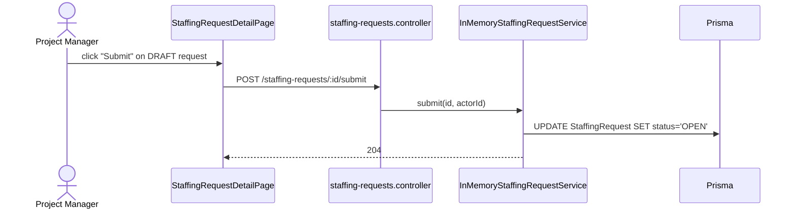

**Entry points:** `frontend/src/routes/staffing-requests/StaffingRequestDetailPage.tsx` (Submit action) → `submitStaffingRequest()` at `frontend/src/lib/api/staffing-requests.ts:106`.

**Endpoint + service:** `POST /staffing-requests/:id/submit` → `staffing-requests.controller.ts:269` → `InMemoryStaffingRequestService.submit()` (note D-24: misleading name — actually Prisma-backed).

**Notes:** No dedicated `SubmitStaffingRequestService` class; the service is named `in-memory-staffing-request.service.ts` despite using Prisma underneath. Phase 20c-03 rename pending.

---

## Flow 3 — Propose a candidate to a staffing request

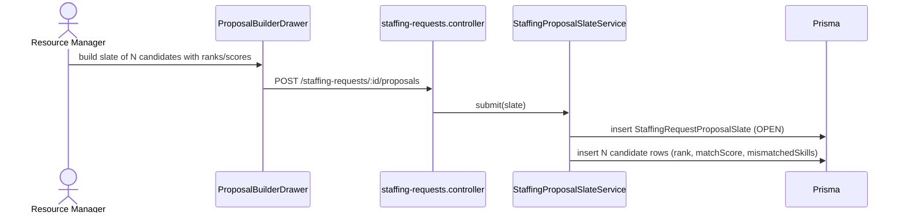

**Entry points:** `StaffingRequestDetailPage.tsx` ProposalBuilderDrawer → `submitProposalSlate()` at `staffing-requests.ts:231`. Also via `WorkforcePlannerService.applyPlan` when planner suggestion accepts a candidate.

**Endpoint + service:** `POST /staffing-requests/:id/proposals` → `staffing-requests.controller.ts:390` → `StaffingProposalSlateService.submit()`.

**Notes:** RM proposes a multi-candidate slate, not a single candidate. Status: OPEN → DECIDED (when picked) or EXPIRED/WITHDRAWN.

---

## Flow 4 — Pick / fulfil a staffing request

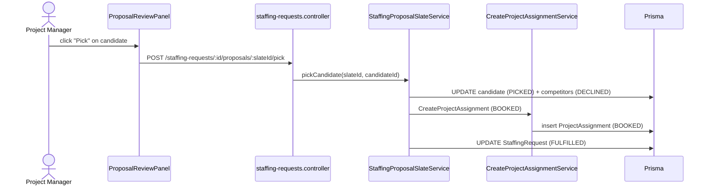

**Entry points:** `StaffingRequestDetailPage.tsx` Pick button → `pickProposalCandidate()` at `staffing-requests.ts:251`. Also `WorkforcePlannerService.applyPlan` (dispatches path).

**Endpoint + service:** `POST /staffing-requests/:id/proposals/:slateId/pick` → `staffing-requests.controller.ts:443` → `StaffingProposalSlateService.pickCandidate()`. Legacy: `POST /staffing-requests/:id/fulfil` → `staffing-requests.controller.ts:320` → `InMemoryStaffingRequestService.fulfil()` (rarely used; backward compat).

**Notes:** Pick creates the assignment AT BOOKED state; bypasses CREATED/PROPOSED (the slate carries the proposal context). The fulfil path is a duplicate kept for legacy callers.

---

## Flow 5 — Reject a staffing request candidate (slate or assignment)

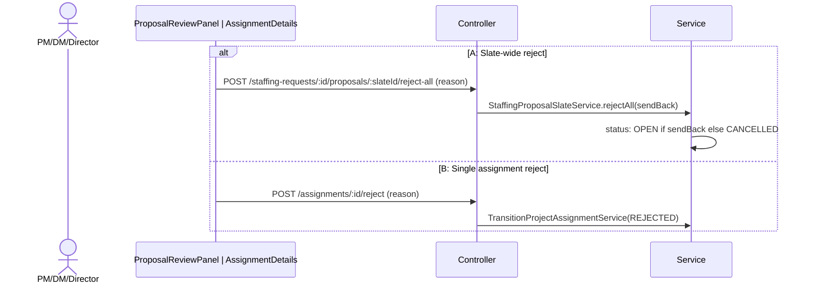

**Entry points:** `StaffingRequestDetailPage.tsx` Reject all → `rejectProposalSlate()` at `staffing-requests.ts:262`. `AssignmentDetailsPage.tsx` Reject → `transitionAssignment(..., 'REJECTED')` at `assignments.ts:287`.

**Endpoints + services:**
- `POST /staffing-requests/:id/proposals/:slateId/reject-all` → `staffing-requests.controller.ts:469` → `StaffingProposalSlateService.rejectAll()`
- `POST /assignments/:id/reject` → `assignments.controller.ts` (canonical transition path) → `TransitionProjectAssignmentService`

**Notes:** Slate rejection is all-or-nothing (no single-candidate reject on slate). `sendBack=true` returns request to OPEN for re-proposal; `sendBack=false` cancels.

---

## Flow 6 — Create a project

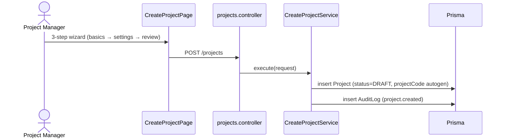

**Entry point:** `frontend/src/routes/projects/CreateProjectPage.tsx:29` (route `/projects/new`, role `PROJECT_CREATE_ROLES`) → `createProject()` at `frontend/src/lib/api/project-registry.ts:130`.

**Endpoint + service:** `POST /projects` → `projects.controller.ts:80-92` → `create-project.service.ts:36`. Project code auto-generated at line 120 if not supplied; PM validation throws NotFoundException.

**Alternative entry points:** none. Only `/projects/new`. No admin or Jira-import path.

**Notes:** D-50 — post-create resets the form and stays on the same page (UX Law 3 violation). D-52 — random hash code format `PRJ-F9CF0C18` differs from seed convention `IT-PROJ-001`. D-53 — silent priority HIGH→MEDIUM drop.

---

## Flow 7 — Activate a project (DRAFT → ACTIVE)

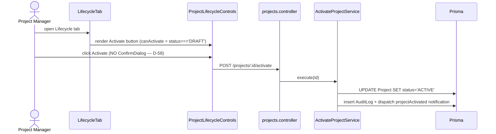

**Entry points:** ONLY `frontend/src/routes/projects/tabs/LifecycleTab.tsx:43` via `frontend/src/components/projects/ProjectLifecycleControls.tsx:51`. No alternative entry on detail page or projects list (D-57: discoverability issue).

**Endpoint + service:** `POST /projects/:id/activate` → `projects.controller.ts:94-106` (roles PM/DM/Director/Admin) → `activate-project.service.ts:18`.

**Notes:** D-58 confirmed: skips ConfirmDialog despite being a state transition. D-12/PM-01 pending: no Director-approval gate on activation.

---

## Flow 8 — Close a project (with override path)

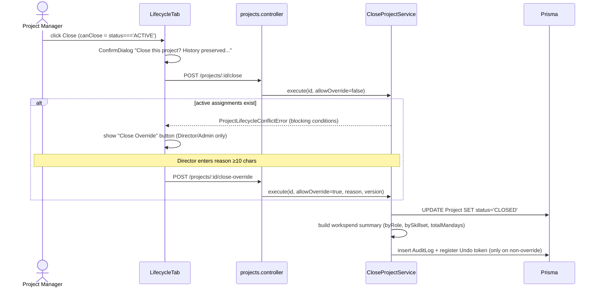

**Entry points:** `LifecycleTab.tsx:43` via `ProjectLifecycleControls.tsx:73-98` (normal) and `:101-134` (override). API: `closeProject()` at `project-registry.ts:147`, `closeProjectOverride()` at `project-registry.ts:150`.

**Endpoints + services:**
- `POST /projects/:id/close` → `projects.controller.ts:173` (roles PM/Director/Admin) → `close-project.service.ts:57`
- `POST /projects/:id/close-override` → `projects.controller.ts:200` (roles Director/Admin only) → same service with `allowActiveAssignmentOverride: true`

**Notes:** Override is gated by separate role + reason field; both paths land on the same service. Workspend summary generated at close. UndoActionId returned only on non-override close.

---

## Flow 9 — Hire / onboard an employee

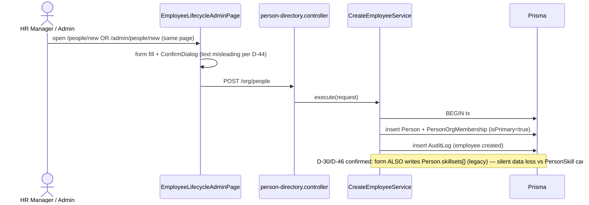

**Entry points:** Both `/people/new` (route-manifest.ts:127) and `/admin/people/new` (route-manifest.ts:125) **render the same `EmployeeLifecycleAdminPage` component** at `frontend/src/routes/people/EmployeeLifecycleAdminPage.tsx:15`. API: `createEmployee()` at `person-directory.ts:108`.

**Endpoint + service:** `POST /org/people` → `person-directory.controller.ts:55-68` (roles hr_manager/director/admin) → `create-employee.service.ts:40-118` (Prisma transaction).

**Notes:** D-30 / D-46 confirmed silent data loss; auto-creates ONBOARDING case (current-state.md). D-44 (misleading confirm copy), D-45/D-49 (Person 360 status mis-derivation).

---

## Flow 10 — Offboard / terminate an employee

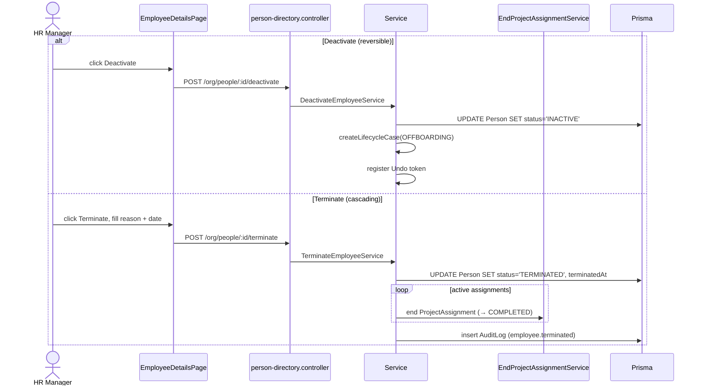

**Entry points:** Both buttons live on `frontend/src/routes/people/EmployeeDetailsPlaceholderPage.tsx:34`. API: `deactivateEmployee()` and `terminateEmployee()` at `person-directory.ts`.

**Endpoints + services:**
- `POST /org/people/:id/deactivate` → `person-directory.controller.ts:70-85` → `deactivate-employee.service.ts:28-80`
- `POST /org/people/:id/terminate` → `person-directory.controller.ts:87-107` → `terminate-employee.service.ts:30-81`

**Notes:** D-15 confirmed: Terminate cascades to end assignments. Deactivate auto-creates OFFBOARDING case + registers undo; Terminate does not.

---

## Flow 11 — Submit a timesheet

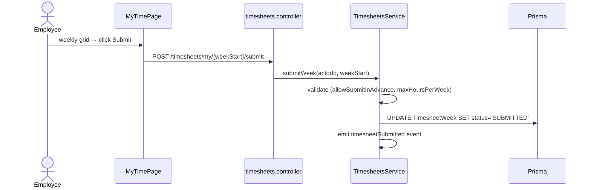

**Entry points:** `frontend/src/routes/my-time/MyTimePage.tsx` (route `/my-time` primary). Route `/timesheets` (route-manifest.ts:150) is `navVisible: false` — likely renders the same component or redirects.

**Endpoint + service:** `POST /timesheets/my/{weekStart}/submit` → `timesheets.controller.ts:90` → `TimesheetsService.submitWeek()`.

**Notes:** Platform settings gate `allowSubmitInAdvance` and `maxHoursPerWeek`.

---

## Flow 12 — Approve a timesheet

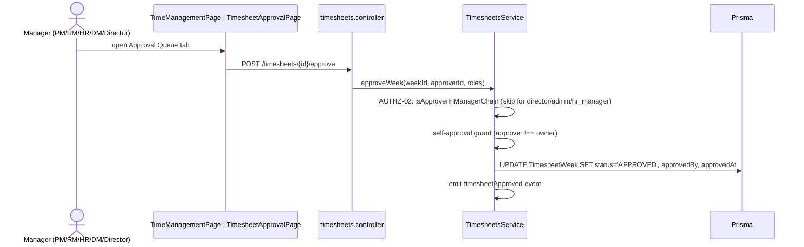

**Entry points:** `frontend/src/routes/time-management/TimeManagementPage.tsx:14` (primary, route `/time-management` route-manifest.ts:149) and `frontend/src/routes/timesheets/TimesheetApprovalPage.tsx:16` (legacy, `/timesheets/approval` route-manifest.ts:151 navVisible:false).

**Endpoint + service:** `POST /timesheets/{id}/approve` → `timesheets.controller.ts:181` → `TimesheetsService.approveWeek()`.

---

## Flow 13 — Resolve a planned-vs-actual exception

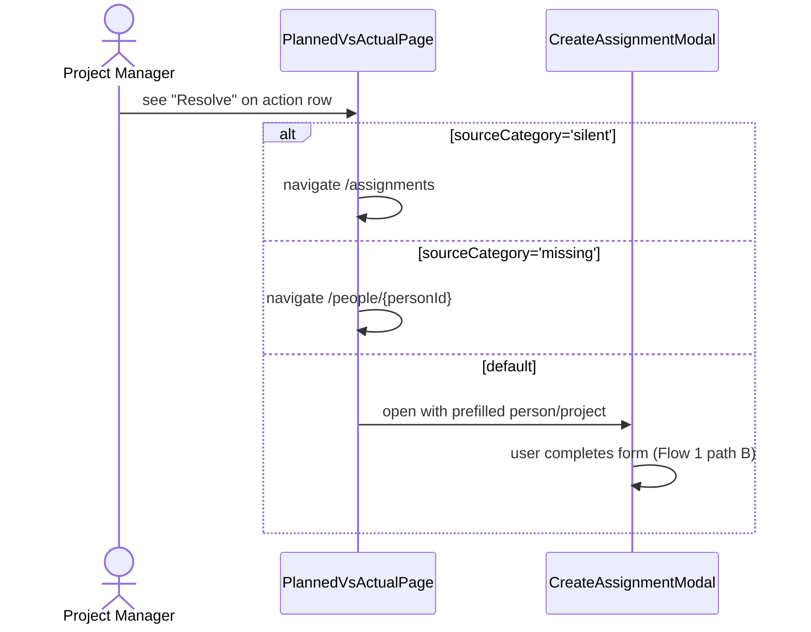

**Entry point:** `frontend/src/routes/dashboard/PlannedVsActualPage.tsx:243-248`. **No backend API call** for the Resolve action itself — it routes the user into Flow 1 path B (Create Assignment) with prefilled context.

**Notes:** Per CLAUDE.md pitfall #14 — resolving from PvA cannot lead to an approval flow on project detail. Confirmed by exploration: the Resolve action is navigation-only.

---

## Flow 14 — Approve a case (INCOMPLETE)

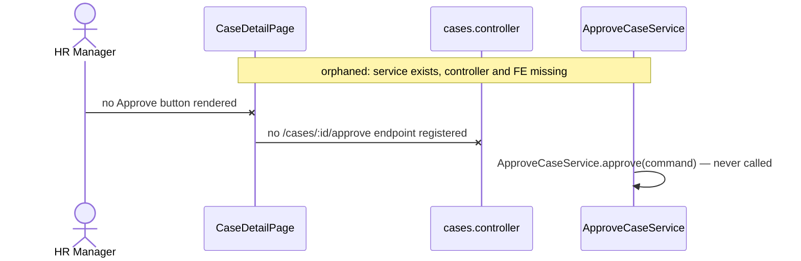

**Status:** Service `src/modules/case-management/application/approve-case.service.ts:20` defines `approve()` but `CasesController` has no endpoint mapping; `frontend/src/lib/api/cases.ts` has no `approveCaseRecord()`. **Feature is partially built.**

**Closing TASK:** D-16 (audit `actorId !== subject` guard once wired) + WO-?? (wire endpoint + FE). Tracker append candidate.

---

## Flow 15a — Approve a project budget change (BACKEND-ONLY)

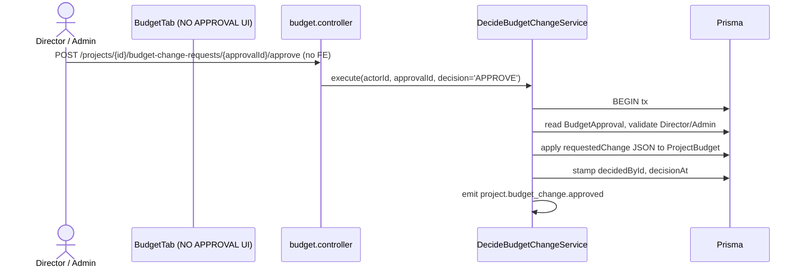

**FE:** `frontend/src/routes/projects/tabs/BudgetTab.tsx` only shows budget upsert; **no approval UI**.

**BE:** `POST /projects/{id}/budget-change-requests/{approvalId}/approve` → `budget.controller.ts:100` → `decide-budget-change.service.ts:79`. Sibling endpoint `/reject`.

**Closing TASK:** PM-01 / financial-governance follow-up — wire FE for approve/reject.

---

## Flow 15b — Lock a period (ADMIN-ONLY, no FE)

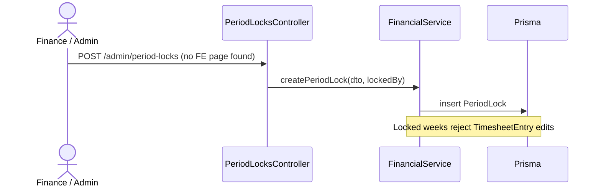

**FE:** none found in `frontend/src/routes/`. Likely admin/CLI-driven.

**Endpoints + service:** `POST /admin/period-locks` → `capitalisation.controller.ts:73` → `FinancialService.createPeriodLock()`.

**Closing TASK:** Period-lock admin UI is missing — file as a tracker candidate (Phase 9 real-org gap or admin-control-surface follow-up).

---

# Duplicates Register

Each row classifies a multi-path flow KEEP / DEPRECATE / MERGE per the spec. Rationale follows the lean-flow rule from the methodology section.

| # | Concept | Path A | Path B | Verdict | Rationale + Owner task |
|---|---|---|---|---|---|
| 1 | **Place a person on a project** | `/staffing-requests/new` (governed slate flow → request → propose → pick → assignment at BOOKED) | `/assignments/new`, `/assignments/bulk`, `/projects/:id` Team tab, `/staffing-desk` planner-apply (direct creation) | **MERGE behind one entry, KEEP both behaviors** | Both paths produce a `ProjectAssignment` row, but they carry different governance information: the slate flow records candidates considered + matchScores + rejection reasons; the direct flow records only the final assignment. Outcome: **single "Add resource" CTA** in PM/RM dashboards that branches by allocation% and project sensitivity (use slate flow when allocation > Director-approval threshold OR project tagged "strategic"; direct otherwise). The ≥6 raw entry points should collapse to **2 user-visible flows** (Quick Add / Plan & Propose) with the routing logic in the CTA itself. Today the planner already does this branching internally — extend the pattern to the Quick Add CTA. **Owner task:** new D-item; references existing WO-4.12 (StaffingRequestDetailPage redesign) + WO-4.14/15 (RM/PM/DM/Director dashboard tiles). |
| 2 | **Hire employee** | `/admin/people/new` (route-manifest.ts:125, role HR_ADMIN_ROLES) | `/people/new` (route-manifest.ts:127, role HR_ADMIN_ROLES) | **DEPRECATE `/admin/people/new`** | Both routes render the **same** `EmployeeLifecycleAdminPage` component at `frontend/src/routes/people/EmployeeLifecycleAdminPage.tsx:15`. Same role gate, same form, same outcome. Two paths exist only because the page lives in two parts of nav (admin menu vs people list). KEEP `/people/new` (closer to user mental model — "I'm in People, I add a person"); add a 301 client-side redirect from `/admin/people/new`. **Owner task:** new D-item; cleanup at FE-FOUND level. |
| 3 | **Submit timesheet** | `/my-time` (primary, navVisible:true) | `/timesheets` (legacy, navVisible:false) | **DEPRECATE `/timesheets`** | Per `phase18-route-jtbd-audit.md` lines 40-41 these are already declared redirects, but the route still resolves and a separate page component exists. Remove the page and the route entry; replace with a `<Navigate to="/my-time">` redirect entry. **Owner task:** new D-item; trivial cleanup. |
| 4 | **Approve timesheet** | `/time-management` (primary, navVisible:true) | `/timesheets/approval` (legacy, navVisible:false) | **DEPRECATE `/timesheets/approval`** | Same pattern as #3. Both pages render approval UIs; the legacy path was kept for backward compat after Phase 5. KEEP `/time-management` (consolidated with leave/compliance/overtime); collapse legacy to redirect. **Owner task:** new D-item; cleanup co-located with #3. |
| 5 | **Assignment lifecycle endpoints (D-04)** | Legacy: `/assignments/:id/{approve, reject, end, revoke}`, `POST /assignments/activate` | Canonical 9: `/assignments/:id/{propose, reject, book, onboarding, assign, hold, release, complete, cancel}` | **DEPRECATE legacy entirely** | Phase CSW (MASTER_TRACKER L85) landed canonical transitions; legacy services were "updated" to consume canonical literals but the legacy ENDPOINTS still ship per HARDEN_WIRING_MAP §2.7 lines 154-159. Phase WO-6 cutover task is **entirely pending** per MASTER_TRACKER L80. **Owner task:** WO-6 (already in tracker) + add `Deprecation: true; Sunset: <date>` headers as transitional measure per HARDEN_BRIEF D-04 recommended action. |
| 6 | **Reject candidate vs reject assignment** | Slate: `POST /staffing-requests/:id/proposals/:slateId/reject-all` (all candidates, all-or-nothing) | Assignment: `POST /assignments/:id/reject` (single existing assignment) | **KEEP both — they target different artifacts** | These are not duplicates: rejecting a slate cancels the proposal round; rejecting an assignment vetoes a specific person already in the BOOKED→ASSIGNED pipeline. The user-facing intent ("say no") is the same, but the persisted artifact and downstream effects differ (slate reject can `sendBack=true`; assignment reject is terminal). **Action:** keep both, but document the semantic in `canonical-staffing-workflow.md` and surface both visually on `StaffingRequestDetailPage` (D-21 / WO-4.12). |
| 7 | **Project lifecycle close: normal vs override** | `POST /projects/:id/close` (any PM if no active assignments) | `POST /projects/:id/close-override` (Director/Admin only, requires reason ≥10 chars) | **KEEP both — they are escalation tiers** | Different roles, different conditions, different audit trails. Not a duplicate; a documented governance escalation. The only minor risk is FE conditional rendering (override button appears only on error response) — UX-wise that's correct. **No tracker append.** |
| 8 | **Activate project: location only on Lifecycle tab (D-57)** | n/a — single endpoint | n/a | (not a duplicate; UX-DISCOVERABILITY) | Activate button is reachable only from `frontend/src/routes/projects/tabs/LifecycleTab.tsx:43`. There's no duplicate path; the issue is reach (UX Law 1 / Law 4 violation). Surface a state-aware primary CTA in the page title bar per WO-4.13 pattern. Captured under D-57; **not a Phase-1 duplicate.** |

---

## Phase 1 acceptance status

- ✅ **15 flows mapped** with FE entry points + endpoints + services + state changes (Flows 1-15b above)
- ✅ **8 multi-path situations classified** (Duplicates Register rows 1-8); 6 of them are real KEEP/DEPRECATE/MERGE verdicts (#1-#6); #7 and #8 documented as not-a-duplicate for completeness
- ✅ Mermaid sequence diagram per flow
- ✅ File:line citations throughout

**Refuted-from-discovery:** Flow 14 (Approve case) and Flow 15a (Approve budget change) and Flow 15b (Period lock) are **incomplete features**, not duplicates. They lack a controller endpoint or FE surface. Captured here as Phase-1 findings; will feed Phase 9 (real-org readiness gap).

**Next:** AskUserQuestion → "Phase 1 looks good — append findings to MASTER_TRACKER then proceed to Phase 2?"
