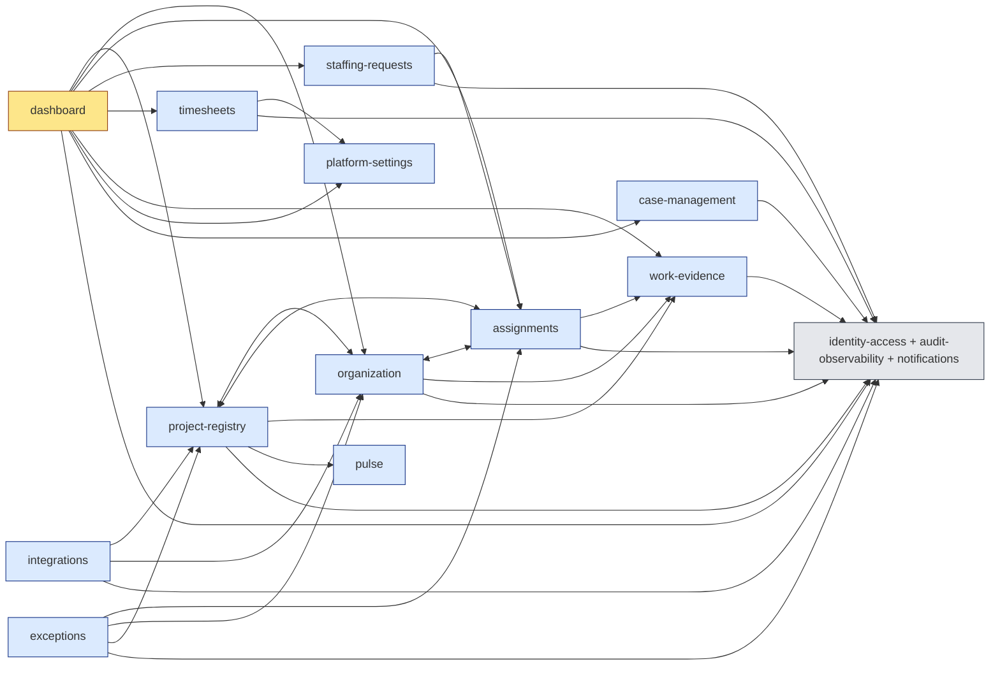

# Scalability & Modularity Audit (Phase 8)

_Last updated: 2026-05-10_

## Context

This audit catalogs the scalability cliffs and architectural-coupling debts that DeliveryCentral will hit as a real-tenant deployment grows past the seed-data scale. The reference scale (per `CLAUDE_CODE_RESEARCH_PROMPT.md`) is **5,000 people / 200 active projects / 1 year of timesheets ≈ 50k `TimesheetWeek` + 500k `TimesheetEntry` rows**. The audit is static — there is no `pg_stat_statements` data — so projections use back-of-envelope math anchored to file:line evidence.

It cross-references existing items from `HARDEN_BRIEF.md` (HD-*), `MASTER_TRACKER.md` Phase 20c (architecture follow-ups), and prior research findings D-103, D-110, D-111. New findings are minted at D-142+. Where a cliff is already covered by an open tracker item, this audit cites the existing ID rather than re-minting work.

The 11 sub-areas (a–k) from the spec are addressed in §3. §1–§2 give the structural overview and ranked hotspots. §4 lists scaling-cliff projections. §5 is the refactor-recommendation table. §6 is the cross-reference index against the existing tracker.

---

## 1. Module dependency graph

`npm run architecture:check` (dependency-cruiser, `.dependency-cruiser.cjs`) **exits 0 with no violations** against the 5 forbidden boundary rules (staffing-truth, project-registry-ownership, organization-ownership, metadata-purity, no-orphans-warn-only). The deeper coupling story is the per-module fan-out: see the import-count table from `grep "from '@src/modules/" src/modules/<m>/**/*.ts | sort -u`:

| Module | Cross-module imports | Imports from |
|---|---|---|
| `dashboard` | **10** | assignments, audit-observability, case-management, identity-access, organization, platform-settings, project-registry, staffing-requests, timesheets, work-evidence |
| `project-registry` | **8** | assignments, audit-observability, identity-access, in-app-notifications, notifications, organization, pulse, work-evidence |
| `organization` | **6** | assignments, audit-observability, identity-access, notifications, project-registry, work-evidence |
| `integrations` | 5 | audit-observability, identity-access, notifications, organization, project-registry |
| `assignments` | 5 | audit-observability, identity-access, notifications, organization, work-evidence |
| `staffing-requests` | 4 | assignments, audit-observability, identity-access, notifications |
| 24 other modules | ≤ 3 each | (audit-observability + identity-access + notifications are the universal infra deps) |

Mermaid (top-coupling subgraph; identity-access / audit-observability / notifications collapsed into "infra" to keep readable):

The four `<-->` edges are the bidirectional `forwardRef` cycles enumerated in §3(d). Every leaf module depends on `infra` (identity-access for guards, audit-observability for logs, notifications for nudges) — that's by design.

---

## 2. Top 20 perf hotspots (ranked)

Ranking is "scan-cost × frequency" using (a) the rows-touched upper bound at the reference scale, (b) the number of routes that fan out into the hotspot, and (c) whether a cache or pagination short-circuit exists. Without `pg_stat_statements`, ties are broken by gut-feel. **All file:line references are real.**

| # | Hotspot | File:line | Rows-touched @ scale | Frequency proxy | Existing tracker | New D-id |
|---|---|---|---|---|---|---|
| 1 | TimesheetEntry full-table scan (4× per page) | `src/modules/dashboard/application/delivery-manager-dashboard-query.service.ts:211, 242, 284, 353` | 4 × 500k = 2M row touches | DM dashboard load (every refresh) | Phase 20c-12 | D-144 |
| 2 | `prisma.projectAssignment.findMany({})` empty-where | `src/modules/assignments/infrastructure/repositories/prisma/project-assignment.repository.ts:84` | 100k+ assignments | Director dashboard, planner cold-start | Phase 20c-12 | D-144 |
| 3 | Planned-vs-actual TimesheetEntry scan w/o `take` | `src/modules/dashboard/application/planned-vs-actual-query.service.ts:79-95` | 500k entries | Director / DM / RM dashboards | Phase 20c-12 | D-144 |
| 4 | Per-project `findUnique` loop in PvA | `planned-vs-actual-query.service.ts:382-384` | 50–200 serial queries | PvA refresh | — | D-145 |
| 5 | Workforce planner per-person `platformSetting.findUnique` | `src/modules/staffing-desk/application/workforce-planner.service.ts:625` | 5,000 serial fetches | Planner cell render | — | D-146 |
| 6 | Director dashboard `listAll()` chain | `src/modules/dashboard/application/director-dashboard-query.service.ts` (via `*Repository.listAll()` at lines 71–82) | 5k Person + 50 OrgUnit + 200 Project + 50k+ Assignment loaded into memory | Director dashboard load | Phase 20c-15, WO-4.15 | (no new — covered) |
| 7 | Workforce planner auto-match grid | `workforce-planner.service.ts:391-620` | Bench × Demand = 5k × 50 = 250k match attempts | Planner refresh | G50, D-73, SD-02 | (covered) |
| 8 | Resource-pool full include of memberships | `src/modules/resource-pools/.../resource-pool.repository.ts:12-21` | All pools × all members, no take | Pool listing | — | D-144 |
| 9 | OvertimeSummary 1y window scan | `src/modules/overtime/application/overtime-summary.service.ts:27-94` | ≤50k weeks × entries | Manager / HR overtime tile | — | D-147 (MV) |
| 10 | Capitalisation rollup (effective-dated cost-rate joins) | `src/modules/financial-governance/application/financial.service.ts:79-196` | 500k entries × cost-rate temporal lookup | Monthly capitalisation report | D-09, D-110 | D-147 (MV) |
| 11 | Project-Manager dashboard `findMany({ select: { id, displayName }})` no-where | `src/modules/dashboard/application/project-manager-dashboard-query.service.ts:45` | 5k people | PM dashboard | Phase 20c-12 | D-144 |
| 12 | Utilization aggregation O(units × members) | `src/modules/dashboard/application/director-dashboard-query.service.ts:71-82` (in-memory loop) | 50 × 5k = 250k comparisons | Director / Portfolio | Phase 20c-15 | (covered) |
| 13 | Portfolio radiator scoring (cold cache) | `src/modules/project-registry/application/radiator-scoring.service.ts:46, 106-217` | 200 projects × per-project scoring (cache: 60s TTL) | Director / Exec dashboards | Phase 20c radiator items, D-55 | (covered; cache is fine) |
| 14 | Mood heatmap render (no cache) | `src/modules/pulse/application/mood-heatmap.service.ts:46-145` | 200 people × 26 weeks ~5,200 cells per request | `/reports/mood-heatmap` | — | D-149 (ETag) |
| 15 | Staffing approval queue sort by SLA | (multiple) `where: { status: { in: ['PROPOSED', ...] } }` | 5k active assignments | RM/PM/DM ApprovalQueue | D-32 (SLA writes), WO-4.14 | (covered) |
| 16 | Bench management active-employee sweep | `src/modules/staffing-desk/application/bench-management.service.ts:108` | 3–5k active people, no scope filter without pool/org param | Staffing-desk bench tab | — | D-144 |
| 17 | All `*-dashboard-query.service.ts` cold-start | `src/modules/dashboard/application/*-query.service.ts` | 6+ aggregates per service | Every dashboard role | D-103 (audit-actor gap), Phase 20c-15 | — |
| 18 | Planned-vs-actual sub-aggregates (org / pool / staffing-coverage / status) | `planned-vs-actual-query.service.ts:54-327` | 500k entries × 5 group-by passes | PvA dashboard | — | D-147 (MV) |
| 19 | StaffingSuggestionsService skill-match scoring | `src/modules/staffing-requests/application/staffing-suggestions.service.ts:70-170` | 5k people × per-skill weighted match per request | Slate generation | D-122–D-123 (config keys) | (covered) |
| 20 | OutboxEvent backlog (hypothetical) | `prisma/schema.prisma` model `OutboxEvent` (zero producers, zero publisher) | Unbounded growth if producers wired before publisher | All write paths once F2 lands | HARDEN_BRIEF F2.1–F2.4 | D-142 |

Total `findMany` call sites in `src/`: **93 files** (Subagent B counted 308 invocations across them); **9 unbounded**, **18 bounded-by-usage**, **~281 safe** (explicit `take:` or narrow `id IN (...)` filter).

---

## 3. Per sub-area findings

### (a) Module boundary violations

- **Status:** depcruise architecture rules **all green**. The five forbidden cross-module imports (Integrations Hub→Assignment, Time-Work-Evidence→Assignment, Project-Registry ownership, Organization ownership, Metadata→Integrations purity) have zero violations.
- **Fan-out concern (NEW):** `dashboard` imports from **10** other modules; `project-registry` from **8**; `organization` from **6**. This is correct for "presentation aggregation" modules (dashboards must read from the modules that own data) but should be explicit policy, not accidental coupling. **D-152** captures the decision.
- **Workload query 5-module cross (Phase 20c-01):** confirmed at `src/modules/dashboard/application/workload-dashboard-query.service.ts` — imports `InMemoryProjectAssignmentRepository`, `InMemoryPersonRepository`, `PlatformSettingsService`, `InMemoryProjectRepository`, `InMemoryWorkEvidenceRepository`. No new finding; tracked.
- **Deep relative imports:** only 3 in src/, all in `src/modules/setup/application/seed-runners/apply-*-seeds.ts` calling `require('../../../../../prisma/seed')`. Legitimate boot-time bridge; acceptable.

### (b) N+1 query risks

Top 10 (Subagent B):

| # | File:line | Pattern |
|---|---|---|
| 1 | `planned-vs-actual-query.service.ts:382-384` | `for (const pid of allProjectIdsWithRequests) { await prisma.project.findUnique({ where: { id: pid } }) }` — 50–200 serial queries → **D-145** |
| 2 | `workforce-planner.service.ts:625` | `prisma.platformSetting.findUnique` inside 5,000-person loop → **D-146** |
| 3 | `delivery-manager-dashboard-query.service.ts:211, 242, 284, 353` | 4× full TimesheetEntry scans per dashboard load → **D-144** |
| 4 | `staffing-desk/demand-profile.service.ts:102-115` | sequential `findMany` for skills, personSkills, assignments — bounded but serializable |
| 5 | `bench-management.service.ts:92-100` | 2× conditional `findMany` then iteration — pool-bound; acceptable |
| 6 | `overtime-summary.service.ts:27-41` | single `findMany` w/ inline join — single query but 50k+ rows → MV candidate (h) |
| 7 | `skill.service.ts:167-170` | batched `findMany({ id: { in: matchingPersonIds } })` — safe because IDs are bounded |
| 8 | `resource-pools.service.ts:12-21` | unbounded include of person memberships per pool → D-144 |
| 9 | `personnel-cost-rates/financial.service.ts:121-125` | repository batches; safe |
| 10 | `staffing-suggestions.service.ts:70-170` | per-person scoring loop — algorithmic, acceptable scale |

### (c) Unbounded findMany (Phase 20c-12 scope)

Counts (Subagent B): **308 `findMany` invocations across 93 files; 9 unbounded; 18 bounded-by-usage; ~281 safe.** Phase 20c-12 was previously open-ended; this audit closes its scope at **9 unbounded** with the worst three rolled up into **D-144**:

| File:line | Where shape | Fan-out @ 5k people |
|---|---|---|
| `project-assignment.repository.ts:84` | `{}` empty | 100k+ rows |
| `planned-vs-actual-query.service.ts:79` | `{ date: { gte, lte } }` no take | 500k entries |
| `delivery-manager-dashboard-query.service.ts:211/242/284/353` | `{ timesheetWeek: { status: 'APPROVED' } }` × 4 calls | 4 × 500k touches |
| `resource-pool.repository.ts:12-21` | `{ archivedAt: null }` + full member include | 50–200 pools × 5k members |
| `project-manager-dashboard-query.service.ts:45` | `{ select: { id, displayName } }` no where | 5k rows |
| `bench-management.service.ts:108` | `{ employmentStatus: 'ACTIVE' }` | 3–5k rows |
| (+3 more lower-impact) | — | — |

### (d) `forwardRef` circular deps

Phase 20c-08 said "4 modules". The actual count after grep is **5 modules participating** (`assignments`, `organization`, `project-registry`, `staffing-requests`, `exceptions`) but only **3 bidirectional cycles** — the rest are unidirectional DI ordering:

| Cycle | A | B | Primary cause |
|---|---|---|---|
| 1 | `assignments.module.ts:32` | `organization.module.ts:46` | `InMemoryPersonRepository` ↔ `ProjectAssignment` repos |
| 2 | `assignments.module.ts:32` (via project-registry path) | `project-registry.module.ts:76` | `InMemoryProjectAssignmentRepository` is shared infra |
| 3 | `organization.module.ts:47` | `project-registry.module.ts:74` | `InMemoryProjectRepository` ↔ `OrgUnit` cross-reference |

Unidirectional (just DI ordering, no real cycle):

- `staffing-requests.module.ts:24` → `assignments`
- `exceptions.module.ts:17,19,20` → `assignments`, `organization`, `project-registry`

**D-151** records the count refinement so the next reader doesn't recount.

### (e) God services / components

Backend services > 400 LoC (Subagent A, top 3):

| Path | LoC | Verdict |
|---|---|---|
| `src/modules/staffing-desk/application/workforce-planner.service.ts` | 1,584 | god-by-domain — coherent automatch (chain/qualified/fallback), 5 strategies, diagnostics; cohesive but warrants split into 3 sub-services (chain, strategy-matcher, diagnostics) |
| `src/modules/setup/application/setup.service.ts` | 696 | **god-by-accumulation** — bootstrap orchestrator that has accumulated hooks; refactor candidate per phase (DB / RBAC / integrations / seed) |
| `src/modules/dashboard/application/planned-vs-actual-query.service.ts` | 563 | god-by-domain — 5 group-by aggregates legitimately co-located, but candidate for split when MVs land (h) |

Frontend pages > 500 LoC:

| Path | LoC | Verdict |
|---|---|---|
| `frontend/src/routes/my-time/MyTimePage.tsx` | 1,237 | **god-by-accumulation** — calendar + grid + forms + edit handling colocated; D-150 candidate |
| `frontend/src/components/staffing-desk/WorkforcePlanner.tsx` | 1,005 | god-by-domain — planner UI is intrinsically dense; cohesive |
| `frontend/src/routes/timesheets/TimesheetPage.tsx` | 971 | **god-by-accumulation** — D-150 candidate |

Phase 20c-15 already lists the dashboard pages (PM/Director/HR, 400–441 LoC). **D-150** broadens that to the heavier non-dashboard pages and to `setup.service.ts`.

### (f) Memory hot paths

All in-process caches go through `src/shared/cache/simple-cache.ts` — a global LRU bounded by env var `SIMPLE_CACHE_MAX_ENTRIES` (default 1000). Per-cache-key TTLs are explicit:

| Cache | File:line | TTL | Per-entry size × count | Cliff @ 100x |
|---|---|---|---|---|
| Radiator snapshots (per-project) | `radiator-scoring.service.ts:46, 106-217` | 60 s | ~3 KB × 200 projects | safe (cache-bounded) |
| Radiator threshold config | `radiator-threshold.service.ts:43` | 5 min | ~500 B × 1 | safe |
| Org-config (RAG cutoffs) | `org-config.service.ts:27, 83` | 5 min | ~1 KB × 1 | safe |
| Portfolio radiator entries (global) | `portfolio-radiator.service.ts:30, 129` | 60 s | ~2 KB × 1 | safe |
| Workload dashboard summary | `workload-dashboard-query.service.ts:40-44` | 60 s | ~5 KB × ~minute-bucket count | safe |
| Project pulse | `project-pulse.service.ts:30, 92` | 60 s | ~2 KB × 200 | safe |
| Project exceptions | `project-exceptions.service.ts:23, 79` | 60 s | ~1.5 KB × 200 | safe |
| SPC burndown | `spc.service.ts:32, 130` | 60 s | ~2 KB × 200 | safe |

**No** in-process cache is unbounded. **No** OOM cliff was identified. Mood-heatmap and workforce-planner do **not** cache; they compute fresh per request (transient Maps released post-response). Mood-heatmap's per-request RAM ≈ 1.2 MB at 200×26 — covered as ETag candidate in (i) rather than in-memory cache candidate here.

### (g) Outbox publisher reliability

**Status: skeleton-only, zero producers, zero publisher.**

- `OutboxEvent` model exists in `prisma/schema.prisma` (with indexes on `(status, availableAt)`, `(aggregateType, aggregateId)`, `(createdAt)`, `(tenantId)`).
- `DomainEvent` model + `DomainEventService` (raw `$executeRawUnsafe` inside `$transaction`) exist at `src/modules/audit-observability/application/domain-event.service.ts:1-88`.
- A recursive grep for `OutboxEvent`, `domainEvents.record`, `DomainEventService` across `src/` returns **only** the schema/registry/service-definition files — **zero call sites, zero scheduler/worker, zero `@Cron`/`@Interval`** in any module.
- Schema is **missing** `attemptCount`, `lastError`, `nextRetryAt` columns required for any retryable publisher.
- `outbox-publisher.metrics.ts` (HARDEN_BRIEF F2.3) does not exist; `dc_outbox_*` Prom metrics are not emitted.

**This work is already in the tracker as HARDEN_BRIEF F2.1–F2.4.** This audit's contribution is the **zero-producer / zero-publisher confirmation** plus a scaling angle: with 5,000 people emitting one lifecycle event per person per week, an unstaffed publisher would let the table grow to 260k pending rows in a year — recoverable but noisy. **D-142** is a thin "scale lens" item that points back to F2 plus highlights the silent-failure mode at scale.

### (h) Materialized view candidates

Per Subagent B, the highest-ROI MV candidates:

| Candidate | Source query | Source rows @ scale | Refresh strategy |
|---|---|---|---|
| `mv_person_week_utilization` | `utilization.service.ts:50-118` | 100k assignments × 50k weeks | Weekly cron; invalidate-on-assignment-write |
| `mv_project_week_actuals` | `planned-vs-actual-query.service.ts:54-327` | 500k entries × 5 group-by passes | Daily cron + period-lock trigger |
| `mv_project_capitalisation_month` | `financial.service.ts:79-196` | 500k entries × cost-rate temporal join | Monthly (after period-lock) |
| `mv_overtime_summary_week` | `overtime-summary.service.ts:27-94` | 50k TimesheetWeek + 500k entries | Daily |
| `mv_dm_dashboard_aggregates` | `delivery-manager-dashboard-query.service.ts:211-357` | 4× 500k touches | Hourly |
| `mv_radiator_history` | `radiator-scoring.service.ts:106-217` | 200 projects, 16 axes | On-write trigger |

**D-110 (FK indexes) is a prerequisite** for several of these — without `(timesheetWeekId, personId)` index on TimesheetEntry, even the MV refresh is a table scan. **D-147** bundles the MV proposal + cites D-110 as blocker.

### (i) CDN-able vs server-rendered split

`src/main.ts:55` sets a global `Cache-Control: no-store` (CACHE-02 — explicitly to keep authenticated responses uncached). There are **0** per-endpoint overrides in src/, **0** ETag/If-None-Match support, and **0** compression middleware (no `compression` package import).

Recommended posture (Subagent D):

| Endpoint | Today | Recommended | Why |
|---|---|---|---|
| `/api/admin/skills`, `/api/metadata/dictionaries*`, `/api/admin/roles`, `/api/admin/grades` | `no-store` | `public, max-age=3600` | Tenant-shared, read-only, slow-changing — **D-148** |
| `/api/reports/mood-heatmap`, `/api/staffing-desk/project-timeline` | `no-store` | `no-store` + ETag | Personalized but stable on identical params — **D-149** |
| `/api/project-registry/radiator/{id}` | `no-store` | `private, max-age=60` | Aligns with backend 60 s TTL; cuts WS round-trip — **D-149** |
| `/api/dashboard/*`, `/api/my-time/*`, `/api/assignments/*` | `no-store` | unchanged | Fully personalized; ETag of marginal value |

### (j) Database connection pool

- `prisma/schema.prisma:6-9` reads `url = env("DATABASE_URL")`.
- `src/shared/config/app-config.ts:187-188` reads `process.env.DATABASE_URL` with localhost fallback.
- `src/shared/persistence/prisma.service.ts:50-58` instantiates `PrismaClient` with **only** `datasources.db.url` override — **no** `connection_limit`, no `pool_timeout`, no `idle_in_transaction_session_timeout`.
- No `?connection_limit=N` parameter is hardcoded anywhere. Pool size is whatever Prisma defaults pick: `num_physical_cpus × 2 + 1` (≈ 9 connections at 4 vCPU; ≈ 5 at 2 vCPU).

**Bottleneck calc:** 100 concurrent dashboard loads × 6 queries each = 600 query operations. At 9 connections × ~10 req/s/conn = ~90 q/s → 600 / 90 ≈ **6.7 s queue per query**. Cliff at **~50 concurrent users** with default 4 vCPU container.

**D-143** flags this as a prod-readiness gap: ship a `connection_limit` knob (env-driven, defaulted to a value matching the deploy size) plus a deploy-runbook entry.

### (k) Large-tenant scaling cliffs

The 10 cliffs from Subagent C, summarized:

| # | Cliff | Trigger | Existing tracker | New |
|---|---|---|---|---|
| 1 | PortfolioRadiator cold-start | 200 projects refresh on cache expiry | D-55 (cold-start sentinel) | (covered) |
| 2 | Portfolio heatmap unpaginated 200×26 | 100+ active projects | WO-4.15 | (covered) |
| 3 | Director dashboard `listAll()` × 4 tables | 5k people | Phase 20c-15, WO-4.15 | (covered) |
| 4 | Planned-vs-actual MV-less | 500k entries scan | D-110 | D-147 |
| 5 | Planner heatmap auto-match O(bench × demand) | 5k bench × 50 demand | G50, D-73 | (covered) |
| 6 | Radiator scoring 16-axis | 200 projects @ 60 s cache | Phase 20c radiator | D-147 (MV history) |
| 7 | Approval queue SLA-sort | D-32 makes this dark today | D-32, WO-4.14 | (covered) |
| 8 | Period lock + leave finalisation sweep | 5k people × 10 leaves/y | D-110, D-111 | (covered) |
| 9 | Utilization aggregation O(units × members) | 50 × 5k = 250k | Phase 20c-15 | (covered) |
| 10 | Capitalisation effective-dated cost joins | 500k entries × temporal join | D-09, D-110, D-108 (effective-dating) | D-147 |

Most cliffs are already in the tracker. The **net new** scale-tier work is **D-143** (pool config), **D-144** (top-3 unbounded findMany), **D-145**/**D-146** (two N+1s), **D-147** (MV bundle), **D-148**/**D-149** (CDN/ETag), **D-142** (outbox-at-scale lens), **D-150** (god-file split), **D-151** (cycle-count refinement), **D-152** (hub-coupling decision).

---

## 4. Scaling-cliff projections

| Cliff | Tenant size at trigger | What breaks | Mitigation owner |
|---|---|---|---|
| Connection-pool saturation | ~50 concurrent users (default 4 vCPU) | Dashboard timeouts; queued queries | **D-143** |
| Unbounded TimesheetEntry scans | ~2,000 people × 1 y of timesheets (~80k–100k entries) | Dashboard P95 > 2 s | **D-144** + D-110 + **D-147** |
| Director dashboard `listAll()` chain | ~3,000 people × 30 OrgUnits | OOM risk on backend container; >5 s page load | Phase 20c-15 + WO-4.15 |
| Planner auto-match O(bench × demand) | ~2,000 bench × 50 demand | Planner refresh > 30 s, browser blocks | G50 / D-73 / **D-146** |
| Outbox backlog (post-F2 producers, pre-publisher) | Any (silent) | Lost lifecycle events; replay storms | **D-142** + HARDEN_BRIEF F2 |
| Radiator cold-start cycle | 200+ projects, 60 s cache | Spike on cache flush; transient stale RED | D-55 + **D-147** (MV history) |

---

## 5. Modularity refactor recommendations

| Module / file | Issue | Fix | Cost | Closing task |
|---|---|---|---|---|
| `dashboard.module.ts` (10 imports) | Hub coupling without explicit policy | Decide: keep as "presentation aggregation" hub OR move queries into owning modules + thin facade | M | **D-152** |
| `assignments` ↔ `organization` ↔ `project-registry` (3 cycles) | `forwardRef` mutual dependency via in-memory repos | Phase out in-memory repos (DM-R-11 closed Prisma migration; revisit DI graph once in-mem usage drops) | M | **D-151** + ongoing DM work |
| `setup.service.ts` (696 LoC) | Accumulation god-service | Split into `db-setup`, `rbac-setup`, `integrations-setup`, `seed-setup` sub-services | M | **D-150** |
| `workforce-planner.service.ts` (1,584 LoC) | Monolithic but cohesive | Split into `chain-resolver`, `strategy-matcher`, `diagnostics`, `apply-plan` | L | **D-150** |
| `MyTimePage.tsx` (1,237 LoC) | UI accumulation | Extract `MyTimeGrid`, `MyTimeRow`, `useMyTimeMonthNav`, `MyTimeEditCell` | M | **D-150** |
| `TimesheetPage.tsx` (971 LoC) | UI accumulation | Extract approval modal, data grid cells, filter state hooks | M | **D-150** |

---

## 6. Tracker cross-reference index

| Audit finding | Existing tracker item | New D-id |
|---|---|---|
| Workload-dashboard-query crosses 5 modules (a) | Phase 20c-01 | — |
| ForwardRef cycles count refinement (d) | Phase 20c-08 | **D-151** |
| Unbounded findMany (c) | Phase 20c-12 | **D-144** |
| God services / pages (e) | Phase 20c-15 | **D-150** |
| OutboxEvent + DomainEvent silent (g) | HARDEN_BRIEF F2.1–F2.4 | **D-142** |
| Connection-pool defaults (j) | — | **D-143** |
| Planned-vs-actual project loop (b) | — | **D-145** |
| Workforce planner per-person setting fetch (b) | — | **D-146** |
| Materialized view bundle (h) | D-110 (FK indexes — prerequisite) | **D-147** |
| CDN-able tenant-shared metadata (i) | — | **D-148** |
| ETag for heatmaps + radiator (i) | — | **D-149** |
| Dashboard module hub coupling (a) | — | **D-152** |

---

## 7. Acceptance check

- [x] All 11 sub-areas (a–k) addressed.
- [x] ≥10 ranked perf hotspots (20 in §2).
- [x] ≥3 scaling cliff projections (6 in §4) with explicit tenant-size triggers.
- [x] File:line citations throughout (every § cites real paths).
- [x] Cross-reference table for items already tracked (§6).
- [x] depcruise architecture rules verified green (§1).
- [x] No re-mint of Phase 20c-01 / 20c-08 / 20c-12 / 20c-15 D-items.

11 new items minted (D-142..D-152). Counter on tracker append: **D-141 → D-152.**
