# Phase 10 — Synthesis: Theme Catalog and Roadmap

**Run date:** 2026-05-10
**Inputs:** 87 D-items (D-85..D-171) across 9 audit docs (Phase 1-9), produced by `docs/planning/CLAUDE_CODE_RESEARCH_PROMPT.md`.
**Output shape:** 24 themes (T-01..T-24), impact×effort scored, sprint-mapped, with Mermaid dependency graph.
**How to use:** This doc is the bridge between findings and execution. Each theme bundles 1–11 D-items into a single user-facing or architectural outcome with a sprint slot. Phase 11 (next session) consumes this to author `NEXT_ITERATION_PLAN.md` + the xlsx roadmap.

---

## 1. Theme catalog (sorted by score, then by P-tier)

| ID | Tier | Theme | Impact | Effort | Score | D-IDs bundled | Blocked-by |
|---|---|---|---|---|---|---|---|
| **T-07** | P0 | Locale + timezone + week boundaries | 5 | 2 | **20** | D-161, D-163, D-165 | — |
| **T-11** | P1 | Outbox producers + DB connection pool | 4 | 2 | **16** | D-142, D-143 | — |
| **T-12** | P1 | Hot-path query optimization | 4 | 2 | **16** | D-144, D-145, D-146 | — |
| **T-18** | P1 | Approval-flow + admin gap completion | 4 | 2 | **16** | D-91, D-92, D-93, D-114, D-117 | — |
| **T-20** | P1 | Dashboard + RBAC data quality fixes | 4 | 2 | **16** | D-115, D-116, D-119, D-120, D-121 | T-04 (D-116) |
| **T-02** | P0 | SSO + IdP-driven user lifecycle | 5 | 3 | **15** | D-155, D-156, D-157 | — |
| **T-06** | P0 | Multi-currency consolidation (FxRate) | 4 | 3 | **12** | D-164 | — |
| **T-10** | P2 | Customization L1 catalog (config knobs) | 3 | 2 | **12** | D-122, D-123, D-124, D-125, D-126, D-127, D-129, D-171 | — |
| **T-16** | P1 | Place-person flow consolidation | 3 | 2 | **12** | D-85, D-89, D-90, D-98, D-100, D-102, D-118 | — |
| **T-01** | P0 | Multi-tenant data isolation | 5 | 4 | **10** | D-153, D-154 (+ HARDEN_BRIEF F6) | — |
| **T-03** | P0 | GDPR + retention compliance | 5 | 4 | **10** | D-96, D-167, D-168 | T-01 (tenantId on AuditLog) |
| **T-05** | P0 | Fiscal calendar + period-aware rollups | 5 | 4 | **10** | D-160 | T-06 (multi-currency for capitalisation) |
| **T-22** | P2 | UI normalization (DS regression + decisions) | 2 | 1 | **10** | D-133, D-134, D-135 | — |
| **T-08** | P1 | Schema-quality batch | 3 | 3 | **9** | D-103, D-104, D-105, D-106, D-108, D-109, D-110, D-111, D-112, D-113 | — |
| **T-09** | P1 | Lookups → MetadataDictionary | 3 | 3 | **9** | D-101, D-107, D-128, D-131, D-132 | — |
| **T-14** | P2 | BI extracts + webhook integration surface | 3 | 3 | **9** | D-169, D-170 | T-11 (webhooks via outbox), T-13 (caching headers) |
| **T-21** | P1 | Nav restructure (6 → 9 groups) | 3 | 3 | **9** | D-136, D-137, D-138, D-139, D-140, D-141 | T-20 (D-116 evidence RBAC fix) |
| **T-04** | P1 | Tenant role customization (RBAC L0→L1) | 4 | 4 | **8** | D-130, D-158, D-159 | — |
| **T-13** | P1 | Materialized rollups + caching layer | 4 | 4 | **8** | D-147, D-148, D-149 | T-08 (D-110 FK indexes) |
| **T-19** | P2 | Functional duplication clean-up | 2 | 2 | **8** | D-94, D-95, D-97 | — |
| **T-23** | P2 | Bulk-import + data-ops expansion | 3 | 4 | **6** | D-166 | — |
| **T-17** | P3 | Route alias clean-up | 1 | 1 | **5** | D-86, D-87, D-88 | — |
| **T-24** | P3 | Org structure depth (real-org seed) | 1 | 1 | **5** | D-162 | — |
| **T-15** | P3 | Architecture refactors (god services + cycles) | 2 | 4 | **4** | D-99, D-150, D-151, D-152 | — |

**Coverage check:** 87/87 D-items mapped. No item appears in two themes as the primary owner; cross-references are noted in the per-theme detail.

---

## 2. Per-theme detail

Themes are presented in score order. Each subsection has Why-this-matters, D-items bundled (with verdict tags), Acceptance criteria, Effort range, and Sprint slot.

### T-07 — Locale + timezone + week boundaries (Score 20, P0)

**Why this matters.** Three settings (`general.timezone`, `timesheets.weekStartDay`, frontend currency formatter) are read into DTOs but never consumed. A distributed team in `Europe/London` and `America/Los_Angeles` sees misaligned week boundaries today; a German tenant sees `$` symbols on every budget. Cheap to ship, blocks every non-AU customer.

**D-items bundled:**
- **D-161** [LOCALE] — consume `general.timezone` + `timesheets.weekStartDay`; replace `getMondayOfWeek(new Date())` with tenant-tz/week-aware helper.
- **D-163** [LOCALE] — multi-region `PublicHoliday` (drop `@default("AU")`; `public-holiday.service.ts:15` accept `regionCode[]`).
- **D-165** [LOCALE] — consume `general.currency` in `Intl.NumberFormat` (drop hardcoded `'en-US' / 'USD'`); install `date-fns-tz` for FE date formatting.

**Acceptance:**
- Tenant admin can pick timezone + weekStartDay + currency in `/admin/general`; **all** server-rendered week and currency values update without code change.
- Multi-region tenant can register UK + IN + AU public holidays in the same workspace.
- 120 raw `new Date()` calls in `frontend/src/` audited and converted (or whitelisted) per `date-fns-tz`.

**Effort:** 5–7 person-days (one BE engineer + one FE engineer for one sprint).
**Sprint slot:** Sprint 0.

---

### T-11 — Outbox producers + DB connection pool (Score 16, P1)

**Why this matters.** Two infra primitives that don't break today but cap horizontal scale. The outbox **schema** exists (HARDEN_BRIEF F2 lineage) but a recursive grep finds zero producers and zero publisher dispatch — every `dispatch()` call goes via the dual-write seam, not the outbox. DB pool default ~9 at 4 vCPU caps the system at ~50 concurrent users.

**D-items bundled:**
- **D-142** [SCALE] — wire outbox producers + add `attemptCount`/`lastError` columns; activate publisher.
- **D-143** [SCALE] — `connection_limit` env-driven; document tuning matrix (workers × replicas × pool).

**Acceptance:**
- ≥3 domain mutations produce `OutboxEvent` rows without dual-writing the same payload through the legacy seam.
- `prisma.service.ts:50-58` reads `DATABASE_POOL_LIMIT` env var; documented in `docs/ops/scaling-tuning.md`.

**Effort:** 4–7 person-days. Pool change is half a day; outbox producers ~5 days.
**Sprint slot:** Sprint 1.

---

### T-12 — Hot-path query optimization (Score 16, P1)

**Why this matters.** Three concrete N+1 / unbounded queries that account for ~2 M row-touches per dashboard load at 5,000-person scale. Each is a small targeted fix.

**D-items bundled:**
- **D-144** [SCALE] — top-3 unbounded `findMany` (project-assignment.repository.ts:84, planned-vs-actual-query.service.ts:79, DM dashboard 4× full TimesheetEntry scans).
- **D-145** [N+1] — PvA `findUnique` loop → `findMany({ where: { id: { in: pids } } })` at planned-vs-actual-query.service.ts:382-384.
- **D-146** [N+1] — workforce planner per-person `platformSetting.findUnique` hoisted outside the 5,000-person loop.

**Acceptance:**
- Dashboard P95 latency for DM, PvA, RM dashboards under 1 s at seed scale; load-test scaffold added per the `slo-budgets.json` budgets.
- `eslint-plugin-prisma` rule (or equivalent) blocks new `findMany({})` without `where` or `take` in CI.

**Effort:** 3–5 person-days.
**Sprint slot:** Sprint 1.

---

### T-18 — Approval-flow + admin gap completion (Score 16, P1)

**Why this matters.** Five back-end endpoints exist but are unreachable from the UI — case approve, budget-change approve, period-lock admin, audit-log admin, post-install setup. Each is a JTBD broken or absent today. The Phase 4 walker logged the audit-log gap as RED; the others are AMBER (workaround exists).

**D-items bundled:**
- **D-91** [INCOMPLETE] — wire `POST /cases/:id/approve` controller endpoint + FE button on CaseDetailPage.
- **D-92** [INCOMPLETE] — FE wiring of `POST /projects/{id}/budget-change-requests/{approvalId}/approve` on BudgetTab.
- **D-93** [INCOMPLETE] — admin FE for `/admin/period-locks` (BE endpoint already exists).
- **D-114** [GAP] — `/admin/audit-log` FE route + page (admin investigation surface).
- **D-117** [GAP] — `/admin/setup` post-install control (re-runnable wizard surface for migrations / health re-check).

**Acceptance:**
- All 5 admin/approval JTBDs have an entry-point in `route-manifest.ts` and a working FE page.
- JTBD walker re-run (subset: A4 + DM3 + PM2) flips RED → GREEN.

**Effort:** 6–8 person-days (mostly FE; controllers/services already exist).
**Sprint slot:** Sprint 1.

---

### T-20 — Dashboard + RBAC data quality fixes (Score 16, P1)

**Why this matters.** Five visible bugs / gaps the Phase 4 walker logged. Each is small and fix-the-data; together they make the dashboard story trustworthy.

**D-items bundled:**
- **D-115** [BUG?] — portfolio radiator `0% Green / 0% Critical` despite 14 projects + Avg 48; likely missing `ProjectRagSnapshot` seed coverage.
- **D-116** [RBAC] — widen `/work-evidence` self-scope OR move into `/dashboard/employee` + `/my-time` (gated to director/admin today).
- **D-119** [DECIDE] — dual-role default landing precedence (HR > RM today, undocumented) — document or add per-user override.
- **D-120** [SEED/DATA] — RM dashboard for 6-person team shows 0% util; verify seed RM-managed-team coverage OR fix dashboard data shaping.
- **D-121** [UX] — silent JS RBAC errors render "Insufficient role for this operation" inline while the page renders fine; standardize to fail-loud-or-hidden.

**Acceptance:**
- Walker re-run (D2, D3 RM, D-mixed, D-employee) returns 0 RED.
- One follow-up unit test per fixed dashboard (`Sophia 6-person RM` becomes a fixture).
- A11y rule: components that pre-render before failing RBAC checks must surface a visible error region.

**Effort:** 5–7 person-days.
**Sprint slot:** Sprint 1.

---

### T-02 — SSO + IdP-driven user lifecycle (Score 15, P0)

**Why this matters.** Enterprise customers mandate Okta/Entra SSO for Day 1; we ship the *settings* but not the *handler*. `sso.autoProvisionUsers` has zero consumer; `M365DirectoryAdapter` is read-only and doesn't create Person rows; SCIM 2.0 absent.

**D-items bundled:**
- **D-155** [BLOCKER] — implement `/auth/oidc/login` + `/auth/oidc/callback` using already-installed `openid-client@6.8.2`.
- **D-156** [SCALE] — extend `M365DirectoryAdapter` to upsert `Person` rows on reconciliation (consume `sso.autoProvisionUsers`).
- **D-157** [DECIDE] — SCIM 2.0 server stub (`/scim/Users`, `/scim/Groups`); recommendation = **defer** until first customer asks. Track as backlog.

**Acceptance:**
- A test tenant configured against Okta dev account can complete OIDC handshake → land on dashboard with auto-provisioned `Person` row.
- M365 reconciliation cron creates net-new `Person` rows for users seen in directory but absent from DB; `m365-directory-adapter.ts:1-38` has tests covering the create/update/disable paths.
- D-157 carries a "DECIDE" backlog ticket but no implementation yet.

**Effort:** 8–12 person-days for D-155 + D-156. D-157 deferred.
**Sprint slot:** Sprint 0 (D-155 + D-156); Backlog (D-157).

---

### T-06 — Multi-currency consolidation (FxRate model) (Score 12, P0)

**Why this matters.** A USD project + a EUR project sum into a non-comparable native-currency P&L today. Real customers running a multi-country business see broken `BudgetCapexOpexSummary` and capitalisation reports.

**D-items bundled:**
- **D-164** [BLOCKER] — new `FxRate { tenantId, fromCurrency, toCurrency, rate, asOf }` model; consolidation in `src/modules/financial-governance/application/financial.service.ts:61-196`.

**Acceptance:**
- `financial.service.ts` accepts a `displayCurrency` parameter; converts native amounts via `FxRate` lookup at the report's `asOf`.
- Admin can seed FX rates via CSV import (or settings page); no UI required for v1 (CLI/seed sufficient).
- Both budget summary + monthly capitalisation tests cover the mixed-currency path.

**Effort:** 7–10 person-days.
**Sprint slot:** Sprint 0. **Prerequisite for T-05** (fiscal capitalisation in mixed currency is the realistic shape).

---

### T-10 — Customization L1 catalog (config knobs) (Score 12, P2)

**Why this matters.** ~21 hardcoded constants across staffing/SLA/risk/closure should be tenant-configurable PlatformSettings. Per-knob impact is small, but the bundle is what unblocks tenant differentiation. Adjacent to but distinct from T-04 (which is RBAC-specific).

**D-items bundled:** D-122 (skill weights), D-123 (recent-role window), D-124 (SLA pre-breach), D-125 (risk breach threshold), D-126 (NudgeSweeper windows), D-127 (ProjectRisk defaults), D-129 (closure budget variance), D-171 (5 more: per-project SLA profiles, per-skill weights, per-org allocation ceiling, per-workflow timesheet lock window, industry presets).

**Acceptance:**
- All ~21 constants surface as registered keys in `platformFlags`/`platformSettings`; per-tenant overrides work.
- Each consumer (staffing-suggestions / sla-sweep / project-risk / closure-readiness / nudge-sweeper) reads via the typed `platformFlags.isEnabled('flagId')` / settings service.
- Industry presets (Finance/Healthcare/Tech/Public-Sector) ship as 4 named JSON profiles in the seed.

**Effort:** 6–9 person-days. Mostly registry entries + replacing `const X = 0.5` with `await settings.getNumber('staffing.weights.skill')`.
**Sprint slot:** Sprint 3.

---

### T-16 — Place-person flow consolidation (Score 12, P1)

**Why this matters.** Phase 1 audit row #1: 6 FE entry points to "place a person on a project" — they aren't redundant, but they aren't routed by a clear rubric either. Plus 4 deprecation/cleanup items adjacent to the same flow.

**D-items bundled:**
- **D-85** [MERGE] — collapse 6 entry points to 2 user-visible flows ("Quick Add" + "Plan & Propose"); routing by allocation% + strategic tag.
- **D-89** [DEPRECATE] — `Deprecation` headers on legacy assignment endpoints (`/approve, /reject, /end, /revoke, /activate`).
- **D-90** [DOCUMENT] — slate reject-all vs assignment reject semantic difference written into `canonical-staffing-workflow.md`.
- **D-98** [DELETE] — three injected-but-unused legacy services in `assignments.controller.ts`.
- **D-100** [DEPRECATE] — `POST /staffing-requests/:id/fulfil` (canonical path is `/proposals/:slateId/pick`).
- **D-102** [DEPRECATE] — `/staffing-board` once drag-write lands in `/staffing-desk`.
- **D-118** [UPDATE] — narrative correction: `/staffing-board` already redirects to `/staffing-desk?view=timeline`; remaining work is drag-write inside `/staffing-desk`.

**Acceptance:**
- Phase 1 flow #1 shows 2 entry points, not 6. CLI walker confirms.
- `/staffing-board` removed from manifest; redirect retained for 1 release.
- Three unused services deleted, no broken imports.

**Effort:** 6–9 person-days; mostly delete + redirect with 1 user-flow rewrite.
**Sprint slot:** Sprint 2.

---

### T-01 — Multi-tenant data isolation (Score 10, P0)

**Why this matters.** HARDEN_BRIEF F6.1-F6.3 plans the 25 already-scoped models. The remaining 80 of 105 models — including the entire notification suite, idempotency keys, integration sync state, and PlatformSetting itself — leak across tenants in a multi-tenant single-DB hosting. This is the SaaS readiness blocker.

**D-items bundled:**
- **D-153** [SECURITY] — add `tenantId` (NOT NULL FK + RLS pass-through) to `NotificationChannel/Template/Request/Delivery`, `IdempotencyKey`, `IntegrationSyncState`, `PlatformSetting`, and the rest of the 80 unscoped models.
- **D-154** [SECURITY] — Prisma middleware extension that injects `where: { tenantId }` into every read; CI lint blocks new repository methods that bypass it.

**Acceptance:**
- 105/105 models have `tenantId` + RLS policy + repository-filter coverage.
- Cross-tenant probe test (Tenant-A logged in cannot read Tenant-B's NotificationTemplate by id) passes.
- HARDEN_BRIEF F6 cross-references this theme; the F6 work doesn't have to grow — this theme covers what F6 left out.

**Effort:** 15–25 person-days. Schema migrations are mechanical; the manual work is identifying every read site that doesn't pass through a tenant-aware repository.
**Sprint slot:** Sprint 0. **Note:** Splittable as T-01a (notification + idempotency + integration — Sprint 0) and T-01b (long-tail of 60 models — Sprint 1).

---

### T-03 — GDPR + retention compliance (Score 10, P0)

**Why this matters.** Zero `purge|forget|gdpr` hits in `src/`. AuditLog is hash-chained, indefinite-retention, payload-PII intact, and `actorId onDelete: SetNull` orphans audit rows with full email/displayName in the `payload`. This is regulatory exposure for any EU/UK customer on Day 1.

**D-items bundled:**
- **D-96** [DECIDE] — `archivedAt` vs `deletedAt` on `Person/Project/OrgUnit` — required input to D-167's design.
- **D-167** [COMPLIANCE] — right-to-erasure endpoint + AuditLog redaction strategy. Decision tree: (1) redact payload PII to `[redacted]` on erasure event, (2) delete the row, or (3) cryptographic forgetting (per-tenant key, encrypt PII payloads, destroy key on erasure). User MUST decide before implementation.
- **D-168** [COMPLIANCE] — `audit.retentionDays` setting + auto-purge cron honoring GDPR Art. 5(1)(e) storage limitation.

**Acceptance:**
- ADR written documenting the chosen erasure approach (recommend: redact-payload as v1, cryptographic-forgetting as v2 for high-bar customers).
- `POST /admin/persons/:id/forget` endpoint implemented per chosen approach; AuditLog rows for that person redact `payload.email` and `payload.actorDisplayName` to `[redacted]` while preserving the hash chain.
- Configurable retention purges AuditLog rows older than `audit.retentionDays`; tested with a 7-day fixture in CI.

**Effort:** 10–15 person-days; ADR + erasure + retention + admin UI + tests. **Blocked by T-01** (need `tenantId` on AuditLog before tenant-scoped erasure works).
**Sprint slot:** Sprint 0–1 (ADR in Sprint 0; implementation in Sprint 1).

---

### T-05 — Fiscal calendar + period-aware financial rollups (Score 10, P0)

**Why this matters.** `financial.repository.ts:216-217` hardcodes `Date.UTC(fiscalYear, 0, 1)`. UK FY=Apr1, AU FY=Jul1, US fed FY=Oct1 produce broken capitalisation against a fundamentally Jan-1-shaped calendar. The `general.fiscalYearStart` setting is read but never consumed.

**D-items bundled:**
- **D-160** [BLOCKER] — splittable into:
  - **D-160a** — quick fix: consume `general.fiscalYearStart` setting in current report code (replace `Date.UTC(fiscalYear, 0, 1)` with `getFiscalYearBounds(fiscalYear, settings.fiscalYearStart)`).
  - **D-160b** — proper entity: new `FiscalCalendar` + `FiscalPeriod` rollup; reverse migration of `ProjectBudget.fiscalYear: Int` → `FiscalPeriodId`. ADR-worthy decision.

**Acceptance (a):** Tenant admin sets `fiscalYearStart=Apr1`; `/api/reports/capitalisation` returns bounds Apr1–Mar31.
**Acceptance (b):** `FiscalCalendar` model carries quarter/period split; `BudgetCapexOpexSummary.tsx` renders quarterly columns matching the tenant's fiscal year.

**Effort:** D-160a = 3 person-days. D-160b = 10–15 person-days (ADR + entity + migration + reports rewire).
**Sprint slot:** Sprint 0 (D-160a). Sprint 2 (D-160b after T-06 lands so capitalisation isn't double-rewritten).

---

### T-22 — UI normalization (DS regression + decisions) (Score 10, P2)

**Why this matters.** Phase 6 is the smallest audit but it surfaces a CI gate that may not be enforced (raw button regression with baseline=0), a DS-5 decision that's been deferred since Phase DS, and a missing test file. Each is small; together they harden the design system contract.

**D-items bundled:**
- **D-133** [REGRESSION] — `MyTimePage.tsx:821` raw `<button>` violates `no-raw-button`. Verify CI runs `node scripts/check-ds-conformance.cjs --report` as a blocking gate.
- **D-134** [DECIDE] — Group A inline-panel architecture (DepartmentSidebarDrawer + PersonSidebarDrawer); either ship DS-5 `MasterDetailLayout` or formally accept inline as chosen UX.
- **D-135** [TEST] — add `DeliveryManagerDashboardPage.test.tsx` (only role dashboard without one).

**Acceptance:**
- Conformance ratchet at 0 enforced as blocking CI gate on PRs touching `frontend/`.
- DS-5 either scheduled or formally retired in `ds-deferred-items.md`.
- DM dashboard has a test mirroring the other 7 role dashboards.

**Effort:** 2–3 person-days.
**Sprint slot:** Sprint 3.

---

### T-08 — Schema-quality batch (Score 9, P1)

**Why this matters.** The largest cluster (10 D-items) — schema hygiene that matters for data integrity, indexing, and effective-dating uniformity. **D-110 (FK indexes) is the prerequisite for T-13 MVs**; if T-08 doesn't ship before T-13, the MV refresh becomes a table scan.

**D-items bundled:**
- **D-103** [GAP] — schema-wide actor-audit gap (0/105 models have `createdById`/`updatedById`); decide AuditLog-join approach + lint rule, or denormalize.
- **D-104** [GAP] — `ProjectActivationApproval`, `PersonReleaseApproval`, `StaffingRequestFulfilment` missing `createdAt/updatedAt`.
- **D-105** [STANDARDIZE] — 10 booleans missing `is*/has*/can*/should*/must*` prefix.
- **D-106** [STANDARDIZE] — enum casing (`AggregateType`, `LocalAccountSource`).
- **D-108** [STANDARDIZE] — effective-dating uniformity (`validFrom/validTo` vs `effectiveFrom/effectiveTo`); `Timestamptz(3)` migration; `@@unique` on parent + start.
- **D-109** [FIX] — `OnboardingTourProgress.person` FK action: Cascade → SetNull.
- **D-110** [INDEX] — 12 missing FK indexes + CI lint rule.
- **D-111** [HARDEN] — bundle 6–10 Postgres CHECK constraints (`allocationPercent BETWEEN 0 AND 100`, `effectiveTo IS NULL OR effectiveTo > effectiveFrom`, etc.).
- **D-112** [DECIDE] — Class E (`isActive` only) — migrate to `archivedAt` if needed for analytics, else document.
- **D-113** [DOCUMENT] — Class F (`isActive` + `archivedAt`); RateCard is financial, drift is a real bug source.

**Acceptance:**
- Migration bundle applied; `prisma migrate deploy` succeeds end-to-end on staging.
- 12 FK indexes present (queryable via `pg_indexes`); CI lint blocks new FK additions without index.
- 6–10 CHECK constraints in production schema; tests cover each invariant violation.
- ADR documents actor-audit decision (denormalized vs AuditLog-join).

**Effort:** 10–15 person-days. The bundle is mostly mechanical, but D-103 + D-108 require ADR-level decisions.
**Sprint slot:** Sprint 1. **Critical: D-110 must land before T-13 D-147.**

---

### T-09 — Lookups → MetadataDictionary (Score 9, P1)

**Why this matters.** 9 enums are tenant-customizable in spirit but compile-time-fixed in code. This is the L2 customization layer; tenants need to add/rename `RiskCategory.SUPPLY_CHAIN`, `LeaveRequestType.SABBATICAL`, etc. without a deploy.

**D-items bundled:**
- **D-101** [CONSOLIDATE] — `/admin/dictionaries` (HR-scoped legacy) into `/metadata-admin` with role-scoped entity-type filter.
- **D-107** [MIGRATE] — 9 enums → MetadataDictionary: `RiskCategory`, `RiskStrategy`, `RiskReviewCadence`, `MilestoneStatus`, `LeaveRequestType`, `ChangeRequestSeverity`, `RolePlanSource`, `VendorContractType`, `VendorEngagementStatus`. Bundle migration; expand-migrate-contract per enum (per `enum-evolution-playbook.md`).
- **D-128** [L2] — fold `risk-review-cadence` cadence-to-days mapping into D-107's MetadataDictionary entry as `value.days`.
- **D-131** [L2 companion] — FE risk-enum labels read from `entry.displayName` after D-107 lands; remove from `labels.ts`.
- **D-132** [TYPE-SAFETY] — `Grade` TS const (`['G7'..'G14'] as const`) for type-safe DTOs; mirrors `PlatformRole` pattern. (Independent of D-107 since `Grade` is L2 already correct.)

**Acceptance:**
- 9 enums migrated; existing data preserved; tenant admin can add a 10th value via `/metadata-admin`.
- FE risk-tab and risk-register show tenant-defined labels.
- `Grade` const exported and used in 3+ DTO call sites.

**Effort:** 8–12 person-days. Each enum follows the expand-migrate-contract template.
**Sprint slot:** Sprint 2.

---

### T-14 — BI extracts + webhook integration surface (Score 9, P2)

**Why this matters.** Real customers run Snowflake/Power BI/Tableau extracts on a schedule. Today every reports endpoint is JSON-only with no pagination and no `modifiedSince` filter. Webhook dispatch is unconstrained — integrators can't self-discover the schema.

**D-items bundled:**
- **D-169** [SCALE] — CSV/XLSX export endpoints + cursor pagination + `modifiedSince` filter on `/api/reports/*`. References D-148/149 for ETag/CDN.
- **D-170** [DOC] — webhook event-type registry + per-event-type schema documentation.

**Acceptance:**
- `GET /api/reports/utilization?format=csv&cursor=...&modifiedSince=2026-01-01` returns paginated CSV; same for the other 2 reports endpoints.
- Webhook registry surfaced at `/admin/webhooks/registry` listing all event types + JSON schema. Integrators can subscribe via UI.

**Effort:** 8–12 person-days. **Blocked by T-11** (D-142 outbox producers — webhooks should flow through outbox not direct dispatch). **Blocked by T-13** (caching headers on extracts).
**Sprint slot:** Sprint 4.

---

### T-21 — Nav restructure (6 → 9 groups) (Score 9, P1)

**Why this matters.** `work` group has 18 routes (overloaded), `governance` has 2 (underused), `evidence` has 1 (underused), `admin` has 15 (overloaded). The restructure improves admin/operator efficiency and is a precondition for new admin surfaces (`/admin/audit-log`, `/admin/setup`, `/admin/webhooks/registry`).

**D-items bundled:**
- **D-136** [REORG] — split `work` → `projects`, `staffing`, `time`, `reports`.
- **D-137** [REORG] — retire `governance`; fold `/exceptions` to `reports`; resolve `/integrations` duplicate (per D-101).
- **D-138** [REORG] — retire `evidence`; fold `/work-evidence` to `reports`. Companion to **D-116** RBAC fix in T-20.
- **D-139** [REORG] — split `admin` → `admin-config`, `admin-integrations`, `admin-governance`. Closes D-117 (post-install `/admin/setup`).
- **D-140** [TYPE] — update `RouteGroup` type to 8–9 keys.
- **D-141** [DOC] — codify or comment the implicit "My Work" pseudo-group at `SidebarNav.tsx:82-87`.

**Acceptance:**
- `route-manifest.ts` has 8 or 9 `RouteGroup` keys; sidebar renders accordingly.
- Phase 7 audit re-walked; all 60+ routes mapped to a non-overloaded group.

**Effort:** 6–10 person-days. Mostly declarative; 60 routes touched by find/replace.
**Sprint slot:** Sprint 2. **Sequence with T-20** (D-116 evidence RBAC widening must happen before D-138 retires the evidence group).

---

### T-04 — Tenant role customization (RBAC L0→L1) (Score 8, P1)

**Why this matters.** ResponsibilityRule (HD-4) covers 6 mutating services. The other 330 `@RequireRoles` decorators — including every `@Get` — are static lists. A tenant can't define `custom_role_X` or redefine what `delivery_manager` can read.

**D-items bundled:**
- **D-130** [L0+ → L1] — three-step extraction:
  1. Extract repeated role-list patterns (24×, 29×, 22×) to named constants in `src/shared/auth/role-presets.ts`.
  2. Drive constants from `responsibilityMatrix.*.roles` PlatformSetting.
  3. Fold into ResponsibilityRule (S-05 of HARDEN).
- **D-158** [SECURITY] — extend `ResponsibilityActionKind` to cover read endpoints; 330 `@RequireRoles` invocations on `@Get` learn to consume tenant rules.
- **D-159** [DECIDE] — `RolePermissionAdminPage` admin UI; tenant can define `custom_role_X` and redefine the 8 baseline roles.

**Acceptance:**
- 0 hardcoded role lists in route-manifest or controllers; all flow through `ResponsibilityRule`.
- Admin can create a custom role and grant it `staffing.read` + `staffing.assign` via the UI.
- E2E tests cover the create-custom-role + assign-to-person + verify-RBAC flow.

**Effort:** 12–18 person-days. D-130 extraction is fast; D-158 schema change + 330-call-site rewire is the bulk; D-159 admin UI is ~5 days.
**Sprint slot:** Sprint 2.

---

### T-13 — Materialized rollups + caching layer (Score 8, P1)

**Why this matters.** Six MVs identified across utilization, capitalisation, overtime, DM dashboard, radiator history. CDN-able tenant-shared metadata (skills/dictionaries/roles/grades) and ETag-on-heatmap-and-radiator are sibling caching layers.

**D-items bundled:**
- **D-147** [PERF] — MV bundle: `mv_person_week_utilization`, `mv_project_week_actuals`, `mv_project_capitalisation_month`, `mv_overtime_summary_week`, `mv_dm_dashboard_aggregates`, `mv_radiator_history`. **Prereq: D-110 FK indexes.**
- **D-148** [PERF] — override global `no-store` on `/api/admin/skills`, `/api/metadata/dictionaries*`, `/api/admin/roles`, `/api/admin/grades` to `public, max-age=3600`.
- **D-149** [PERF] — ETag interceptor for `/api/reports/mood-heatmap`, `/api/staffing-desk/project-timeline`; switch radiator endpoints to `private, max-age=60`.

**Acceptance:**
- 6 MVs created + refreshed via cron; existing dashboards consume MV instead of live query.
- `Cache-Control` on tenant-shared metadata endpoints flips to `public, max-age=3600`; 304 responses verified.
- Mood heatmap returns ETag; conditional GET returns 304.

**Effort:** 12–18 person-days. **Blocked by T-08 D-110.**
**Sprint slot:** Sprint 2.

---

### T-19 — Functional duplication clean-up (Score 8, P2)

**Why this matters.** Three small wins from Phase 2: drop 2 orphan join tables, derive a counter, decide a relation duplicate. None blocks production but each is a future-bug source.

**D-items bundled:**
- **D-94** [DROP] — drop orphaned `ProjectTag` and `ProjectTechnology` join tables; supersedes the "consolidate" half of HARDEN_BRIEF D-10.
- **D-95** [DERIVE] — replace `StaffingRequest.headcountFulfilled` cached counter with a derived count.
- **D-97** [VERIFY] — `Project.projectManagerId` vs `Project.leadPmPersonId` — confirm DM-2.5/DM-3 ownership; if not, audit writers and drop the loser.

**Acceptance:**
- 2 orphan tables dropped via migration.
- `headcountFulfilled` removed from schema; consumers read derived count.
- ADR (or DM-3 follow-up) documents canonical PM relation.

**Effort:** 4–6 person-days.
**Sprint slot:** Sprint 3.

---

### T-23 — Bulk-import + data-ops expansion (Score 6, P2)

**Why this matters.** A real customer onboards 5,000 people, 500 projects, 50 org units, 200 skills, 30 rate cards on Day 1. Today only Person bulk-import exists, CSV-text body only, no batch tracking, no rollback.

**D-items bundled:**
- **D-166** [DATA] — expand bulk import to `Project`, `OrgUnit`, `Skill`, `RateCard`; XLSX support; new `ImportBatch` model; transactional rollback per batch.

**Acceptance:**
- 5 entity types importable via CSV + XLSX; admin sees per-batch status with row-level error detail.
- Failed batches are atomically rolled back; `ImportBatch` model carries audit trail.

**Effort:** 12–18 person-days.
**Sprint slot:** Sprint 4.

---

### T-17 — Route alias clean-up (Score 5, P3)

**Why this matters.** Three legacy aliases that point at canonical routes. Pure cleanup; small.

**D-items bundled:**
- **D-86** [DEPRECATE] — `/admin/people/new` → `/people/new` redirect.
- **D-87** [DEPRECATE] — `/timesheets` → `/my-time` redirect.
- **D-88** [DEPRECATE] — `/timesheets/approval` → `/time-management` redirect.

**Acceptance:** 3 `<Navigate>` redirects in route-manifest; old paths still resolve for one release.

**Effort:** 1 person-day.
**Sprint slot:** Backlog.

---

### T-24 — Org structure depth (real-org seed) (Score 5, P3)

**Why this matters.** Schema supports arbitrary depth; the `it-company` seed only ships 3 levels (Root → Directorate → Department). Real-org pattern needs 5 (with Region/Country layer for 5,000-person multi-country orgs).

**D-items bundled:**
- **D-162** [LOCALE] — add Region + Country layer to `it-company-profile.ts:479-490`; add a 5,000-person variant or a `--profile=enterprise` opt-in.

**Acceptance:** Seed renders 5-level org chart correctly; demo screenshots updated.

**Effort:** 2–3 person-days.
**Sprint slot:** Backlog.

---

### T-15 — Architecture refactors (god services + cycles) (Score 4, P3)

**Why this matters.** Internal velocity wins; no external customer cares. `setup.service.ts` (696 LoC), `MyTimePage.tsx` (1,237 LoC), `TimesheetPage.tsx` (971 LoC), `workforce-planner.service.ts` (1,584 LoC) are all split-worthy. Three bidirectional cycles in `forwardRef` (5 modules participating).

**D-items bundled:**
- **D-99** [REFACTOR] — `WorkforcePlannerService.applyPlan` → route through `CreateProjectAssignmentService` (audit + transaction wrap).
- **D-150** [REFACTOR] — split `setup.service.ts`, `MyTimePage.tsx`, `TimesheetPage.tsx`, `workforce-planner.service.ts`.
- **D-151** [DOC] — refine forwardRef cycle count (5 modules / 3 bidirectional cycles, not "4 modules").
- **D-152** [DECIDE] — keep `dashboard.module.ts` as presentation hub OR push queries back to owning modules.

**Acceptance:** No file in `src/` exceeds 800 LoC; 0 bidirectional cycles; ADR documents `dashboard.module` shape.

**Effort:** 15–25 person-days; defer until customer pressure forces.
**Sprint slot:** Backlog.

---

## 3. Mermaid theme dependency graph

```mermaid
graph TD
  T01[T-01 Multi-tenant<br/>data isolation]
  T02[T-02 SSO + lifecycle]
  T03[T-03 GDPR + retention]
  T04[T-04 Tenant role customization]
  T05[T-05 Fiscal calendar]
  T06[T-06 Multi-currency<br/>FxRate]
  T07[T-07 Locale + timezone]
  T08[T-08 Schema-quality batch<br/>incl. D-110 FK idx]
  T09[T-09 Lookups → MetadataDictionary]
  T10[T-10 Customization L1 catalog]
  T11[T-11 Outbox producers + DB pool]
  T12[T-12 Hot-path queries]
  T13[T-13 MVs + caching]
  T14[T-14 BI extracts + webhooks]
  T16[T-16 Place-person flow]
  T18[T-18 Approval-flow gaps]
  T20[T-20 Dashboard data quality]
  T21[T-21 Nav restructure]

  T08 -->|D-110 FK idx prereq| T13
  T13 -->|caching headers| T14
  T11 -->|D-142 outbox prereq for webhooks| T14
  T01 -->|tenantId on AuditLog| T03
  T06 -->|FxRate needed for capitalisation| T05
  T07 -->|ResponsibilityRule reads need locale-aware values| T04
  T09 -->|D-107 enum migration before D-131 FE labels| T09
  T20 -->|D-116 evidence RBAC| T21
  T20 -->|D-116 self-scope| T04

  classDef p0 fill:#fee,stroke:#c00,stroke-width:2px;
  classDef p1 fill:#fef,stroke:#90c,stroke-width:1px;
  classDef p2 fill:#eef,stroke:#069,stroke-width:1px;
  classDef p3 fill:#eee,stroke:#666,stroke-width:1px;
  class T01,T02,T03,T05,T06,T07 p0;
  class T04,T08,T09,T11,T12,T13,T16,T18,T20,T21 p1;
  class T10,T14,T19,T22,T23 p2;
  class T15,T17,T24 p3;
```

**Cycle check:** No cycles. The graph is a DAG.

---

## 4. Impact × effort scatter (4 quadrants)

| | Low effort (1-2) | High effort (3-5) |
|---|---|---|
| **High impact (4-5)** | **QUICK WINS** — T-07, T-11, T-12, T-18, T-20 | **BIG BETS** — T-01, T-02, T-03, T-04, T-05, T-06, T-13 |
| **Low impact (1-3)** | **FILL-INS** — T-10, T-16, T-17, T-22, T-24 | **THANKLESS** — T-08, T-09, T-14, T-15, T-19, T-21, T-23 |

**Reads:**
- **5 Quick Wins** (high-impact, low-effort): ship these first. T-07 alone delivers locale to every distributed-team customer in 5–7 days.
- **7 Big Bets** are the SaaS-readiness substance. Sprint 0 should target ≤6 of these to fit Phase 9's Top-10 Blockers shape — keep T-04 in Sprint 2.
- **Thankless** doesn't mean low-value — schema quality (T-08) gates MVs (T-13). It just means the value is internal/foundational and the work isn't fast.

---

## 5. Sprint roadmap

Theme-to-sprint mapping. Sprint cadence assumed 2 weeks. Engineer count not specified — slot density is what matters.

### Sprint 0 — Real-customer blockers (P0)

| Theme | Score | Effort | Notes |
|---|---|---|---|
| T-07 Locale + timezone | 20 | 5–7d | Quick win; ship first |
| T-02 SSO + lifecycle | 15 | 8–12d | OIDC handler + M365 auto-provision; SCIM deferred |
| T-06 Multi-currency | 12 | 7–10d | Prereq for T-05 |
| T-01 Multi-tenant isolation | 10 | 15–25d | Splittable as T-01a (notification suite) + T-01b (long tail); a-only in S0 |
| T-03 GDPR (ADR + start) | 10 | 10–15d | ADR in S0; implementation crosses into S1 |
| T-05 Fiscal calendar (D-160a) | 10 | 3d | Quick fix only; D-160b in S2 |

**Sprint 0 effort total:** ~48–72 person-days = 6 themes × ~10 days each. Phase 9 named 10 must-fix Blockers; this Sprint 0 covers 6 unique themes (D-153, D-155, D-160, D-164, D-167, D-161) — within the Phase 9 upper bound.

### Sprint 1 — Production-readiness P1

| Theme | Score | Effort |
|---|---|---|
| T-11 Outbox + DB pool | 16 | 4–7d |
| T-12 Hot-path queries | 16 | 3–5d |
| T-18 Approval-flow gaps | 16 | 6–8d |
| T-20 Dashboard data quality | 16 | 5–7d |
| T-08 Schema-quality batch (D-110 priority) | 9 | 10–15d |
| T-03 GDPR (implementation) | 10 | continuation |
| T-01 Multi-tenant isolation (T-01b long tail) | 10 | continuation |

### Sprint 2 — Architecture + customization

| Theme | Score | Effort |
|---|---|---|
| T-13 MVs + caching | 8 | 12–18d |
| T-04 Tenant role customization | 8 | 12–18d |
| T-16 Place-person flow consolidation | 12 | 6–9d |
| T-21 Nav restructure | 9 | 6–10d |
| T-09 Lookups → MetadataDictionary | 9 | 8–12d |
| T-05 Fiscal calendar (D-160b) | — | 10–15d |

### Sprint 3 — Polish + L1 customization

| Theme | Score | Effort |
|---|---|---|
| T-10 Customization L1 catalog | 12 | 6–9d |
| T-22 UI normalization | 10 | 2–3d |
| T-19 Functional duplication | 8 | 4–6d |

### Sprint 4 — Integration surface

| Theme | Score | Effort |
|---|---|---|
| T-14 BI extracts + webhooks | 9 | 8–12d |
| T-23 Bulk-import expansion | 6 | 12–18d |

### Sprint 5 — (slack / overflow from above)

Reserved for spillover from S0–S4.

### Backlog (P3)

| Theme | Score | Effort | Reason |
|---|---|---|---|
| T-15 Architecture refactors | 4 | 15–25d | Internal velocity only; defer until customer pressure forces |
| T-17 Route alias clean-up | 5 | 1d | Cosmetic; small enough to slot opportunistically |
| T-24 Org structure depth | 5 | 2–3d | Seed-only |
| (T-02 D-157 SCIM 2.0) | — | — | Defer until first customer asks |

---

## 6. Cross-cutting decisions

Numbered list of "before X, do Y" edges. Each edge is a hard prerequisite or a strong sequencing recommendation.

1. **T-08 D-110 (FK indexes) before T-13 D-147 (MVs).** Without `(timesheetWeekId, personId)` index on TimesheetEntry, the MV refresh is itself a table scan. Audit `scalability-modularity-audit.md:220` confirms.
2. **T-11 D-142 (outbox producers) before T-14 D-170 (webhook registry).** Webhooks should flow through the outbox seam, not direct dispatch — otherwise the registry's event-type schema is decoupled from the actual emit path.
3. **T-13 (caching headers) before T-14 D-169 (BI extracts).** ETag and `Cache-Control` infrastructure on extract endpoints requires the same interceptor pattern T-13 introduces.
4. **T-06 D-164 (FxRate) before T-05 D-160b (FiscalCalendar entity).** Multi-currency capitalisation must work before the period-aware rollup is rewritten; otherwise we rewrite the report twice.
5. **T-01 D-153/D-154 (tenantId everywhere) before T-03 D-167 (GDPR erasure).** Tenant-scoped erasure can't work if AuditLog or NotificationDelivery rows lack `tenantId`.
6. **T-09 D-107 (enum migration) before T-09 D-131 (FE risk-enum labels).** FE reads `entry.displayName` only after the MetadataDictionary entries exist.
7. **T-09 D-107 (enum migration) before T-09 D-128 (cadence-to-days fold).** D-128 stuffs `value.days` into the dictionary entry produced by D-107.
8. **T-21 D-136..D-139 (group splits) before T-21 D-140 (RouteGroup type update).** Type narrowing has no value until the data shape settles.
9. **T-20 D-116 (evidence RBAC widening) before T-21 D-138 (retire evidence group).** Don't retire the group until self-scope is wired into `/dashboard/employee` and `/my-time`.
10. **T-04 D-130 (extract role-list constants) before T-04 D-158 (extend ResponsibilityRule to reads).** The 330 `@RequireRoles` invocations need to be normalized first; then the schema change applies cleanly.
11. **T-04 D-158 (read-endpoint coverage) before T-04 D-159 (admin UI).** Admin UI to redefine roles is meaningless until reads + writes both consume tenant rules.
12. **T-03 D-96 (soft-delete decision) before T-03 D-167 (erasure design).** Phase 9 explicitly notes D-96's decision is unimplemented; D-167's strategy depends on whether `archivedAt` is the live column or `deletedAt` is.

---

## 7. New findings (Phase 10)

**Count: 0.** Every potential new finding turned out to be either (a) a cross-reference between existing D-items already covered in the Phase 1–9 audits, or (b) a process item (e.g., "ADR backlog management") that is not a new D-item.

**Borderline candidates considered and rejected:**
- *"Customization L1 catalog needs a `/admin/platform-settings` admin UI"* — already a sibling concern of T-04 D-159 (admin UI for role redefinition); the platform-settings admin surface follows the same pattern. Captured as an open question on T-10 instead of a new D-id.
- *"Tenant-defined date and number formats"* — covered by T-07 D-165 (currency formatter wiring) + T-09 (lookups in general). No new finding.
- *"ADR backlog hygiene"* — D-160 calls for an ADR; T-08 D-103/D-108 imply ADRs; T-03 D-167 explicitly needs one. This is process, not a finding. Recommendation lives in this doc, not in tracker.

If, during Phase 11 plan-writing, a genuinely new finding emerges that none of the existing 87 D-items covers, mint at D-172 then.

---

## Appendix A — Coverage matrix (D-id → theme)

Sanity check that all 87 D-items (D-85..D-171) have a theme home.

| D-id | Theme |
|---|---|
| D-85 | T-16 |
| D-86, D-87, D-88 | T-17 |
| D-89, D-90, D-98, D-100, D-102, D-118 | T-16 |
| D-91, D-92, D-93 | T-18 |
| D-94, D-95, D-97 | T-19 |
| D-96 | T-03 |
| D-99 | T-15 |
| D-101 | T-09 |
| D-103, D-104, D-105, D-106, D-108, D-109, D-110, D-111, D-112, D-113 | T-08 |
| D-107, D-128, D-131, D-132 | T-09 |
| D-114, D-117 | T-18 |
| D-115, D-116, D-119, D-120, D-121 | T-20 |
| D-122, D-123, D-124, D-125, D-126, D-127, D-129, D-171 | T-10 |
| D-130, D-158, D-159 | T-04 |
| D-133, D-134, D-135 | T-22 |
| D-136, D-137, D-138, D-139, D-140, D-141 | T-21 |
| D-142, D-143 | T-11 |
| D-144, D-145, D-146 | T-12 |
| D-147, D-148, D-149 | T-13 |
| D-150, D-151, D-152 | T-15 |
| D-153, D-154 | T-01 |
| D-155, D-156, D-157 | T-02 |
| D-160 | T-05 |
| D-161, D-163, D-165 | T-07 |
| D-162 | T-24 |
| D-164 | T-06 |
| D-166 | T-23 |
| D-167, D-168 | T-03 |
| D-169, D-170 | T-14 |

87/87 covered.

---

_End of synthesis-themes.md._
